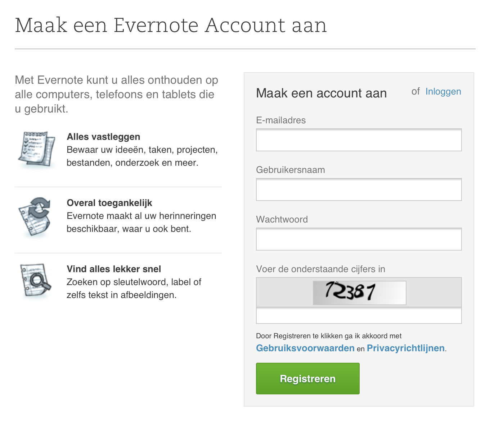
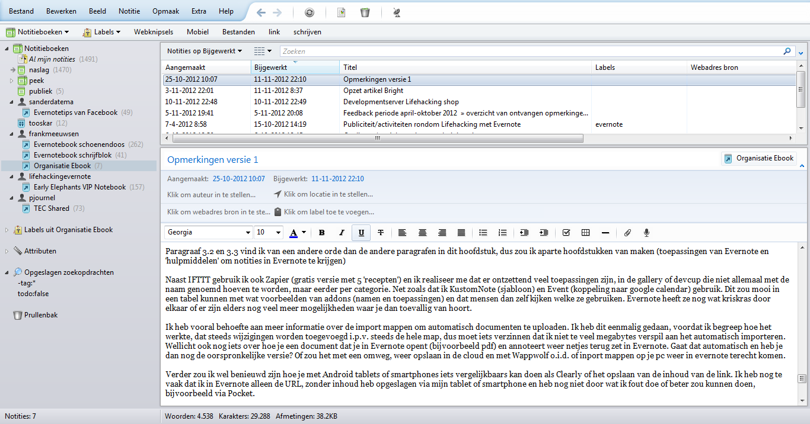
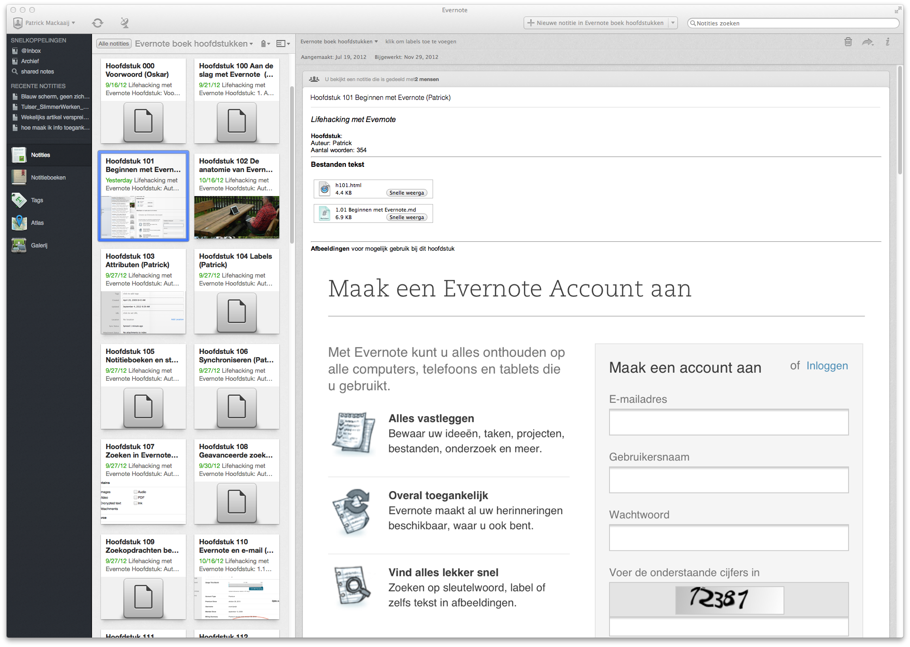
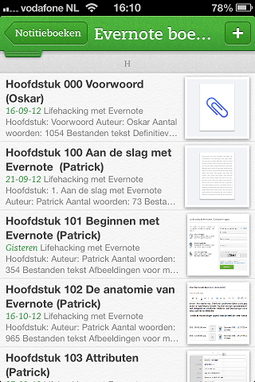

## Beginnen met Evernote

De kracht van Evernote is dat het werkt op de computers, mobiele apparaten (smartphones en tablets) en de webbrowsers die je dagelijks gebruikt. Zodra je verbinding legt met internet worden je notities automatisch op alle apparaten bijgewerkt. Door met één Evernote-account in te loggen op meerdere apparaten kun je notities die je op het ene apparaat vastlegt terugvinden op alle andere.

Evernote werkt prima in een webbrowser en heeft speciale extensies ontwikkeld voor webbrowsers Firefox, Chrome en Safari om snel notities aan te maken en op te zoeken.

Om naadloos aan te sluiten op de mogelijkheden van een apparaat ontwikkelt Evernote de programmatuur op maat voor ieder populair platform. Zo is Evernote er op PC's en laptops voor Mac OSX en Microsoft Windows. Voor mobiele apparaten heeft Evernote apps voor iOS (iPhone en iPad), Android, BlackBerry en Windows Phone.

De verschillende implementaties van Evernote lopen op details uit de pas. Nieuwe platformen inspireren Evernote tot een andere aanpak welke leiden tot een nieuwe "generatie" van de interface.

Vrijwel ieder platform werkt inmiddels met een eigen winkeltje waar je de gratis software van Evernote kunt vinden en installeren. Of volg de links via [de downloadpagina van Evernote](http://evernote.com/download/ "Evernote: Download").

Om te beginnen kun je [een Evernote-account aanmaken](https://www.evernote.com/Registration.action "Evernote: Create an Evernote Account") in de webbrowser.

Nadat je bovenstaand formulier hebt ingevuld krijg je een e-mailbericht van Evernote om je e-mailadres te bevestigen. In het e-mailbericht vind je ook je Evernote e-mailadres - daar kun je aantekeningen naartoe sturen. Hier komen we later nog op terug.

Na het bevestigen van je e-mailadres kun je eerst een kijkje nemen in de webbrowser, of direct een client van Evernote downloaden.

### De interface van Evernote

De interface van Evernote verschilt per platform. De basis is natuurlijk hetzelfde: Evernote bestaat uit notitieboeken waarin je notities stopt, al dan niet voorzien van extra informatie zoals labels en bijlagen. Deze notities kun je gemakkelijk aanmaken en terugvinden.

Evernote maakt applicaties voor elk apparaat. De interface verschilt per apparaat. Soms ontdekt Evernote voor het ene apparaat een handige verbetering. Later komt die verbetering vaak ook op andere apparaten.

Ook via de kleinere schermen van tablets en smartphones zijn alle functies van Evernote te gebruiken. Om zoveel mogelijk schermruimte beschikbaar te houden voor de notitie(s) zelf moet je wat vaker heen en weer tikken om een ander notitieboek te openen of te filteren op het een of ander.

Smartphones en tablets hebben al wel een mooie weergave om notities die voorzien zijn van geografische informatie (coördinaten) als pin weer te geven op de wereldkaart. Handig als je weet waar je een notitie hebt genomen of wilt zien welke notities je eerder op locatie hebt genomen. In het volgende hoofdstuk is daar een screenshot van te zien.

In de interfaces voor Windows en OSX geeft de knop Activiteit met een teller het aantal wijzigingen in jouw Evernote-omgeving die je nog niet hebt gezien weer. Dat is met name handig als je samenwerkt met anderen. Zo zie je dat er nieuwe of gewijzigde notities zijn en door wie die wijzigingen zijn aangebracht. Vanaf de activiteit kun je doorklikken naar de betreffende notitie.

#### Windows-interface (PC)

Het onderstaande screenshot laat de interface van de Windows Desktopclient van Evernote zien.

Bovenaan het scherm vind je het menu en een knoppenbalk met een aantal functies onder handbereik. Zo kun je bladeren tussen notitieboeken en notities die je onlangs hebt aangeklikt, snel een nieuwe notitie aanmaken en synchroniseren. Knoppen toevoegen, verplaatsen of verwijderen kan via het menu Extra > Werkbalk aanpassen...

Onder de knoppenbalk is de *Favorietenbalk* zichtbaar. Standaard staan daar wat filters op zodat je snel kunt zoeken naar een notitieboek of label. Ook kun je snel alleen notities met "Webknipsels", "Mobiel" of "Bestanden" weergeven. De Favorieten Balk kun je zelf uitbreiden. Je kunt er notitieboeken, labels, individuele notities, opgeslagen zoekopdrachten op slepen die je onder handbereik wilt hebben.

Als je notitieboeken deelt met andere Evernote-gebruikers dan kun je daar via de linkerkant naartoe.

Evernote somt aan de linkerkant alle notitieboeken, labels, attributen en zoekopdrachten op. De labels en attributen werken als filter - als je erop klikt dan laat Evernote alleen notities zien waarop het label of attribuut van toepassing is.

Tip: Via het menu Beeld kun je ervoor kiezen om labels die niet zijn gebruikt in het huidige notitieboek te verbergen zodat je niet mis klikt. Je kunt er ook voor kiezen om ze te laten staan zodat je er notities op kunt slepen om het label juist toe te kennen.

Voor je eigen notities vind je aan de linkerkant ook de prullenbak waarin verwijderde notities terecht komen. Onderaan rouleert Evernote reclame, Premium-gebruikers kunnen dit uitschakelen.

Doordat de reclames direct aan Evernote zijn gerelateerd en handmatig worden gekozen zijn ze zo relevant dat Premium-gebruikers ze in de praktijk gewoon laten staan.

De manier waarop de notities worden weergegeven kun je instellen via het menu Beeld.

1. De *lijstweergave* somt de notities op als rijen en laat de actieve notitie onderaan het scherm zien.
2. De *fragmentweergave* (zie screenshot) laat de titel, aanmaakdatum en de eerste regels van de notitie zien, samen met een eventuele afbeelding.
3. De *thumbnailweergave* geeft een miniatuurweergave van je notitie weer.

De volgorde waarin notities worden weergegeven is instelbaar op onder andere titel en datum van aanmaak of wijziging. Je kunt de sorteervolgorde ook omkeren zodat je de laatst gewijzigde notitie boven- of onderaan kunt weergeven.

Notities kun je ook groot weergeven door ze in een apart venster te openen. Dubbelklik daarvoor op de notitie.

Evernote Touch is een client voor Windows 8 die, *alleen voor het lezen van notities* beter aansluit bij de nieuwe interface. Als je op je apparaat ook de Windows Desktop client kun installeren dan moet je dat zeker doen want die heeft veel meer mogelijkheden om notities te bewerken.

> Tip: Overzicht van de [sneltoetsen van Evernote voor Windows](https://support.evernote.com/ics/support/KBAnswer.asp?questionID=625 "Evernote: What are the keyboard shortcuts in Evernote for Windows?")

#### OSX-interface (Mac)

De interface van de OSX-client verschilt op het moment van schrijven sterk van de Windows-interface. De Mac-client is van de nieuwste, vijfde generatie.

De interface is overzichtelijker doordat niet alle notitieboeken en labels aan de linkerkant worden weergegeven. Bovenaan de linkerzijkant kun je onder snelkoppelingen (shortcuts) zelf bepalen wat je prominent in beeld wilt hebben. Je kunt er notitieboeken, notities, labels en opgeslagen zoekopdrachten die je vaak gebruikt heen slepen. Net zoals naar de favorietenbalk in de Windowsclient. De snelkoppelingen kun je sorteren door ze te verslepen met de muis. En als je een snelkoppeling wilt verwijderen dan sleep je deze van de zijbalk af. Evernote synchroniseert de snelkoppelingen tussen verschillende clients.

Opgeslagen zoekopdrachten zijn bereikbaar via het zoekvenster. Misschien ken je dat wel van de webinterface van Twitter. Vanaf daar kun je ook een opgeslagen zoekopdracht slepen naar Snelkoppelingen. Een nieuwe zoekopdracht bewaar je via het menu Bewerken > Zoeken > Zoekopdracht opslaan.

Onder de snelkoppelingen laat Evernote de laatste vijf notities die je hebt bewerkt zien.

Linksonder staan links naar alle notities, notitieboeken en labels. Als je toch liever alle notitieboeken en labels ziet zoals in de vorige generatie van de interface dan kun je dat instellen via het rechtermuisknopmenu. 

Meerdere labels in één keer selecteren kan door (rechts)bovenaan de lijst op de naam van het label te klikken. Je kunt dan andere labels die in de al geselecteerde notities zijn gebruikt aanklikken.

Handig is ook dat je notities kunt weergeven als miniatuur (Card View) zodat je een notitie snel op het oog kunt vinden.

Gedeelde notitieboeken staan in één overzicht met je eigen notitieboeken. Je kunt de notitieboeken ordenen zoals je zelf wilt. Als je veel notitieboeken hebt dan is het handig te weten dat je op de naam kunt zoeken. Notities in gedeelde notitieboeken worden ook gevonden met zoekopdrachten over alle notities heen.

Meldingen van activiteiten worden op de Mac ook weergegeven in het Notification Center van OSX Mountain Lion.

Evernote vult je zoekopdrachten tijdens het typen aan op basis van de inhoud van jouw Evernote-account. Aan Premium-gebruikers laat Evernote gerelateerde notities zien van de notitie die je nu bekijkt of bewerkt.

Tenslotte vind je linksonder de Atlas-weergave waarin notities met GPS-coördinaten op een geografische kaart worden weergegeven zoals we die kennen van de smartphone- en tabletclients.

Met het Evernote-pictogram rechtsboven op de menubalk open je snel een nieuwe notitie (Quick Note). Je kunt de notitie aanvullen met foto's, video's, screenshots en attachments. De notitie blijft staan totdat je op opslaan klikt. Ga je Quick Note vaak gebruiken? Leer dan de sneltoetsen Ctrl+Cmd+N (Nieuw) en Cmd+Enter (Opslaan) aan!

> Tip: Overzicht van de [sneltoetsen van Evernote voor OS X](https://support.evernote.com/ics/support/KBAnswer.asp?questionID=587 "Evernote: What are the keyboard shortcuts in Evernote for OS X?")

##### Mac App Store vs zelf installeren

Je kunt [Evernote installeren via de Mac App Store](https://itunes.apple.com/nl/app/evernote/id406056744?mt=12 "Mac Apple Store: Evernote") of [het installatiebestand van Evernote downloaden](http://evernote.com/download/get.php?file=EvernoteMacApp "Download Evernote voor Mac OS X"). De versies verschillen functioneel. In de Mac App Store versie van Evernote ontbreekt de instelling onder Voorkeuren > Software Update om de *beta versies* te installeren. Er zijn nog twee verschillen wegens beperkingen van installaties via de Mac App Store maar die kun je zelf opheffen:

1. Installatie van de [Evernote Web Clipper](http://evernote.com/webclipper/ "Evernote: Web Clipper") in Safari om snel (delen van) webpagina's en PDF-bestanden tijdens het browsen in Evernote te bewaren.
2. De afdrukoptie *PDF in Evernote bewaren* kun je toevoegen door het AppleScript [Save PDF to Evernote](http://discussion.evernote.com/topic/24095-howto-adding-send-pdf-to-evernote-to-the-pdf-menu-in-the-os-x-print-dialog/ "Evernote Forum: Save PDF to Evernote AppleScript") uit te voeren.

Evernote verwijst wegens deze drie extra's via de website naar de zelf te installeren versie.

#### iOS-interface

De iOS-interface van iPhone en iPad is van de vijfde generatie. Op Snelkoppelingen na is de werking hetzelfde als onder Mac OS X.

Zoeken en sorteren kun je op iPhone vinden door de lijst met notities naar beneden te slepen. Ze zijn daar verborgen om meer ruimte te geven aan de lijst met notities.

Om ongewenste opmaak uit de tekst te verwijderen zijn twee functionaliteiten toegevoegd: "(Opmaak) vereenvoudigen" of zelfs "Platte tekst (maken)". De functionaliteiten vind je op iPad boven het virtuele toetsenbord achter het alinea symbool. Op iPhone tik je boven het virtuele toetsenbord op "A".

Een niet aan Evernote gelieerde ontwikkelaar heeft de app Clever ontwikkeld. De app is op het moment van schrijven sneller, overzichtelijker en veelzijdiger dan de officiële Evernote-app. Download [Clever voor iPhone](http://clkuk.tradedoubler.com/click?p=24371&a=2064103&url=https%3A%2F%2Fitunes.apple.com%2Fnl%2Fapp%2Fclever-for-evernote-another%2Fid551017006%3Fmt%3D8%26uo%3D4%26partnerId%3D2003 "iTunes: Clever voor iPhone") en/of [Clever HD voor iPad](http://clkuk.tradedoubler.com/click?p=24371&a=2064103&url=https%3A%2F%2Fitunes.apple.com%2Fnl%2Fapp%2Fclever-hd-for-evernote-another%2Fid568312823%3Fmt%3D8%26uo%3D4%26partnerId%3D2003 "iTunes: Clever voor iPad").

#### Android-interface

Na het installeren van [Evernote voor Android](https://play.google.com/store/apps/details?id=com.evernote "Google Play: Evernote") kun je vrijwel direct aan de slag. Evernote kan een nieuw account aanmaken op basis van het e-mailadres waarmee je op het toestel bent ingelogd. Later kun je via een link in je e-mail inbox een wachtwoord aan het account toekennen. Let dus even goed op als je al een account had anders heb je er per ongeluk twee!

Op Evernote voor Android kun je je snelkoppelingen naar notities, notitieboeken, labels en opgeslagen zoekopdrachten gebruiken door met je vinger vanaf rechts het scherm in te slepen. Een nieuwe snelkoppeling toevoegen kan door een element lang aan te wijzen met de vinger en dan te kiezen voor *Toevoegen aan snelkoppelingen*.

Installeer op Android zeker de extra app [Evernote Widget](https://play.google.com/store/apps/details?id=com.evernote.widget "Google Play: Evernote Widget"). Je kunt dan widgets toevoegen aan je startpagina om met snelknoppen notities toe te voegen of op te zoeken. De snelknoppen waar je uit kunt kiezen zijn:

* Nieuwe notitie
* Momentopname (foto)
* Geluidsfragment
* Zoeken
* Snelle momentopname (foto direct bewaren als notitie)
* Skitch (Evernote-tool voor het aanwijzen en benoemen van gedeeltes van een afbeelding om daar de focus op te leggen, komt verderop in dit boek aan bod)
* Spraak-naar-tekst notitie (zet gesproken tekst om in digitale tekst)

Vooral Spraak-naar-tekst notitie is fraai. De tekst die je uitspreekt verschijnt vrijwel direct op het scherm. Op iOS heb je hier een aparte app zoals [Braintoss](http://clkuk.tradedoubler.com/click?p=24371&a=2064103&url=https%3A%2F%2Fitunes.apple.com%2Fnl%2Fapp%2Fbraintoss%2Fid576226036%3Fmt%3D8%26uo%3D4%26partnerId%3D2003 "iTunes: Braintoss") voor nodig en zie je het resultaat pas later terug.

Na de installatie van Evernote Widget wijs je met je vinger een lege plek op het scherm aan en kies je voor het menu Widget. Daar kun je kiezen uit drie widgets van Evernote:

1. Evernote Widget actie (1x1)
2. Evernote Widget Groot (4x2)
3. Evernote Widget klein (4x1)

De widget "actie" omvat één snelknop naar keuze. Aan de kleine en grote widget kun je een snelknop Instellingen toevoegen om snel de instellingen van de widget zelf te veranderen.

De grote widget heeft een extra scherm waarin je drie notities ziet. Welke drie notities dat zijn bepaal je zelf door te kiezen uit: Laatst bekeken, Laatst bijgewerkt, Notitieboek, Label of Opgeslagen zoekopdracht. Je kunt bladeren door de notities met een klein knopje vorige/volgende.

#### Webinterface

De webinterface heeft geen menu en knoppenbalk waardoor je soms even wat meer moet zoeken naar een optie. Het is handig om te weten dat de webinterface ook reageert op de rechtermuisknop.

Je kunt de lijst met notities sorteren door onderaan de lijst te klikken op "Bekijk opties". Sorteermogelijkheden zijn *Datum aanmaak*, *Datum wijziging* en *Titel* - in twee richtingen.

In het zoekvenster zijn zelfs opties te vinden zoals filteren op attributen en je opgeslagen zoekopdrachten.

### Linux-interface

Evernote heeft zelf nog geen client voor Linux beschikbaar gesteld. Ontwikkelaars hebben op eigen initiatief [Everpad](https://github.com/nvbn/everpad "github: Everpad") en [NeverNote](http://nevernote.sourceforge.net/ "NeverNote") beschikbaar gesteld.

### Op de hoogte blijven van Evernote

Blijf vervolgens op de hoogte van nieuwe ontwikkelingen door het [Evernoteblog](http://blog.evernote.com "Evernote: Blog") te volgen. Via e-mail of RSS krijg je dan ongeveer eenmaal per week een (Engelstalig) bericht. Via je [persoonlijke instellingen](https://www.evernote.com/PersonalSettings.action "Evernote: Personal Settings") kun je aangeven welk type nieuwsberichten je wilt ontvangen. Via RSS kun je ook alleen de [productupdates](http://blog.evernote.com/category/product-updates/ "Evernote blog: Product Updates") volgen.

Met vragen over de software kun je terecht bij [Evernote Support](https://evernote.com/contact/support/ "Evernote Support"). Premium-gebruikers mogen binnen een werkdag een reactie verwachten en kunnen gebruik maken van een (Engelstalige) chat.

