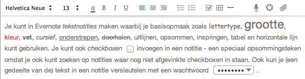
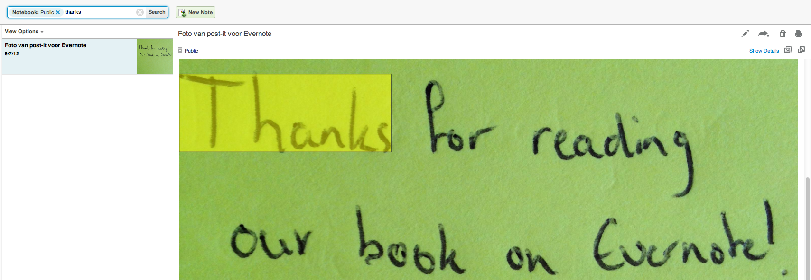
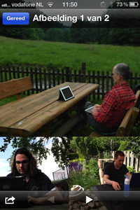
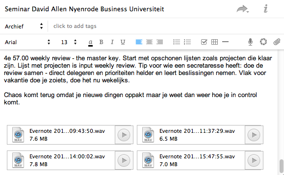

## De anatomie van Evernote

Alles wat je wilt bewaren in Evernote is uiteindelijk een *notitie* (*Engels: note*). Evernote legt bij het aanmaken van een notitie zoveel mogelijk context vanuit de bron vast om de notitie zo vindbaar mogelijk te maken. Denk bij een foto met een smartphone aan datum, tijd, GPS-locatie en agendagegevens.

Een nieuwe notitie maak je eenvoudig met de knop "Nieuwe notitie". Je kunt de notitie een titel geven en van tekst voorzien. Zie ook [Aan de slag met Evernote](http://evernote.com/intl/nl/getting_started/#3). Om snel een nieuwe notitie aan te maken in Evernote gebruik je de toetscombinatie Ctrl+Alt+N (Windows) of Cmd+Ctrl+N (Mac).

Je kunt ook een notitie aanmaken met gegevens die op je klembord staan met Ctrl+Alt+V (Windows) of Cmd+Ctrl+V (Mac). Als je bestanden op het klembord hebt staan dan maakt Evernote één notitie per bestand aan.

Deze sneltoetsen werken ook als Evernote op de achtergrond draait en je zelf in een ander programma aan het werk bent.

Tip: Wijzigingen in een notitie worden automatisch opgeslagen, je hoeft dus niet eerst op een opslaanpictogram te klikken.

### Tekstnotitie

Je kunt in Evernote *tekstnotities* maken waarbij je basisopmaak zoals lettertype, grootte, kleur, vet, cursief, onderstrepen, doorhalen, uitlijnen, opsommen, inspringen, tabel en horizontale lijn kunt gebruiken. Je kunt ook *checkboxen* invoegen in een notitie - een speciaal opsommingsteken omdat je ook kunt zoeken op notities waar nog niet afgevinkte checkboxen in staan. Ook kun je (een gedeelte van de) platte tekst in een notitie versleutelen met een wachtwoord.

Tip: Je kunt hyperlinks maken met het rechtermuisknopmenu, of met de sneltoets Ctrl+K (Windows) of Cmd+K (Mac).

### E-mailnotitie

Ieder Evernote-account krijgt een eigen *e-mail*adres waarnaar je berichten kunt doorsturen. Evernote importeert deze berichten en de eventuele bijlagen. In hoofdstuk 1.10 lees je hier meer over.

Aan een tekstnotitie kun je ook bijlagen toevoegen. Evernote accepteert ieder bestandsformaat en je kunt ze gewoon door elkaar gebruiken. Met sommige bestandsformaten doet Evernote iets extra's.

### Handgeschreven notitie

Van oudsher kan Evernote goed overweg met *handgeschreven* notities. Evernote maakte teksten die je met de hand hebt geschreven vindbaar. Dat kunnen scans zijn van handgeschreven aantekeningen of teksten die je op je apparaat hebt ingevoerd. De [herkenning van Nederlandstalige *handgeschreven* teksten is nog in ontwikkeling](http://translate.evernote.com/tools/availability.html "Evernote: Public language availability").

De losse Evernote-app Penultimate kun je je iPad als schrift gebruiken. Je kunt schrijven en schetsen met een stylus of je vingers. Lees verderop in dit boek meer Penultimate.

### Fotonotitie

Een *fotonotitie* bevat een of meerdere foto's. Als jouw PC, laptop, smartphone of tablet een webcam heeft dan kunt je daar ook direct vanuit Evernote een foto mee maken. Evernote laat foto's direct in een notitie zien, op een mobiel apparaat kun je er zelfs doorheen bladeren zoals het iPhone screenshot hieronder laat zien.

Evernote gebruikt de foto's ook in thumbnails die je te helpen notities snel terug te vinden in een lijst met notities. 

### Webnotitie

Als je een *webpagina* bewaart dan probeert Evernote zoveel mogelijk van de oorspronkelijke opmaak in de notitie te bewaren. Inclusief tekst, links en afbeeldingen.

[Installeer de Webclipper van Evernote](http://evernote.com/webclipper "Evernote: Webclipper") op íeder apparaat in álle webbrowsers die je gebruikt. Zo kun je snel informatie toevoegen aan Evernote. Evernote heeft extensies voor de webbrowsers Safari, Chrome, Firefox en Internet Explorer. Voor andere webbrowsers kun je de bookmarklet van Evernote gebruiken.

De extensies voor de webbrowsers bieden meer functionaliteit dan de bookmarklet. Lees alles over de Evernote Webclipper in hoofdstuk 1.15.

### Audionotitie

Een *audionotitie* bevat een of meerdere geluidsopnames. Veel apparaten zoals laptops, smartphones en tablets hebben een microfoon waarmee je direct vanuit Evernote kunt opnemen. Zo kun je bijvoorbeeld even snel iets voor jezelf inspreken of het geluid van een presentatie of vergadering opnemen om later terug te luisteren.

Evernote-CEO Phil Libin heeft een audionotitie met de in 2009 opgenomen [Evernote Rap](https://www.evernote.com/shard/s1/sh/90ef31fd-2c6d-4d50-8ac7-c007e8a0788b/847076f11f773d57cb603e4d0ac54d53 "Evernote Rap"). Klinkt goed, echt eens luisteren!

### Notities mixen

Net als bijlagen aan een e-mailbericht kun je in een Evernote-notitie allerlei bestandstypen kwijt. Op je PC kun je bestanden gewoon in een notitie of op het pictogram van Evernote slepen - of via het rechtermuisknop menu naar Evernote sturen. Op de Mac kun je standaard naar PDF afdrukken - daar vind je ook een optie om de PDF direct naar Evernote te sturen.

De enige beperking is de omvang in MB's. Maximaal 25 MB per notitie in de gratis versie van Evernote en maximaal 100 MB voor Premium gebruikers.

Je kunt bijlagen ook direct vanuit Evernote openen om te bewerken (live update). Evernote adviseert met klem bijlagen niet te lang open te laten staan. Het kan zijn dat je laatste wijzigingen niet worden bewaard omdat het programma waarmee je de bijlage bewerkt vastloopt of je computer in slaap- of sluimerstand gaat. Sla daarom het document waaraan je werkt regelmatig op.

Het maximale aantal notities wat je in Evernote kwijt kunt is 100.000.

### Notities kopiëren, verplaatsen en samenvoegen

Notities kun je verplaatsen naar een ander notitieboek door in de eigenschappen van de notitie een ander notitieboek op te geven. In de Windows- en Mac clients kun je notities ook selecteren en dan verslepen. Of selecteer de notities en kies voor *verplaatsen* in het menu Notitie of het rechtermuisknopmenu.

Een notitie kopiëren kan in de Windows- en Mac clients. Selecteer de notitie(s) en kies voor *kopiëren* in het menu Notitie of het rechtermuisknopmenu waarna je een doel-notitieboek opgeeft. Via de opties in het submenu kun je aangeven of je de labels en/of datum van aanmaak en wijziging wilt behouden.

Voor het samenvoegen van notities in de Windows- en Mac client selecteer je de notities en kies je voor *samenvoegen* in het menu Notitie of het  rechtermuisknopmenu. 

Let op: de notities worden samengevoegd in de volgorde waarin het notitieboek is gesorteerd. In de Windows client kun je de volgorde van samenvoegen bepalen. Klik de eerste notitie aan en houdt tijdens het aanklikken van de volgende notitie(s) de Ctrl-toets ingedrukt voordat je kiest voor *samenvoegen*.
