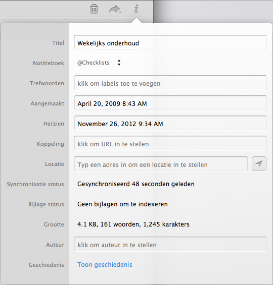

## Attributen

Evernote bewaart bij iedere notitie zoveel mogelijk extra gegevens uit de context. Evernote noemt deze meta-informatie *attributen* (*Engels: attributes*). Zo wordt de aanmaakdatum van een notitie automatisch bewaard. Als je een notitie wijzigt dan bewaart Evernote de datum waarop de notitie is bijgewerkt apart.

Van geïmporteerde e-mailberichten bewaart Evernote de afzender in het veld Auteur. Van webpagina's wordt het webadres (de URL) als bron bewaart.

Hieronder zie je een screenshot van de meta-informatie. Alle automatisch geregistreerde gegevens kun je naar wens aanpassen of verwijderen door in de velden te klikken.

Notities die je maakt met een apparaat waarmee Evernote de locatie kan achterhalen worden voorzien van GPS-coördinaten. Je kunt dergelijke notities terugvinden op lengte- en breedtegraad of hoogte (*latitude:*, *longitude:* en *altitude:*) zoals we in hoofdstuk 1.8 laten zien. De mobile clients van Evernote hebben een kaartweergave waarin dergelijke notities met een pin worden weergegeven.

De notitie laat ook zien of eventuele attachments zijn geïndexeerd (vindbaar zijn gemaakt) en geeft de omvang van de notitie weer.

Voor Premium gebruikers bewaart Evernote om de acht uur de huidige status van notities. Via *notitiegeschiedenis* kun je dan opvragen hoe een vorige versie van de notitie eruit zag en daar eventueel naar terug keren.

Attributen kun je ook gebruiken voor de volgorde waarin notities in je notitieboek worden weergegeven. Zo kun je notities sorteren op onder andere titel, datum van aanmaak of wijziging, webadres (URL) en grootte.

In hoofdstuk 1.8 laten we zien hoe je Evernote kunt doorzoeken op notities met specifieke eigenschappen. Zo kun je bijvoorbeeld gericht zoeken op naar notities met een PDF-bestand erbij.
