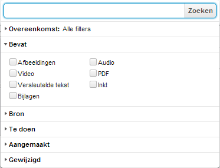

## Zoeken in Evernote
Doordat het gemakkelijk is om informatie in Evernote op te slaan zul je merken dat je al snel veel notities hebt aangemaakt. Dan wordt de kracht van Evernote zichtbaar, de vindbaarheid van tekst in notities.

Je kunt in Evernote zoeken in:

* Alle notities binnen heel Evernote met Win+Shift+F (Windows) of Cmd+Ctrl+E (Mac). Met deze sneltoetsen activeer je de zoekfunctie van Evernote ook als je in een ander programma aan het werken bent. 
* Alle notities binnen het actieve notitieboek.
* De notitie die je nu open hebt met Ctrl+F (Windows) of Cmd+F (Mac).

Via het zoekscherm kun je op basis van trefwoorden zoeken. Het trefwoord moet *precies overeenkomen* in de titels van notities, teksten die zijn ingetypt in een notitie, namen van labels of woorden die door Evernote herkend zijn in ingesloten bestanden van een notitie. Je kunt dus via Evernote in Word documenten, PDF's en andere tekstbestanden zoeken.

Maar Evernote gaat verder. Als je foto in een notitie tekst bevat dan kan Evernote deze herkennen en terugvinden. Dus ook het etiket van een fles wijn, een screenshot van een website of handgeschreven tekst op een post-it of whiteboard na een brainstormsessie.

Evernote bewaart, onzichtbaar voor eindgebruikers, bij iedere notitie de posities waarop mogelijk tekst staat. Voor iedere positie somt Evernote mogelijke trefwoorden en varianten daarop op. Iedere variant krijgt een wegingsfactor mee, de inschatting van Evernote welke trefwoord van toepassing is.

Tip: Als je benieuwd bent naar de varianten, maak dan eens een export van een notitie en bekijk deze in een tekst-editor.

De webinterface van Evernote helpt met het samenstellen van gerichte zoekopdrachten, bijvoorbeeld op het type notitie of de datum. In de Windows client van Evernote kun je de opbouw van een zoekopdracht al wel overzichtelijk opvragen en verfijnen via Ctrl+F10.

In het volgende hoofdstuk leer je hoe je deze krachtige zoekopdrachten ook in de clients van Evernote kunt gebruiken.

Tips:

* Als je een lokaal notitieboek hebt aangemaakt dan kun je teksten in afbeeldingen en handgeschreven notities niet terugvinden. De mogelijke trefwoorden worden door de webservice van Evernote aan notities toegevoegd en lokale notities worden niet door de servers van Evernote verwerkt.
* Evernote werkt voor het indexeren van bestanden met een wachtrij. Opdrachten van Premium-gebruikers worden sneller afgehandeld dan die van gratis-gebruikers.
* Evernote maakt voor Premium-gebruikers de eerste 100 pagina's van PDF bestanden die uit zichzelf niet doorzoekbaar zijn doorzoekbaar (searchable).
* Evernote werkt nog aan de [herkenning van Nederlandstalig handgeschreven teksten](http://translate.evernote.com/tools/availability.html). Tot die tijd zit de herkenning van handgeschreven Nederlandstalige teksten er helaas regelmatig naast.
