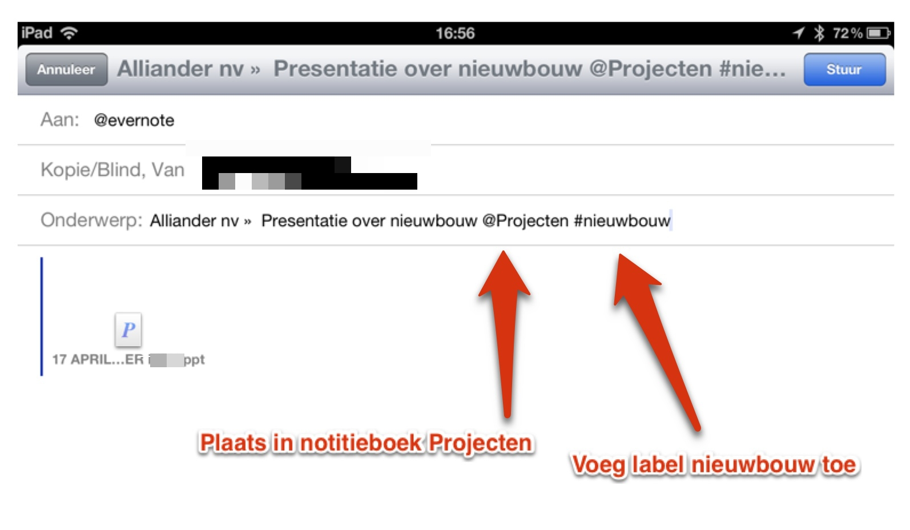

## Evernote en e-mail

Evernote kun je eenvoudig met tekst en bestanden vullen via e-mail. Bij Evernote krijg je daarvoor een eigen e-mailadres. Alles wat je per e-mail kunt versturen, kun je daarmee ook naar Evernote versturen. Daar wordt het een notitie met titel, tekst en/of bestanden (bijlagen). Je kunt zelfs per e-mail opdracht geven deze notitie in een specifiek notitieblok te plaatsen en te voorzien van labels.

Omdat e-mail op veel apparaten en in veel applicaties beschikbaar is kun je zo eenvoudig van alles toevoegen aan jouw Evernote.

Samen met de Windowsclient installeert Evernote een plugin voor Microsoft Outlook om (tekst uit) e-mailberichten naar notities te kopiëren.

\newpage

### Eigen e-mailadres van Evernote

Bij Evernote krijg je een uniek eigen e-mailadres. Het ziet er ongeveer uit als <code>[gebruikersnaam].12345@m.evernote.com</code>. Evernote stuurt het je direct na het aanmaken van een Evernote-account toe. Je kunt het [e-mailadres vinden bij de accountinformatie van Evernote](https://support.evernote.com/link/portal/16051/16058/Article/547/Adding-content-to-Evernote-using-email).

Hierboven zag je waar je in de webversie van Evernote jouw e-mailadres vindt.
Naast het e-mailadres staat een *Reset*-knop. Daarmee kun je jouw e-mailadres wijzigen. Dat is handig als het per ongeluk in de handen van spammers terecht is gekomen.

### E-mailadres van Evernote gebruiken

Maak je Evernote e-mailadres gemakkelijker in het dagelijkse gebruik door het toe te voegen aan je lijst met contactpersonen (je digitale adresboek). Vanuit de instellingen van Evernote iOS kan dat meteen met de optie 'Toevoegen aan Contacten'.

Geef het lange e-mailadres van jouw Evernote een makkelijk te onthouden naam. Bijvoorbeeld : *@Evernote*. Door het apenstaartje verschijnt het bovenin de alfabetische lijst van je contacten. In je e-mailprogramma kun je daarna volstaan met het typen van een @ als verzendadres om het volledige adres als keuzeoptie te laten verschijnen. Je kunt jouw Evernote e-mailadres in meerdere adresboeken zetten, behorend bij verschillende e-mailaccounts of apparaten.

Jouw e-mailadres van Evernote werkt altijd, ongeacht de afzender. Je kunt het adres dus ook delen met anderen. Handig om je Postvak IN minder vol te laten lopen. Ontvang je regelmatig e-mail, die je daarna altijd als naslag, leesvoer of vergaderstukken  bewaart in Evernote? Regel dan dat de afzender die informatie niet meer naar jou mailt, maar meteen naar jouw Evernote stuurt. Ben je bijvoorbeeld abonnee van een e-mail-nieuwsbrief en lees je die liever vanuit Evernote? Dan kun je jouw e-mailadres wijzigen in jouw adres bij Evernote. Dan hoef je niet telkens zelf die e-mails naar Evernote door te sturen.

Tips:

* Evernote Premium gebruikers kunnen [contact opnemen met Evernote Support](https://support.evernote.com/ics/support/default.asp?deptID=16058 "Evernote: Support") om hun e-mailadres aan te laten passen naar iets handzamers, zoals johnny@m.evernote.com
* Als je zelf een domein bezit dan kun je zelf een handig e-mailadres voor Evernote aanmaken en deze als alias doorsturen naar Evernote.

### Opdrachten geven aan Evernote via e-mail 

Verstuur je een e-mail aan Evernote, dan worden zowel de tekst als de bijlagen geplaatst in een notitie in het notitieboek dat jij als *standaard* hebt ingesteld. De onderwerpregel van de e-mail wordt de *titel* van de notitie. De inhoud van de e-mail wordt de *tekst* van de notitie, de opmaak blijft behouden. Bijlagen bij de e-mail worden ook als *bijlagen* (bestanden) in de notitie geplaatst.

Je kunt achteraan de onderwerpregel metadata plaatsen. Daarmee geef je Evernote opdrachten. In onderstaand screenshot sturen we een e-mailbericht door naar Evernote. Dit resulteert in een notitie met:

* Notitieboek: Projecten
* Titel: Aliander nv - Presentatie over nieuwbouw
* Label: nieuwbouw
* Bijlage: de PowerPoint-presentatie

Er zijn dus twee opdrachten via e-mail aan Evernote mogelijk:

1. **@** voor **notitieboek** - Met een @*naam_notitieboek* laat je Evernote de e-mail in een ander notitieboek dan jouw standaardnotitieboek plaatsen. In het voorbeeld: het notitieboek *Projecten* is niet jouw standaardnotitieboek, maar je wil de e-mail wel daarin laten plaatsen. Die opdracht aan Evernote is in de onderwerpregel toegevoegd als: *@Projecten*
2. **#** voor **labels** - Met een #*naam_label* laat je Evernote een label toevoegen aan de notitie waarin de e-mail wordt geplaatst. Je kunt zoveel labels toevoegen als je wilt. Bijvoorbeeld: door in de onderwerpregel de tekst *#nieuwbouw* te typen laat jij Evernote het label *nieuwbouw* aan de notitie toevoegen.

*Let op*. Je kunt met deze metadata in het onderwerp van een e-mail geen nieuwe notitieboeken of labels in Evernote aanmaken. Het notitieboek en de labels die je als metadata aan het onderwerp van je e-mail toevoegt moet jij dus al eerder in jouw Evernote gezet hebben. Daarnaast kun je via e-mail geen notitieboeken die beginnen met een @ of labels die beginnen met een # gebruiken. Evernote importeert de e-mailberichten wel, maar ze komen zonder labels in je standaard notitieboek terecht.

Neem bij het doorsturen van een e-mail naar Evernote even de tijd om het *onderwerp* te wijzigen in een duidelijke titel voor de notitie in Evernote. Daarachter kun je een gewenst notitieboek en labels typen. Evernote verwijdert zelf de eventuele naam van het notitieboek en labels netjes uit de titel van de notitie.

In de inhoud van de e-mail die je naar Evernote wil doorsturen staat veelal nog overbodige tekst. Verzendadressen, handtekening, toelichtende blabla: je kunt het eerst verwijderen uit de inhoud, zodat de *tekst* van de notitie in Evernote alleen de voor jou relevante informatie zal bevatten. Zo zorg je binnen een minuut dat de aan jouw Evernote doorgestuurde e-mail correct volgens jouw wensen als nieuwe notitie wordt geplaatst. Je hoeft dit later niet meer in Evernote alsnog bij te werken.

E-mailen naar Evernote helpt om je mailbox dagelijks leeg te werken. Veel ontvangen e-mail kun je direct beantwoorden en in de prullenbak gooien. Wat daarna nog in je Postvak IN staat kun je allemaal doorsturen naar Evernote!

Wil je liever in Evernote zelf handmatig de notitie met de doorgestuurde e-mail labelen, opschonen en in het gewenste notitieboek zetten? Stuur dan de e-mail ongewijzigd en zonder metadata direct door naar jouw Evernote. Je kunt die notitie daar dan makkelijk terugvinden in jouw standaardnotitieboek met de zoekopdracht: *-tag:* (notities zonder label), eventueel aangevuld met jouw afzenderadres als *Auteur*. Deze zoekopdracht bewaar je natuurlijk zodat je 'm iedere dag kunt gebruiken.

### Evernote en Microsoft Outlook

Onder Microsoft Windows installeert Evernote een plugin voor Microsoft Outlook. De plugin voegt een knop "Add to Evernote" toe aan de werkbalk in Outlook om (tekst uit) e-mailberichten naar notities te kopiëren.

1. Selecteer tekst die je in Evernote wilt bewaren, of één of meerdere mailtjes in een lijst (klik met de Ctrl-toets ingedrukt op de mailtjes die je in Evernote wilt bewaren) (mailtjes worden aparte notities)
2. Klik op de knop "Add to Evernote" in de werkbalk van Outlook
3. Pas indien gewenst de titel (dit is standaard het onderwerp van het e-mailbericht), labels en het notitieboek aan waarin de notitie terecht komt
4. Evernote maakt per e-mailbericht een aparte notitie aan en opent deze in als aparte vensters

De knop werkt ook met Outlook-notities dus als je die over wilt zetten naar Evernote dan is dat zo gebeurd.

### Powerbot voor Gmail

Gebruik je Gmail? Neem dan eens een kijkje naar [Powerbot](http://gmail.powerbotapps.com/ "Powerbot - connect Evernote to Gmail"). Deze webbrowser extensie kan berichten en conversaties doorsturen naar Evernote waarbij je notitieboek, labels en opmerkingen mee kunt geven. En vanuit Gmail kun je snel een link naar een Evernote-notitie invoegen.
