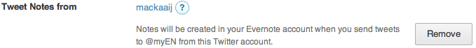

## Evernote en Twitter

Je kunt korte notities aanmaken via Twitter. Evernote heeft hiervoor het [Twitter account @myEN](http://twitter.com/myEN) aangemaakt. Voordat je tweets kunt importeren leg je eenmalig een koppeling tussen Evernote en jouw Twitter-account. Tweets die je vervolgens richt aan @myEN worden als notitie aangemaakt.

Evernote importeert zowel publieke tweets waarin je @myEN noemt als privéberichten die je naar @myEN stuurt. De tweets komen terecht in je standaard notitieboek. Van publieke tweets bewaart Evernote ook het adres naar de tweet op het web.

Door @myEN te vermelden (mention) attendeer je in één moeite door ook je volgers op een leuke website. *@myEN* is lekker kort en kost je maar 6 van de 140 tekens, bijvoorbeeld:

> e-book Lifehacking met Evernote: http://ebooks.lifehacking.nl @myEN

Je kunt @myEN ook een reactie (reply) sturen, deze tweet is dan wel zichtbaar op je Twitter-profiel en kan worden gelezen door Twitter-gebruikers die zowel jou als @myEN volgen:

> @myEN Melk halen.

Tenslotte kun je @myEN een privébericht sturen, dan leest niemand mee. Dat kan vanaf de profielpagina van @myEN of door de tweet te beginnen met een *d*:

> d @myEN Cadeauidee iPad Dock: http://lifehacking.nl/spullen/e4-ipad-dock/

### Je Twitter-account koppelen aan Evernote

Om je Twitter-account te koppelen aan Evernote doorloop je de volgende stappen:

1. Volg [@myEN op Twitter](http://twitter.com/myEN).
2. @myEN stuurt je een privébericht via Twitter (Direct Message) met een link. Volg deze link.
3. Login op Evernote en geef toestemming voor de koppeling.

Voor het leggen van de koppeling hoef je eigenlijk alleen [@myEN te volgen op Twitter](https://twitter.com/intent/user?screen_name=myEN), via het privébericht doorloop je vanzelf de volgende stappen. @myEN volgt je ook terug zodat je privéberichten kunt sturen.

Via de [instellingen van Evernote](https://www.evernote.com/Settings.action "Evernote: Settings") kun je je Twitter-account weer ontkoppelen. Dat kan handig zijn als je een andere Twitter-account wilt koppelen.

Als je je Twitter-gebruikersnaam verandert dan blijft de koppeling gewoon werken.
