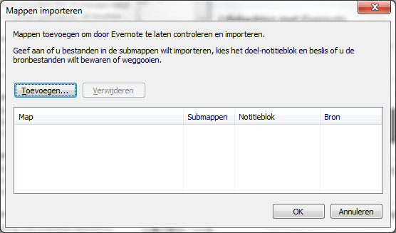

## Importmappen

Een functie die helaas alleen beschikbaar is in de Windows client is Importmappen (Watched Folders). Via Extra > Importmappen kun je mappen toevoegen waar Evernote vervolgens een oogje op houdt.

Per map kun je aangeven in welk notitieboek Evernote de bestanden moet importeren, of je bestanden in submappen ook wilt importeren en of je de geïmporteerde bestanden in de map wilt behouden of verwijderen.

Op de Mac kun je wel een bestand op het Evernote-pictogram slepen. Evernote opent dan een nieuwe notitie in het standaard notitieboek met de bijlage erin.

Zowel onder Windows als OS X is het mogelijk om bestanden vanuit de Verkenner of Finder door te sturen naar Evernote. Klik daarvoor met de rechtermuisknop op het bestand. Evernote is te vinden onder een submenu als *Open with*, *Send to* of *Verzenden naar*.

Evernote-gebruikers hebben scripts gemaakt die de functionaliteit van Importmappen nabootsen. Zo is [Evernote Watched Folder on Mac Snow Leopard](http://iformattable.blogspot.nl/2012/01/evernote-watched-folder-on-mac-snow.html) een eenvoudig Automator-script om een notitie van een bestand in Evernote te maken en [Create an *Evernote Dropbox*](http://veritrope.com/tech/evernote-desktop-folder/) een variant die je bij het importeren de mogelijkheid geeft het notitieboek te kiezen en labels in te voeren.

Of lees in hoofdstuk 3.7 hoe je bestanden uit een specifieke map kunt importeren naar Evernote via Dropbox met Wappwolf.
