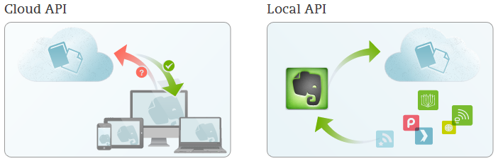

## Evernote-API en RSS

Steeds vaker maken websites het mogelijk voor andere ontwikkelaars om programma's te schrijven die samenwerken met de website. Zo bieden bijvoorbeeld Twitter, LinkedIn, Facebook en Evernote een zogenaamde Application Programming Interface (API).

API's zijn vaak zo uitgebreid dat een ontwikkelaar een programma kan schrijven die de volledige functionaliteit van de website benut. Twitter is daar een interessant voorbeeld van omdat daar al snel een uitgebreide API  voor beschikbaar was. Dit heeft geleid tot duizenden programma's die kunnen samenwerken met Twitter, sommige daarvan worden zelfs liever gebruikt dan de apps van Twitter zelf. In tegenstelling tot Twitter die uiteindelijk advertenties wil verkopen heeft Evernote geen belangenverstrengeling met ontwikkelaars.

Een API maakt ook integraties mogelijk. Zo kan een ontwikkelaar van een applicatie om nieuwsberichten te lezen de eindgebruiker berichten laten doorsturen naar zowel Twitter als Evernote.

Dit hoofdstuk legt uit hoe je als ontwikkelaar koppelingen met Evernote kunt leggen. Het is dus wat technischer van aard dan andere delen van dit boek.  De Local API is relatief eenvoudig te doorgronden en kan je veel tijd besparen als je merkt dat je vaak dezelfde handelingen uitvoert in Evernote - die zouden te automatiseren moeten zijn!

In het volgende hoofdstuk "De Evernote Galerij" behandelen we voorbeelden van hard- en software die slim gebruik maakt van de Evernote-API.

Ontwikkelaars kunnen op twee manieren met Evernote communiceren: via de Local API of via de Cloud API.

### Local API

De [Local API](http://dev.evernote.com/documentation/local/ "Evernote: Local API") van Evernote is minder omvangrijk dan de Cloud API en dus ook eenvoudiger in gebruik. Je hoeft niet echt te kunnen programmeren om deze API te kunnen gebruiken.

Met de Local API communiceer je via een script met een lokale installatie van Evernote. Je hoeft je bijvoorbeeld geen zorgen te maken over het inloggen van de gebruiker, dat regelt Evernote.

Onder Windows maak je gebruikt van [command line tools](http://dev.evernote.com/documentation/local/chapters/Windows.php "Evernote Developers: Windows"). Voor OSX levert Evernote mogelijkheden via [AppleScript](http://dev.evernote.com/documentation/local/chapters/Mac.php "Evernote Developers: Mac"). En op Android kun je gebruik maken van [Intents](http://dev.evernote.com/documentation/local/chapters/Android.php "Evernote Developers: Android"). De linkjes in deze alinea leiden direct naar pagina's met uitleg en voorbeelden.

### Cloud API

De [Cloud API](http://dev.evernote.com/documentation/cloud/ "Evernote: Cloud API") van Evernote gebruik je als ontwikkelaar als je een webservice ontwikkelt en dus geen toegang hebt tot een lokale installatie van Evernote. Of als je functionaliteiten wilt gebruiken waarin de Local API niet voorziet. Denk hierbij aan thumbnails, notities delen of de herkende tekst in afbeeldingen opvragen. Hoewel Evernote faciliteert met een [Software Development Kit (SDK)](https://github.com/evernote "GitHub: Evernote") voor diverse ontwikkeltalen moet je voor de Cloud API veel meer kennis van programmeren in huis hebben dan voor de Local API.

De Cloud API communiceert rechtstreeks met de webservice van Evernote. Je kunt met je eigen applicaties alles doen wat een officiële client van Evernote ook kan. In tegenstelling tot de Local API moet je zelf zorgen voor [toegang (via OAuth)](http://dev.evernote.com/documentation/cloud/chapters/Authentication.php "Evernote: Authentication") tot het account van de gebruiker.

### Developer Showcase

Evernote heeft een [Developer Showcase](http://dev.evernote.com/showcase/ "Evernote: Developer Showcase") met beschrijvingen van bestaande uitbreidingen om ontwikkelaars op ideeën te brengen, levert documentatie en [ondersteuning](http://dev.evernote.com/support/ "Evernote: Support Resources for Developers").

### Ondersteuning bij de marketing

Evernote brengt uitbreidingen van ontwikkelaars, [na aanmelding en een test](http://dev.evernote.com/benefits/trunk.php "Evernote: List your app in the Evernote Trunk"), onder de aandacht van haar miljoenen eindgebruikers. Zo kunnen eindgebruikers bladeren door de [Evernote Galerij](http://trunk.evernote.com/ "Evernote: Trunk") (*Engels: Evernote Trunk*). [Opvallende integraties worden onder de aandacht gebracht via het Evernote blog](http://blog.evernote.com/category/friends_partners/ "Evernote blog: Friends and Partners") en benaderd om te adverteren in Evernote zelf.

### Op de hoogte blijven

Er is een apart [Evernote blog voor ontwikkelaars](http://blog.evernote.com/tech/ "Evernote Techblog"). Naast belangrijke informatie omtrent de API vind je daar voorbeelden en achtergrondinformatie over de technische architectuur van Evernote. Er is ook een [handige nieuwspagina](http://dev.evernote.com/news/ "Evernote: Developer Community News") met zowel de laatste blogposts, de twitterfeed [@evernote_dev](http://twitter.com/evernote_dev "Twitter: @evernote_dev") en [de actuele status van de servers van Evernote](http://status.evernote.com/ "Evernote Status").

### RSS feed op Openbare links

Notitieboeken kunnen gedeeld worden op een Openbare link. Op deze manier kun je notities eenvoudig delen met heel veel andere Evernote-gebruikers.

Als Evernote-gebruiker kun je een openbaar notitieboek toevoegen aan jouw account met de knop "Lid worden van notitieboek". Evernote attendeert je in de Windows- of OSX-client via Activiteiten op nieuwe of gewijzigde notities. 

Een openbaar notitieboek heeft ook een RSS-feed. Zo kun je ook buiten Evernote om op de hoogte blijven van wijzigingen in een nieuwslezer (feedreader) waarmee je websites kunt volgen.

Zo vat [Sander Datema](http://twitter.com/sanderdatema "Twitter: @sanderdatema") de meest interessante berichten uit [de Nederlandse Facebook groep Evernote.nl](https://www.facebook.com/groups/evernote.nl/ "Facebook: Groep Evernote.nl") samen in [het openbare notitieboek "evernotetipsvanfacebook"](https://www.evernote.com/pub/sanderdatema/evernotetipsvanfacebook/ "Evernote: evernotetipsvanfacebook").

Als jouw RSS-lezer het feedadres niet zelf kan vinden op basis van de openbare URL, voeg dan "/feed" toe aan het einde. Zo verander je bijvoorbeeld:

[https://www.evernote.com/pub/sanderdatema/evernotetipsvanfacebook](https://www.evernote.com/pub/sanderdatema/evernotetipsvanfacebook "Evernote: evernotetipsvanfacebook")

in

[https://www.evernote.com/pub/sanderdatema/evernotetipsvanfacebook/feed](https://www.evernote.com/pub/sanderdatema/evernotetipsvanfacebook/feed "Evernote: RSS van evernotetipsvanfacebook")
