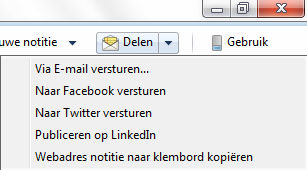
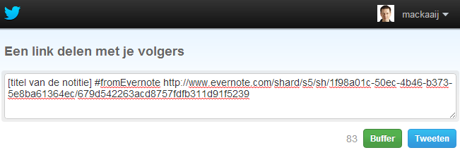

## Notities en notieboeken delen

Je kunt via Evernote notities delen. De ontvangers hoeven zelf geen Evernote te hebben. Je kunt ook een heel notitieboek delen. Zo deel je meerdere notities in een keer. In een gedeeld notitieboek kun je samenwerken met andere Evernote-gebruikers, zowel Free als Premium.

### Notities delen

In de Windows-client van Evernote kun je een geselecteerde notitie delen via de werkbalk of het rechtermuisknopmenu > Delen. In de andere interfaces gebruik je de standaardknop om te delen.

De knop Delen in de werkbalk deelt op de laatstgekozen manier via e-mail, Facebook, LinkedIn of Twitter - via het kleine driehoekje ernaast kun je hiertussen kiezen.

#### Notitie via e-mail versturen

Je kunt een notitie doorsturen vanuit Evernote doorsturen via e-mail. Via e-mail kun je zelfs meerdere notities in één keer delen. Hiervoor selecteer je de te versturen notities voordat je op de knop Delen drukt.

Evernote laat vervolgens een pop-up zien waarin je de geadresseerde kunt intypen. Je kunt in de pop-up meerdere mensen in één keer adresseren. Meerdere e-mailadressen moet je dan scheiden met een komma. Het bericht is zelfs te personaliseren met een onderwerp en een korte notitie. Verder kun je "Stuur mij een CC van deze e-mail" aanvinken om zelf een kopie van het e-mailbericht te ontvangen, zo weet je zeker dat het bericht is verstuurd.

Let wel: Evernote verstuurt een *kopie* van de notitie(s) in het e-mailbericht. Als je de notitie later bijwerkt dan krijgt de ontvanger de vernieuwde notitie *niet* vanzelf.

Als je werkt in een door iemand anders gedeeld notitieboek dan kun je de notities daarvan alleen maar delen via e-mail. De overige manieren van delen zijn daar uitgeschakeld.

#### Webadres notitie naar klembord kopiëren

Met de optie "Webadres notitie naar klembord kopiëren" synchroniseert Evernote de notitie eerst met de server.

Vervolgens staat er op je klembord (clipboard) een link naar de notitie in Evernote. Deze link kun je plakken met Ctrl+V (Windows) of Cmd+V (OS X), bijvoorbeeld in een e-mailbericht.

Zo'n link ziet er als volgt uit:

> http://www.evernote.com/shard/s5/sh/1f98a01c-50ec-4b46-b373-5e8ba61364ec/679d542263acd8757fdfb311d91f5239

Het voordeel van een link ten opzichte van een e-mailbericht versturen is dat de link altijd de laatste stand van zaken weergeeft. Met de knop Synchroniseren werk je de notitie bij op de Evernote-server.

Het adres van de notitie blijft hetzelfde als je later de link nog eens nodig hebt en klikt op "Webadres notitie naar klembord kopiëren".

#### Notitie naar Facebook, Linkedin of Twitter versturen

Bij het delen van een notitie via Facebook, LinkedIn of Twitter maakt Evernote ook een webadres aan. Het verschil met de optie "Webadres notitie naar klembord kopiëren" is dat Evernote een bericht opstelt welke je snel via het sociale netwerk kunt versturen. Bijvoorbeeld:

Je kunt het bericht altijd zelf nog aanpassen voordat je het verstuurt.

Na de eerstvolgende synchronisatie gedraagt het rechtermuisknopmenu Delen zich hetzelfde als notities die je deelde via "Webadres notitie naar klembord kopiëren". Je kunt na synchronisatie het webadres van de notitie rechtsreeks in Evernote opvragen of het delen van de notitie stopzetten.

#### Gedeelde notities en Google

Google komt de cryptische webadressen van notities niet zomaar op het spoor. Als je naar de notitie verwijst vanaf een webpagina die wel is geïndexeerd in Google dan zul je jouw notitie op termijn via de zoekmachine kunnen vinden.

Deze Google-zoekopdracht geeft geïndexeerde Evernote-notities en -notitieboeken weer:

> inurl:evernote.com/shard/

Het is overigens niet mogelijk om te zien wie een gedeelde notitie via een webadres heeft opgevraagd. Dit kan immers anoniem zijn. Evernote geeft je ook geen bezoekersstatistieken.

\newpage

#### Gedeelde notities terugvinden

In Evernote kun je al je gedeelde notities met een webadres terugvinden door te zoeken op:

> sharedate:*

Je kunt hier een opgeslagen zoekopdracht van maken. Zo kom je 'm af en toe tegen en kun je het delen van notities die niet meer nodig zijn stopzetten.

#### Delen notitie stopzetten

Je kunt het delen van de notitie in de Windows-client stopzetten via het rechtermuisknopmenu van de notitie > Delen > Delen stoppen. Op OS X en iOS gebruik je de standaardknop om te delen. In de webinterface klik je op de knop "Gedeeld".

Als de optie om het delen te stoppen nog niet actief is, synchroniseer Evernote dan eerst nog een keer.

In de pop-up moet je het stoppen met delen nog even bevestigen. De notitie wordt immers onbereikbaar gemaakt. Als je de notitie later opnieuw deelt dan krijgt deze een ander webadres.

### Notitieboek delen

Door met de rechtermuisknop op een notitieboek te klikken kun je deze delen. Zowel openbaar als alleen met andere Evernote-gebruikers.

Evernote Premium gebruikers hebben meer mogelijkheden bij het delen van notitieboeken. Evernote Free-gebruikers kunnen notitieboeken als alleen-lezen beschikbaar stellen en hebben dus alleen de eerste twee opties.

* Bekijk notities
* Notities en activiteiten bekijken
* Notities aanpassen
* Aanpassen en anderen uitnodigen

Je kunt een bericht toevoegen aan je uitnodiging en mensen toestaan zonder inloggen eerst gewoon even door de notities te bladeren.

Evernote doorzoekt standaard alle notitieboeken waar je toegang toe hebt. Je kunt de zoekopdracht toespitsen op notitieboeken van jezelf in het zoekvenster.

#### Koppeling met Google Contactpersonen

Als je gebruik maakt van Gmail of Google Contactpersonen dan kun je Evernote daar toegang toe geven. De e-mailadressen worden dan in het vervolg door Evernote automatisch aangevuld zodra je een deel van de naam intypt. Dit werkt ook met contactpersonen die je later toevoegt.

Via de webinterface van Evernote kun je [de verbinding met Google verbreken en verlengen](https://www.evernote.com/ConnectedServices.action "Evernote: Gekoppelde diensten").

#### Notitieboek openbaar delen

Je kunt notities eenvoudig delen met heel veel andere Evernote-gebruikers. Hiervoor gebruik je de optie "Maak een Openbare Link". Evernote maakt dan een zogenaamde "publieke link" aan die je doorstuurt naar andere Evernote-gebruikers.

Andere Evernote-gebruikers kunnen het openbare notitieboek toevoegen aan hun account met de knop "Lid worden van notitieboek". Zij kunnen geen wijzigingen maken in de notities maar alleen-lezen.

Iedere internetgebruiker kan een openbaar notitieboek bekijken door de link te volgen. Ze kunnen zelfs op de hoogte blijven via de standaard RSS feed die bij een openbaar notitieboek hoort. In het hoofdstuk "RSS feed op Openbare links" lees je hier meer over.

Met de knop "Nodig individuele personen uit" kun je alsnog extra Evernote-gebruikers van meer rechten voorzien. Bijvoorbeeld om samen met andere Evernote-gebruikers een openbaar notitieboek over een onderwerp op te bouwen.

Het openbaar delen van een notitieboek kun je altijd stoppen. Hiervoor gebruik je de optie "Openbare link verwijderen". Evernote-gebruikers die het notitieboek aan hun account hebben toegevoegd krijgen hier een melding van zodra zij het notitieboek openen. Notities die deze Evernote-gebruikers al hadden gedownload blijven beschikbaar.

### Activiteitenstroom volgen

Evernote stelt een Activiteitenstroom samen voor gebruikers van een notitieboek. Onder de knop Activiteit blijven zij op de hoogte van nieuwe gebruikers die toegang kregen tot het notitieboek plus nieuwe en gewijzigde notities.
