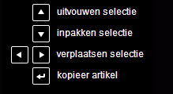
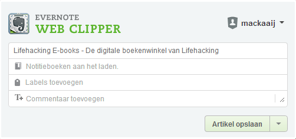
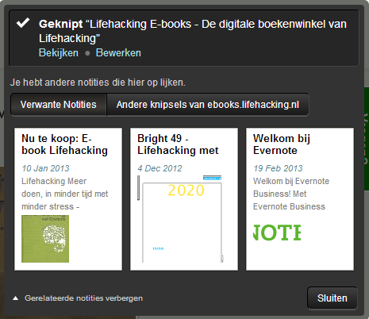
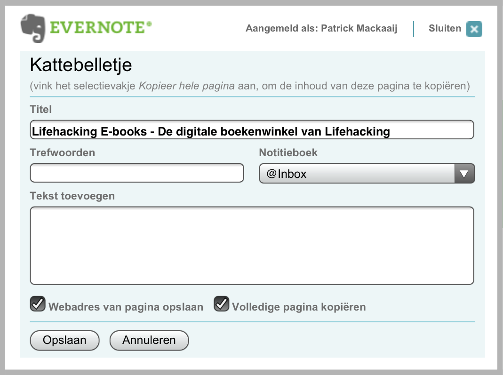
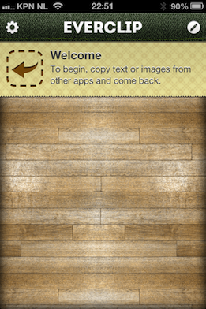

## Evernote-clippers

Clippen is het in Evernote bewaren van informatie die je op het scherm ziet. Het Engelstalige werkwoord *to clip* wordt bijvoorbeeld gebruikt voor het uitscheuren van coupons - *knipsels* dus.

Tijdens het webbrowsen stuit je vaak op informatie die je later terug wilt kunnen vinden of wilt gebruiken in een onderzoek. Deze *clip* je dan in Evernote. Evernote stelt *extensies* beschikbaar voor de meestgebruikte webbrowsers.

Voor andere webbrowsers kun je de *bookmarklet* van Evernote gebruiken om snel een webpagina in Evernote te bewaren.

Met een screenshot kun je de oorspronkelijke opmaak van webpagina's bij het clippen behouden. Een screenshot beperkt zich niet tot de webbrowser, je kunt er ook een "foto" van een willekeurige andere applicatie mee maken.

De losse applicatie [Evernote Skitch](http://evernote.com/skitch/ "Evernote Skitch") is handig voor het aanwijzen van dingen op foto's en clips. Lees verderop meer over Skitch.

### Evernote Webclipper Extensies

Evernote stelt extensies beschikbaar voor de webbrowsers Safari, Chrome, Firefox en Internet Explorer. Hiermee kun je snel (delen van) een webpagina bewaren als notitie in Evernote, inclusief webadres. Als je een PDF-document open hebt in je browser, dan bewaart Evernote deze als bijlage van de notitie.

De functionaliteiten van de webclippers verschillen per webbrowser. Zo stuurt de webclipper van Internet Explorer gegevens rechtstreeks naar het lokaal geïnstalleerde Evernote voor Windows. De webclippers voor Google Chrome en Safari hebben meer mogelijkheden. Die beschrijven we hier.

[Installeer de Webclipper van Evernote](http://evernote.com/webclipper "Evernote: Webclipper") op íeder apparaat én in álle webbrowsers die je gebruikt. De installatiepagina van de webclipper past zich automatisch aan je apparaat en webbrowser aan.

Onder Windows installeert Evernote de webclipper voor Internet Explorer automatisch mee met Evernote voor Windows. Op Mac OS X installeert Evernote de webclipper voor webbrowser Safari mee als je de installatie via de website van Evernote start. Als je Evernote hebt geïnstalleerd via de Mac App Store dan moet je de webclipper voor Safari zelf even installeren. En als je een andere webbrowser gebruikt dan Internet Explorer (onder Windows), Firefox, Chrome of Safari (onder OS X).

Als je klikt op de extra knop die zo'n extensie toevoegt aan je webbrowser dan scant deze de webpagina en probeert te herkennen wat je precies wilt bewaren. Evernote gaat ervan uit dat je de hoofdtekst van een artikel wilt bewaren en niet de navigatie-elementen.

Als je een artikel wilt bewaren laat Evernote hints zien in een pop-up. Je kunt de selectie snel aanpassen met de pijltjes op het toetsenbord. Met de pijltjes naar boven en naar beneden kun je het geselecteerde gedeelte vergroten of verkleinen. Met de pijltjes naar links en naar rechts kun je de selectie verplaatsen door herhalende elementen op dezelfde pagina.

Bewaar je regelmatig artikelen? Lees dan verderop meer over Evernote Clearly. Met Evernote Clearly maak je artikelen en webpagina's overzichtelijk en makkelijk leesbaar doordat de navigatie-elementen verdwijnen. Vanuit Evernote Clearly kun je het artikel ook clippen naar Evernote - en eventueel tekst arceren.

Als je eerst tekst selecteert en vervolgens op de extensie klikt, biedt de webclipper *Selectie opslaan* als optie. Je kunt altijd nog kiezen voor *Artikel opslaan* en een keuze maken zoals hiervoor beschreven.

Als je kiest voor *Volledige pagina opslaan* dan bewaart Evernote de hele pagina. Met *URL opslaan*  bewaart Evernote alleen de URL als notitie. Deze twee opties vind je eveneens door met de rechtermuisknop te klikken op een webpagina en te kiezen voor *Evernote Web Clipper*.

Via de instellingen van de extensie (rechtermuisknop > Opties) kun je aangeven wat de standaard handeling voor selecteren moet zijn: artikel, hele pagina, of URL. De artikelselectie met pijltjestoetsen kun je in- en uitschakelen - of zonder de hints laten werken.

Evernote suggereert de titel van de webpagina als titel voor de notitie. De titel kun je aanpassen. Op basis van andere notities die je hebt geclipt kan Evernote een notitieboek en/of labels suggereren - dit *Smart Filing* is instelbaar via de opties. Onder *Commentaar* kun je tekst toevoegen die bovenaan de notitie terecht komt. Als je op de webclipper klikt en de selectie en instellingen zijn goed dan kun je op Enter drukken om er direct een notitie van te maken.

Na het clippen zie je in een pop-up verwante notities. En met een druk op de knop kun je bladeren door andere knipsels die je op deze website hebt bewaard. Je kunt de notitie die je net hebt aangemaakt direct openen, bijvoorbeeld om te delen met anderen. Als je via de Opties het vinkje bij *Meldingen inschakelen* weg haalt dan laat Evernote deze pop-up niet zien.

De extensie kan een zoekopdracht die je uitvoert in onder andere Google, Bing of Yahoo gelijktijdig in Evernote uitvoeren. Bij de zoekresultaten zie je verwante resultaten in je persoonlijke notities. Regelmatig heb je al eerder geclipt wat je zoekt!

Links naar notities kun je laten openen in de webbrowser zelf óf in de Evernote-client op Windows of OS X. Kies bij Opties onder *Open notities in* voor respectievelijk Webprogramma of Desktopprogramma.

Tenslotte kun je in de opties aangeven of Evernote de opmaak van de webpagina moet meenemen. De webpagina blijft dan zoveel mogelijk in de oorspronkelijke staat. Tekst bewaren om later gemakkelijk te lezen of bewerken gaat gemakkelijker zonder opmaak. Het eerder genoemde Evernote Clearly is een uitstekende oplossing om overbodige elementen van het knipsel te verwijderen.

### Evernote bookmarklet

Voor sommige webbrowsers, zoals Safari onder iOS op je iPhone of iPad, kan Evernote wegens beperkingen van de leverancier van de webbrowser geen extensies maken. Er zijn ook webbrowsers die maar door een klein publiek worden gebruikt.

Op Android kun je alleen het webadres van een pagina bewaren in Evernote via de knop Menu > Meer > Pagina delen > Evernote.

De extensies voor de webbrowsers bieden veel meer functionaliteit dan de bookmarklet. Met de bookmarklet kun je alleen een webpagina omzetten in een nieuwe notitie. Het toevoegen van nieuwe notities is wel de belangrijkste functionaliteit. Voeg aan webbrowsers waar Evernote geen extensie voor heeft dus de bookmarklet toe.

De term "bookmarklet" is een samentrekking  van "bookmark" en "applet". Een applet is een klein (Javascript)-programma dat in een webbrowser draait. Een bookmark is een favoriet (bookmarkets werden ook favlets genoemd toen de term favorites meer in trek was).

Bij het clippen via een bookmarklet kun je de *titel*, *trefwoorden* (labels) en het *notitieboek* aanpassen. Verder kun je *tekst toevoegen* - deze bewaart Evernote bovenaan de nieuwe notitie. Met *Webadres van pagina opslaan* actief bewaart Evernote het webadres (de URL) van de pagina. De optie *Volledige pagina kopiëren* bewaart de hele pagina - het clippen kan dan langer duren dan alleen zelf een kattebelletje intypen. Als je zelf tekst selecteert vóórdat je de bookmarklet aanroept dan bewaart Evernote alleen de geselecteerde tekst. 

Volg het [stappenplan van Evernote om de bookmarklet toe te voegen aan Safari onder iOS](https://support.evernote.com/link/portal/16051/16058/Article/2517/Workarounds-for-Clipping-Web-Pages-into-Evernote-on-iOS "Workarounds for Clipping Web Pages into Evernote on iOS"). Of [voeg de bookmark van Evernote snel toe via iOS Bookmarklet](http://ctrlq.org/ios/ "Send to Evernote Bookmarklet"). Kies Evernote, bookmark de pagina en pas tenslotte de bookmark aan door alles voor "javascript" te verwijderen - *inclusief* het hekje #. Op je iPad kun je via de app Instellingen > Safari kiezen voor *Toon bladwijzerbalk altijd* zodat je de bookmarklet met één tik onder handbereik hebt.

Als alternatief kun je onder iOS een notitie aanmaken met alleen de URL erin. Als je die notitie opent in Evernote dan kun je vanuit Evernote de site opnieuw openen door op de link te klikken. Via het knopje Delen kun je de pagina dan doorsturen naar Evernote.

Als je veel bookmarklets gebruikt dan kan het menu of de balk met favorieten onoverzichtelijk worden. Overweeg dan [Quix](http://www.quixapp.com/ "Quix: Your Bookmarklets, On Steroids"). Quix opent een pop-up waarin je andere bookmarklets kunt openen met een trefwoord - zo nemen ze niet allemaal schermruimte in.

Met de Android-app [Bookmarklet Free](https://play.google.com/store/apps/details?id=com.kurtchen.android.bookmarklet.free&hl=nl "Google Play: Bookmarklet Free") kun je de bookmarklets van een aantal veelgebruikte websites, waaronder Evernote, toevoegen aan het menu *Pagina delen*. Als je Quix wilt gebruiken dan kun je geëxporteerde bookmarks van je PC inlezen met de app [MyBookmarks](http://www.rerware.com/MyBookmarks/ "Google Play: MyBookmarks").

### Screenshots voor het behouden van de opmaak

Webpagina's kunnen complex zijn in opbouw. Bij het clippen van een webpagina bewaart Evernote zoveel mogelijk van de oorspronkelijke opmaak in de notitie. De *exacte* vormgeving blijft meestal niet bewaard.

Als het belangrijk is de webpagina 100% in de oorspronkelijke layout te bewaren, stuur dan een screenshot van de pagina naar Evernote. Je maakt dan eigenlijk een fotonotitie. Als je de webpagina later nog terug wilt kunnen vinden dan is het handig om de URL handmatig als attribuut toe te voegen aan de notitie. Screenshots kun je natuurlijk van iedere willekeurige applicatie maken, niet alleen van de webbrowser.

Evernote installeert voor het snel maken van screenshots een clipper in Windows en OS X. Met Win+Printscreen (Windows) of Cmd+Ctrl+C (OS X) selecteer je snel een gedeelte van het scherm om te clippen. Onder Windows kun je de sneltoets veranderen via Extra > Opties > Sneltoetsen en via Extra > Knipselvoorkeuren instellen in welk notitieboek je dergelijke notities wilt bewaren. Onder OS X kun je alleen de sneltoets veranderen via Evernote > Voorkeuren > Sneltoetsen. Evernote opent in OS X een zogenaamde *Quick Note* waarin je snel aantekeningen kunt maken.

Van lange webpagina's die niet in één keer op het scherm passen kun je screenshots maken met tools als [Webpage Screenshot](https://chrome.google.com/webstore/detail/ckibcdccnfeookdmbahgiakhnjcddpki "Google Chrome Extension: Webpage Screenshot") (Google Chrome) of [Paparazzi!](http://derailer.org/paparazzi/ "Paparazzi!") (Mac OS X).

Een [schermafdruk maken op Android](http://www.androidplanet.nl/android-tips/basisfuncties/screenshot-maken-op-een-android-toestel/ "Planet Android: Screenshot maken op een Android-toestel") verschilt per toestel. Om [een screenshot te maken op iPhone en iPad](http://www.iphoneclub.nl/iphone-tips/basisfuncties/screenshot-maken-op-de-iphone/ "Screenshot maken op iPhone, iPod touch en iPad") houd je de knop Home ingedrukt waarna je kort op de sluimerknop drukt.

\newpage

### Sneller clippen met EverClip

Op iOS kun je de app [EverClip voor iPhone](http://clkuk.tradedoubler.com/click?p=24371&a=2064103&url==24371&a=2064103&url=https%3A%2F%2Fitunes.apple.com%2Fnl%2Fapp%2Feverclip-clip-to-evernote%2Fid536058926%3Fmt%3D8%26uo%3D4%26partnerId%3D2003 "iTunes: EverClip voor iPhone") of [iPad](http://clkuk.tradedoubler.com/click?p=24371&a=2064103&url==24371&a=2064103&url=https%3A%2F%2Fitunes.apple.com%2Fnl%2Fapp%2Feverclip-for-ipad-clip-to%2Fid618054123%3Fmt%3D8%26uo%3D4%26partnerId%3D2003 "iTunes: EverClip voor iPad") starten. EverClip vangt alles wat je kopieert af om door te sturen naar Evernote - ook vanuit andere apps dan Safari. Van webpagina's bewaart de app netjes het webadres.

Als je klaar bent met clippen, start je EverClip om de gegevens door te sturen naar Evernote. Open een clip voor een preview waaraan je eventueel labels kunt toevoegen. Tik vervolgens op het pictogram rechtsbovenin om een notitie in Evernote aan te maken.

Als je meerdere clips hebt gemaakt dan kun je deze vanuit de lijstweergave samenvoegen tot één notitie. Tik daarvoor rechtsboven op het potloodpictogram om te bewerken en tik vervolgens de notities in de gewenste volgorde aan. Vanuit deze weergave kun je met EverClip ook een foto toevoegen of maken, en een tekstnotitie meesturen.

Je kunt [in een korte video zien hoe EverClip werkt](http://clip.ignition.hk/ "EverClip: Video").

Via de instellingen van de app kun je opgeven in welk notitieboek je de clips standaard wilt bewaren en labels meegeven. Met *Sound Effects* kies je of je geluid wilt horen ter bevestiging dat EverClip het gekopieerde heeft ontvangen. *Timeout Notification* attendeert je op het afsluiten van EverClip als je een minuut of 10 niets hebt gekopieerd (de app sluit om je batterij te sparen). Met de optie *Download Clipped URL* actief haalt EverClip de hele webpagina binnen als je een URL kopieert. Met *Delete Clip on Sent* bepaal je of je clips automatisch uit EverClip wilt laten verwijderen na het doorsturen naar Evernote, of dat je dit liever handmatig doet. De optie *Separate Clips* bepaalt of samengevoegde clips in de notitie in Evernote van elkaar worden gescheiden met een horizontale lijn.

Voor Android is er [EverClip voor Android](https://play.google.com/store/apps/details?id=com.noinnion.android.everclip "Google Play: EverClip"). Hoewel deze app door andere ontwikkelaars is gemaakt is de werking in grote lijnen hetzelfde. Je kunt alleen geen notities migreren en de app sluit zichzelf niet af omdat Android dat niet afdwingt. De betaalde versie kan meer dan vijf items op het klembord vasthouden en laat geen reclame zien.
