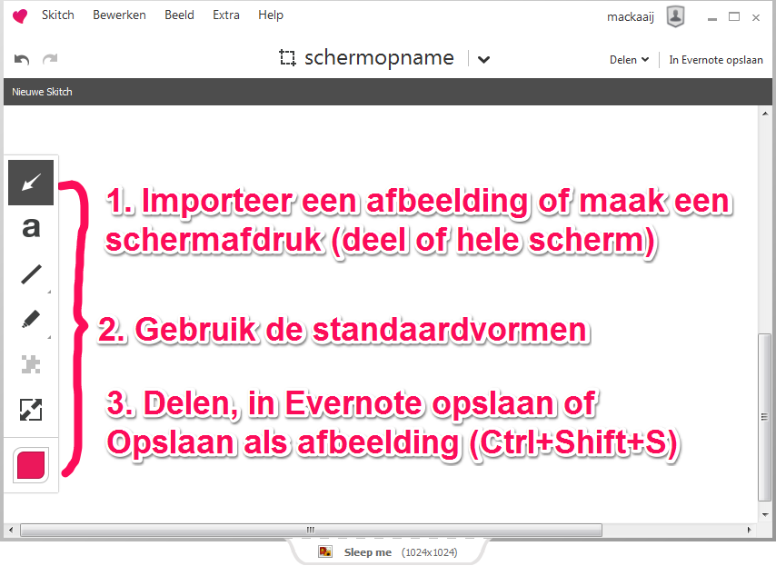
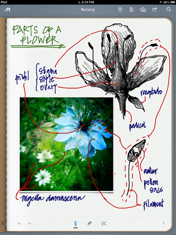
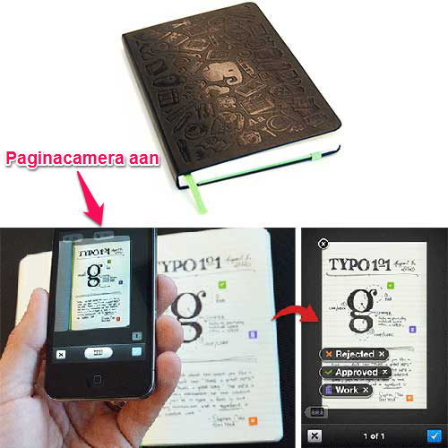
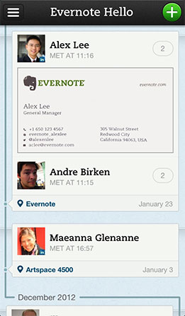
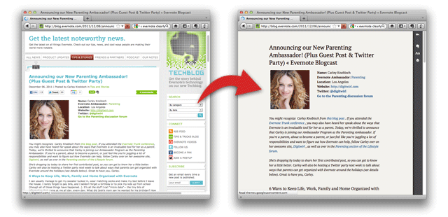
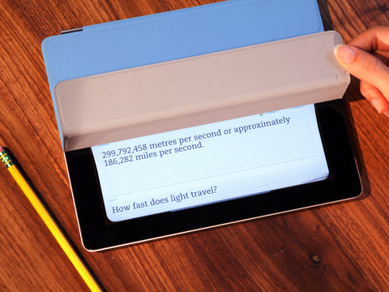

## Evernote-apps

Evernote stelt *gratis* een aantal losse applicaties voor specifieke doeleinden ter beschikking. Sommige zijn aangekocht, andere vanaf begin af aan zelf ontwikkeld.

[Evernote kocht takenlijst Egretlist](http://techcrunch.com/2012/01/24/evernote-bought-four-companies-last-year-and-almost-nobody-knew-about-it/ "Evernote Bought Four Companies Last Year And (Almost) Nobody Knew About It"), maar omdat de ontwikkelingen van deze applicatie sindsdien stil liggen besteden we hier verder geen aandacht aan.

### Skitch

Een plaatje zegt meer dan 1000 woorden. Dankzij [Skitch](http://evernote.com/skitch/ "Skitch") trek je snel de aandacht naar de juiste plek door aan te wijzen en te benoemen waar het om gaat of wat je wilt toelichten. De bewerkte afbeelding kun je opslaan op je computer of in Evernote. Je kunt de afbeelding delen met anderen via e-mail, LinkedIn, Twitter en Facebook.

Skitch heeft gereedschappen waarmee je snel kunt arceren en aanwijzen. Skitch biedt standaardvormen die je gemakkelijk kunt gebruiken zoals een pijl, vierkant, ellips, lijn en een basale kleurenkiezer. Je kunt ook tekenen uit de vrije hand en arceren met een markeerstift. Daarnaast kun je tekst toevoegen. Met het pixel-gereedschap kun je een deel van de afbeelding onherkenbaar maken. Tenslotte kun je een afbeelding bijsnijden (crop) om irrelevante delen weg te laten.

Skitch is beschikbaar voor iOS (iPad, iPhone en iPod Touch), Android, Mac OS X, Windows Desktop en Windows 8.

### Penultimate

Met [Penultimate](http://evernote.com/penultimate/ "Penultimate") kun je je iPad als schrift gebruiken. Schrijven en schetsen kun je met je vingers of een stylus doen. Door in te stellen of je links- of rechtshandig bent en hoe je je stylus vasthoudt voorkomt Penultimate ongewenste strepen van vingers of de rug van je hand.

Via de gereedschappen kun je kiezen voor ander papier dan de standaard ruitjes, bijvoorbeeld horizontale lijnen. Je kunt ook papiersoorten bestellen. Een aantal gelinieerde soorten zijn gratis. Voor papier voor foto's, taken, bladmuziek, tekenen of spelletjes betaal je per set eenmalig een bedrag.

Je kunt tien verschillende kleuren gebruiken en de pendikte nauwkeurig regelen. Om een tekening in te kleuren of over een ingeladen afbeelding heen te tekenen.

Met het knip-pictogram kun je eenvoudig een deel van de pagina omcirkelen en vervolgens verslepen naar een andere plek. Handig bij het maken van een schema of diagram. Foutjes gum je weg of maak je ongedaan.

Dankzij de synchronisatie met Evernote heb je je aantekeningen over tot je beschikking en kun je ze gemakkelijk delen. Doordat Evernote handgeschreven tekst vindbaar maakt (indexeert) kun je je aantekeningen snel terugvinden.

Een pagina deel je vanuit Penultimate via e-mail of Dropbox. Een notitieboek van meerdere pagina's verstuurt Penultimate als PDF.

### Evernote Smart Notebook

In samenwerking met Evernote heeft Moleskine een speciaal papieren notitieboek gemaakt: het [Evernote Smart Notebook](http://evernote.com/moleskine/ "Evernote Smart Notebook"). Het gaat hier dus niet om een app maar om mooie *papieren* notitieboekjes om aantekeningen in te maken.

Je kunt met Evernote natuurlijk ook op gewoon papier, een flipover of een whiteboard schrijven en daar een foto van maken. Evernote zal deze handgeschreven tekst ook vindbaar maken. Als je foto's maakt van aantekeningen in een Evernote Smart Notebook met de standaard Evernote-app dan heb je een paar extra mogelijkheden. Hiervoor zet je vlak voordat je de foto maakt de optie *Paginacamera* (Page Camera) aan.

Evernote herkent de bladzijde uit een Evernote Smart Notebook. Als eerste zal het een onder een hoek gefotografeerde pagina recht zetten, schaduw verwijderen en contrast verhogen waardoor de handschriftherkenning beter werkt. Vervolgens worden zogenaamde *Slimme stickers* (Smart Stickers) herkend. Via de instellingen in de Evernote-app kun je een notitieboek en label koppelen aan een sticker. Zo worden je pagina's direct handig bewaard. De Smart Stickers levert Moleskine mee met het notitieboekje. Je kunt ze plakken op iedere pagina.

Bij de aanschaf van ieder notitieboek krijg je een code voor een kwartaal (extra) Evernote Premium.

### Evernote Hello

Met [Evernote Hello](http://evernote.com/hello/ "Evernote Hello") leg je chronologisch vast *wie* je *wanneer* en *waar* tijdens een *bijeenkomst* hebt ontmoet.

Vanuit het startscherm kun je in een tijdslijn bladeren door je eerdere ontmoetingen. Als je doorklikt op een ontmoeting dan zie je verwante notities én andere contactpersonen uit je Evernote Hello-account. Samen met een rijk profiel helpt Evernote Hello je zo herinneringen boven te halen.

Met het plus-pictogram rechtsbovenin leg je snel een nieuwe ontmoeting vast.

Nieuwe contactpersonen kun je handmatig toevoegen. Of geef je smartphone even uit handen en laat je contactpersoon het zelf doen. Kies vanuit je bestaande contactpersonen of vul het e-mailadres in. Als je Evernote Hello hebt gekoppeld met Facebook en LinkedIn dan worden gegevens mogelijk al automatisch aangevuld op basis van informatie uit online profielen. Neem eventueel een foto en vul gegevens aan.

Met een Evernote Premium-account kun je een foto van een visitekaartje maken waarna Evernote Hello automatisch de naam, het telefoonnummer, e-mailadres en andere belangrijke gegevens detecteert en bewaart. Leg het visitekaartje op een contrasterende ondergrond en neem de foto onder een hoek om reflectie van de flits te voorkomen - Evernote Hello trekt de foto zelf recht.

Om snel ontmoetingen vast te leggen kun je Evernote Hello toegang geven tot je agenda. Je afspraken staan dan in beeld en vanuit de gekoppelde genodigden uit je agenda kun je de aanwezigen aanvinken. Aan een ontmoeting kun je tekstuele aantekeningen en foto's toevoegen.

Ontmoetingen met een groep andere gebruikers van Evernote Hello kun je snel vastleggen met de functie *Hello Connect*. Eén persoon trapt af waarna de smartphones met geluid de namen van de aanwezige contactpersonen uitwisselen. Bekijk de [videodemonstratie van Hello Connect](https://www.youtube.com/watch?v=BoUmcj23hzs "YouTube: Hello Connect").

Evernote Hello is beschikbaar voor iPhone en iPod (werkt ook op iPad) en Android.

### Evernote Food

[Evernote Food](http://evernote.com/food/ "Evernote Food") helpt je met het ontdekken van recepten. Zoek op gerechten of ingrediënten waar je trek in hebt of blader door foto's van gerechten.

Met een druk op de knop bewaar je recepten in je persoonlijke kookboek. Evernote Food je recepten automatisch vindbaar, ook als je ze met de Evernote Web Clipper hebt geclipt. Vanuit "Mijn kookboek" kun je de recepten delen via Facebook en Twitter.

Notities die Evernote onterecht als recept heeft aangemerkt kun je verbergen met "Geen recept?". Andersom kun je via de instellingen expliciet notitieboeken en labels kiezen waarin je recepten opslaat - al de betrokken notities worden toegevoegd aan jouw kookboek.

Met Evernote Food kun je restaurants in de buurt vinden en aan een lijst toevoegen.

Tenslotte kun je met Evernote Food eenvoudig vastleggen en delen wat je hebt gegeten. Inclusief foto's, bijschriften, locaties, labels en andere notities.

Evernote Food is beschikbaar voor iOS (iPad, iPhone en iPod Touch) en Android.

> Evernote Food is vertaald naar het Nederlands maar maakt helaas nog geen gebruik van websites met Nederlandstalige gerechten. De database van restaurants komt uit FourSquare en daar zijn lang niet alle Nederlandse restaurants te vinden. Restaurants reserveren is alleen mogelijk als deze zijn aangesloten bij [OpenTable](http://www.opentable.com/ "OpenTable") - ten tijde van dit boek waren er geen restaurants in Nederland te vinden.

### Evernote Clearly

[Evernote Clearly](http://evernote.com/clearly/ "Evernote Clearly") maakt artikelen en webpagina's overzichtelijk en makkelijk leesbaar. Met een druk op de knop clip je een artikel in Evernote. Dankzij de synchronisatie van Evernote kun je het artikel op ieder apparaat later terugvinden of op een rustig moment lezen.

Als je het Evernote Clearly activeert met het leeslamp-pictogram of via de rechtermuisknop dan verdwijnen alle navigatie-elementen van de webpagina. Afbeeldingen en video's die bij de tekst horen blijven wel gewoon staan. Zo kun je je volledig concentreren op het lezen van de tekst.

> Je kunt de pagina ook in deze staat afdrukken waarbij Evernote Clearly de linkjes nummert en onderaan de pagina opneemt.

Met het markeerstift-pictogram kun je tekst arceren. Zodra je dat doet bewaart Evernote het artikel automatisch. Als je meer tekst arceert dan werkt Evernote de notitie daarop bij.

Je kunt een artikel ook handmatig clippen naar Evernote. Dat kan direct met de Evernote-knop in het menu van Evernote Clearly. Je hebt de Evernote Web Clipper er niet voor nodig want een selectie van het artikel is immers al gemaakt.

Bij het bewaren van een artikel kan Evernote op basis van eerdere notities die je hebt geclipt een notitieboek en/of labels toepassen. Dit *Smart Filing* gebeurt, in tegenstelling tot de Evernote Web Clipper, zonder tussenkomst van een pop-up en is instelbaar via de opties.

> In webbrowser Google Chrome kan Evernote Clearly een artikel voorlezen. Nederlands is mogelijk maar klinkt net iets meer als een robot dan Engels.

De weergave van Evernote Clearly is instelbaar. Kies uit een van de standaard standaard thema's of stel het lettertype, -grootte en kleuren handmatig naar wens in. Onderaan de pagina kan Evernote Clearly verwante notities uit Evernote laten zien.

### Evernote Peek

Met [Evernote Peek](http://evernote.com/peek/ "Evernote Peek") kun je jezelf overhoren met de magnetische beschermhoes (Smart Cover) van de iPad2+ aan de hand van notities uit Evernote. Handig als je tijdens studeren of om namen van mensen uit je hoofd te leren de kracht van herhaling nodig hebt. Op de originele iPad werkt Evernote Peek ook, dan bedien je een "virtuele" Smart Cover met je vinger.

Als je de Smart Cover een stukje optilt verschijnt de vraag. Het antwoord verschijnt als je de Smart Cover verder oprolt. Sluit de Smart Cover en til 'm weer een stukje op voor de volgende vraag. Deze verschijnt naar wens willekeurig of gesorteerd op datum of titel. Vragen waarbij je het vinkje "Incorrect" aantikt krijg je later nog een keer voorgeschoteld. [Bekijk de demonstratievideo van Evernote Peek.](http://www.youtube.com/watch?v=vqVjruCt6yg "YouTube: Evernote Peek")

Evernote Peek werkt met notities uit een notitieboek. De vraag formuleer je in maximaal 50 tekens in de titel van een notitie, het antwoord in maximaal 250 tekens als notitie. Je kunt ook geluid toevoegen aan een notitie – Evernote Peek speelt deze dan af bij de vraag.

Er worden een aantal notitieboeken door Evernote en *StudyBlue* meegeleverd zodat je direct met de applicatie aan de slag kunt.

Het verhaal achter Evernote Peek is ook leuk om te vertellen. De ontwikkelaars waren zo enthousiast over de magnetische Smart Cover van de iPad en het feit dat apps erop kunnen reageren dat ze er een app omheen bedachten. Ze kwamen op "peek" (spieken) en de app volgde.
