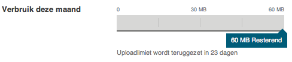
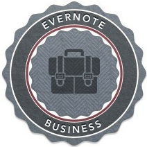

## Evernote-accounts

Evernote werkt met het Freemium-verdienmodel. Freemium is een samentrekking van de "free" en "premium" en draait om een goede balans tussen gratis en betalende gebruikers. Belangrijke factoren zijn een groot aantal potentiële gebruikers, lage bedrijfskosten en een product of dienst die waarde toevoegt en op de lange termijn van betekenis blijft.

Het [Freemium-model werkt goed voor Evernote](http://www.fastcompany.com/1659121/evernote-ceo-phil-libins-3-steps-freemium-success "Evernote CEO Phil Libin's 3 Steps to Freemium Success") doordat het tientallen miljoenen eindgebruikers heeft waarvan een deel op termijn de meerwaarde van Premium inziet. Evernote ziet het percentage betalende gebruikers als indicator voor de kwaliteit van de gratis versie en streeft ernaar dit onder de 5% houden.

Evernote is erop berekend winstgevend te zijn met 1% Premium gebruikers. Een half jaar na het aanmaken van een account heeft 0,5% van de gebruikers voor Premium gekozen. Een jaar na het aanmaken van een account is dat percentage opgelopen tot 1% en na twee jaar 6%.

Zo'n 2% van *alle* Evernote-gebruikers heeft een betaald account, dus de gratis versie voldoet. Gebruikers kiezen niet eens zozeer voor Evernote-Premium door de extra functionaliteiten, die zo nu en dan worden uitgebreid. De vele herinneringen die in deze handige tool van dit sympathieke bedrijf zijn opgeslagen maakt van gebruikers ambassadeurs.

Educatieve instellingen krijgen 50% korting op Evernote-Premium met *Evernote for Schools*. Voor zakelijke gebruikers is slim samenwerken, gezamenlijke facturering en beheer en ondersteuning beschikbaar via *Evernote Business*.

### Evernote Free

In de gratis versie van Evernote mag je *iedere 30 dagen opnieuw* 60 MB opslaan. Hiermee kun je flink vooruit, zeker als je vooral webpagina’s en tekst bewaart en niet al te veel afbeeldingen/foto’s of audio. In 60 MB passen bijvoorbeeld 30.000 tekst notities, 400 clips van webpagina’s, 60 audio notities of 16 hogeresolutie-foto’s.

Evernote opent af en toe een pop-up om je te attenderen op het feit dat je richting de 60 MB gaat. In iedere Evernote-app kun je je maandelijkse gebruik opvragen. Je krijgt dan een voortgangsbalk met het verbruik van de lopende maand ten opzichte van je uploadlimiet zoals hieronder.

De Windows- en OSX-clients van Evernote laten aan Free-gebruikers advertenties zien. Evernote heeft vertrouwelijkheid hoog in het vaandel staan. De advertenties worden dus niet gekozen op basis van de inhoud van je notities. Evernote gebruikt alleen advertenties van aanvullende producten en diensten. Voornamelijk uit de galerij waar we in hoofdstuk twee van dit boek ook een greep uit doen.

### Evernote Premium

Gebruikers van [Evernote-Premium](http://evernote.com/premium/ "Evernote Premium") zijn mensen die het intensief gebruiken, meer opslagruimte nodig hebben en gegevens offline op hun smartphone of tablet willen zetten. Veelal zijn het ook ambassadeurs die graag bijdragen aan het voortbestaan van het bedrijf. De extra's van Evernote zijn voor hen bedoeld, Evernote-Free voldoet voor het gros van de gebruikers.

Evernote Premium kost €5 per maand, of €40 als je een jaar vooruit betaalt. Daarvoor krijg je:

* Iedere maand 1GB opslagruimte, Evernote Free heeft 60MB.
* 100MB opslagruimte per notitie, in Evernote Free is de limiet 25MB.
* Versiegeschiedenis op notities.
* Doorzoekbare PDF-bestanden, ook als deze gescand zijn zonder OCR software (dus niet searchable waren).
* Doorzoekbare documenten van Microsoft Office, iWork en OpenOffice.
* Snellere tekstherkenning voor je afbeeldingen (gratis accounts sluiten achter in de rij en wachten minuten in plaats van seconden).
* Snellere reactie van Evernote Support (gratis accounts sluiten ook hier achter in de rij aan). 
* Chat met Evernote Support (Engelstalig, bereikbaar tussen 18:00 – 02:00 Nederlandse tijd).
* Offline toegang tot je notitieboeken, handig voor smartphone en tablet (per notitieboek instelbaar).
* Evernote geeft verwante notities uit andere notitieboeken weer.
* Optionele pincode op de mobiele app (handig als je die al niet op het apparaat zelf hebt).
* Schrijfrechten geven op gedeelde notitieboeken (met een gratis account kun je read-only delen).
* Mogelijkheid om de advertenties te verbergen.
* Visitekaartjes scannen en met de gegevens direct contactpersonen aanmaken met Evernote Hello.

####  Versiegeschiedenis op notities

Evernote controleert enkele keren per dag (dus niet na elke mutatie) of je notities hebt gewijzigd. Van de gewijzigde notities maakt Evernote een kopie die je via de webinterface kunt inzien en downloaden. Ook kun je de oude versie van een notitie weer in gebruik nemen. Deze oude versies tellen qua opslagruimte niet mee in het maandverbruik.

#### Opslagruimte eenmalig verhogen met 1GB

Als Evernote Premium gebruiker kun je een keer krap in je opslagruimte zitten omdat je bijvoorbeeld je papieren archief in één keer door digitaliseert. Je kunt dan wachten tot de maand voorbij is of je uploadlimiet in de lopende maand met 1GB verhogen door €5 bij te betalen.

#### Naadloze terugval naar Evernote Free

Als je niet verlengt dan valt Evernote naadloos terug op Evernote-Free. De notities die je al in Evernote had staan blijven dus gewoon werken zoals ze deden. PDF-bestanden die dankzij Evernote Premium zijn geïndexeerd blijven gewoon vindbaar.

Je kunt je opslagruimte op deze manier maximaal 5x per maand en maximaal 25 keer per jaar ophogen.

### Betalen met PayPal of creditcard

Betalen kan bij Evernote via PayPal of een creditcard van Mastercard, Visa of American Express (AMEX). Een PayPal account kun je gratis openen en [koppelen aan je bankrekening](https://www.paypal-nederland.nl/particulier/start/rekening-koppelen.html "PayPal: Bankrekening koppelen en bevestigen"). Met PayPal kun je zo online betalingen verrichten die direct van je bankrekening worden afgeschreven - zonder creditcard.

### Evernote cadeau of een paar maanden gratis

Voor €45 kun je iemand een jaar Evernote Premium cadeau doen. Ook handig als iemand geen PayPal en creditcard heeft.

Soms krijg je een paar maanden Evernote Premium cadeau bij een aan Evernote gerelateerd product zoals een [Moleskine Smart Notebook](http://evernote.com/moleskine/ "Evernote Smart Notebook") of Livescribe Sky Smartpen. Of is Evernote onderdeel van een bundel aan applicaties. Goed om in de gaten te houden want de maanden worden gewoon netjes toegevoegd aan je abonnement.
    
### Evernote voor scholen

Gebruikers van educatieve instellingen krijgen met minimaal drie Evernote Premium gebruikers 50% korting op de maandelijkse prijs. Lees voor meer informatie [de eisen om als educatieve instelling gezien te worden](http://evernote.com/intl/nl/schools/ "Evernote voor scholen").

\newpage

### Evernote zakelijk

[Evernote Zakelijk](http://evernote.com/business/ "Evernote Business") is bedoeld voor mensen die in een vast verband samenwerken. Evernote for Business is opgezet vanuit de gedachte dat je met je privé-account lid wordt van een zakelijk account. Je eigen notitieboeken blijven privé en je kunt samenwerken in notitieboeken die je deelt met het team. Terwijl je notities typt laat Evernote op basis van trefwoorden verwante notities van binnen het team zien. Zo ontsluit je het collectieve geheugen en ontdek je wat jouw collega’s weten. En als je uit dienst gaat, dan heb je gewoon geen toegang meer tot de zakelijke notitieboeken en val je terug op je eigen Free- of Premium-abonnement.

Evernote Zakelijk kost €10 per gebruiker per maand. Daarvoor krijg je alles van Evernote Premium, plus:

* Iedere maand 2GB opslagruimte, Evernote Premium heeft 1GB.
* Iedere maand 2GB extra opslagruimte per gebruiker voor de zakelijke notitieboeken.
* Gebruik van je zakelijk e-mailadres om notities uit een zakelijk notitieboek te delen via e-mail.
* Evernote doorzoekt de zakelijke notitieboeken waar je lid van bent.
* Evernote geeft verwante notities uit zakelijke notitieboeken waar je lid van bent weer.
* Evernote webclipper extensies in de webbrowser geven tijdens het zoeken in bijvoorbeeld Google verwante notities uit zakelijke notitieboeken waar je lid van bent weer.

Qua beheer kunnen Evernote-gebruikers lid worden van Evernote Zakelijk op basis van hun e-mailadres. Goedkeuring kan automatisch of handmatig plaatsvinden. Betalen kan per maand waarbij Evernote het aantal actieve gebruikers in rekening brengt, of per jaar waarbij je voor een overeengekomen aantal gebruikers vooruit betaalt.
  
Zakelijke notitieboeken zijn in eerste instantie zichtbaar voor de maker en de beheerder. Vervolgens kunnen ze worden gedeeld met andere Evernote-gebruikers. Ook buiten het bedrijf. Beheerders kunnen zakelijke notitieboeken aanbevelen, deze staan dan prominent bovenaan de lijst van notitieboeken wat handig is om ze onder de aandacht van nieuwe teamleden te brengen.

Stap je over van Free of Premium naar Business? Weet dat je met de Evernote-clients voor Windows en OS X notities kunt selecteren om snel te kopiëren of verplaatsen naar zakelijke notitieboeken. Zo profiteer je snel van al elkaars eerder verzamelde informatie.

Notities die je uit je zakelijke notitieboeken verwijdert komen in de prullenbak van het bedrijf terecht. Beheerders kunnen deze doorzoeken zodat ze ter ondersteuning snel een notitie terug kunnen vinden om te herstellen (restore). Beheerders legen periodiek de prullenbak door notities definitief te verwijderen. Om het beheer van de prullenbak te vereenvoudigen zien beheerders naast de titel en de inhoud van de notitie uit welk notitieboek de notitie is verwijderd, op welke datum en door wie.

Vanaf 10 gebruikers kun je gebruik maken van telefonische ondersteuning.

### Conclusie

Het verdienmodel van Evernote zit goed in elkaar. Daarbij voldoet Evernote Free voor de meeste gebruikers. Als je regelmatig een stukje maand over hebt aan het einde van je uploadlimiet dan is het echt tijd voor Evernote Premium. Tegen die tijd zie je daar dan ook zeker de meerwaarde van in. Educatieve instellingen profiteren daarbij van een schappelijke korting van 50%. Zakelijke gebruikers kunnen ontdekken wat hun teamgenoten weten met Evernote Business. En belangrijk: het overstappen tussen de verschillende varianten is laagdrempelig waarbij je altijd toegang tot je eigen notities behoudt.
