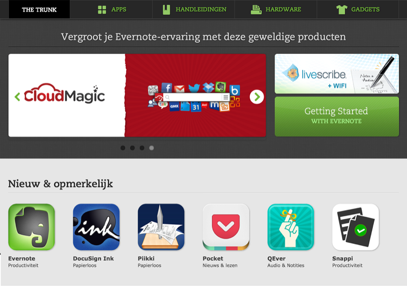
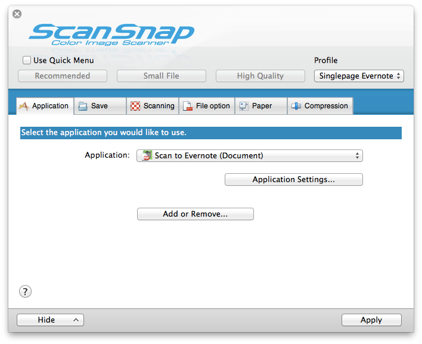
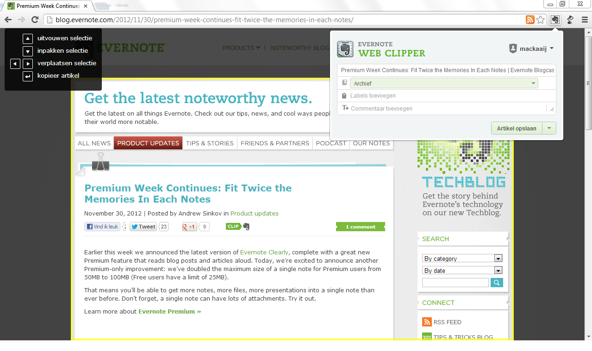

# De Evernote Galerij

Met 40+ miljoen gebruikers wereldwijd is Evernote een interessant programma voor andere ontwikkelaars om op verder te bouwen of een aansluiting mee te maken. [Evernote Trunk](http://trunk.evernote.com/nl) bracht in 2010 flink wat uitbreidingen op de diensten van Evernote. De Evernote Trunk - op de Nederlandstalige versies van Evernote de *Galerij* genaamd - kun je zien als de Evernote Appstore zoals Apple en Google deze hebben voor hun mobiele besturingsysteem. De galerij is een onderdeel binnen Evernote waar je kunt zoeken naar applicaties en diensten om je gebruik van Evernote te verbeteren en te koppelen aan andere diensten die je wellicht al gebruikt. Zo kun je er webclippers vinden voor exotische browsers, mogelijkheden om je to-do lijsten aan Evernote te knopen of extra mobiele applicaties om nog sneller foto’s of teksten in Evernote te zetten.

De galerij is geen webwinkel waar je direct afrekent, maar eerder een wegwijzer naar andere plekken op het web waar je uitbreidingen en software kunt aanschaffen en downloaden. We zullen hier een aantal interessante uitbreidingen bespreken, maar neem zeker zelf een kijkje in de galerij om iets van je gading te vinden. De galerij krijgt constant updates met nieuwe software en diensten, dus ga er zeker eens terug om op de hoogte te blijven. Doordat de prijzen van apps regelmatig veranderen (soms zelfs van betaald naar gratis) noemen we die hier niet. Je kunt de galerij openen via de knop Galerij in Evernote of via [de website](http://trunk.evernote.com/nl). Er zit inhoudelijk geen verschil in de twee.

*Hou er rekening mee dat niet alle uitbreidingen en toevoegingen in de galerij op alle platformen werken. Dit staat per toepassing aangegeven in de galerij onder het kopje „platform”*.

## Apps in de Galerij
De galerij is in vier categorieën opgedeeld zodat je makkelijker kunt zoeken: 

* **Apps**: Evernote heeft zowel de mobiele apps als desktop-apps bij elkaar geplaatst en ze verdeeld in de manier van gebruik. Van het maken van notities tot het papierloze leven en productiviteitsapps.
* **Hardware**: Scanners en andere apparaten die naadloos met Evernote samenwerken.
* **Handleidingen**: Een overzicht van internationale handleidingen en (e)boeken over het gebruik van Evernote.  
* **Gadgets**: T-shirts, stickers, wallpapers en andere leuke hebbedingen van Evernote. Inclusief het slimme notitieboek van Moleskine, dat met Evernote samenwerkt.

### Apps
Wil je Evernote in zijn volle kracht benutten dan is het gebruik van extra applicaties, of apps, zeker aan te raden. Evernote is voor alle grote platformen beschikbaar: Windows/Windows 7 Phone, iOS/OSX, Android, Blackberry en WebOS. Zowel in de opslag als het doorzoeken zijn de mobiele apps erg krachtig. Even een bonnetje fotograferen voor de administratie, een idee voor je woning of een URL die je nog eens wilt bekijken bewaren. Veel mobiele applicaties bieden de mogelijkheid om artikelen en informatie direct in Evernote op te slaan. Dit maakt het mogelijk om een leeslijst in Evernote te maken of om relevante berichten snel op te slaan voor onderzoek of eigen opslag.   
De Galerij is ingedeeld in categorieën, gebaseerd op het soort werk dat je wilt doen. We geven per categorie onze aanrader

#### Audio & Notities

* **FastEver apps:** Deze [iPad en smartphone apps](http://clkuk.tradedoubler.com/click?p=24371&a=2064103&url=http%3A%2F%2Fitunes.apple.com%2Fnl%2Fapp%2Ffastever-quickly-create-evernote%2Fid364580273%3Fmt%3D8%26uo%3D4%26partnerId%3D2003) zijn gemaakt met één specifiek doel: Zo snel mogelijk en zonder omwegen een foto of tekst in Evernote zetten. Deze apps werken sneller om "even iets" in Evernote te zetten, dan Evernote zelf. Je geeft eenmalig toestemming aan de apps om notities voor je te maken en plaatsen, daarna kun je met een druk op de knop nieuwe ideeën toevoegen. 
* **Braintoss**: Deze [Nederlandse iOS app](http://lifehacking.nl/algemeen/braintoss-stuurt-je-gedachten-snel-van-telefoon-naar-inbox/) maakt het zeer eenvoudig om direct snelle notities in Evernote te zetten. 

#### Nieuws & lezen
* **Pocket (Voorheen Read it Later)**: Fraaie leesmap voor artikelen en blogposts die je nog eens wilt bekijken en mogelijk opslaan in Evernote. [iOS](http://clkuk.tradedoubler.com/click?p=24371&a=2064103&url=http%3A%2F%2Fitunes.apple.com%2Fnl%2Fapp%2Fpocket-formerly-read-it-later%2Fid309601447%3Fmt%3D8%26uo%3D4%26partnerId%3D2003) en [Android](https://play.google.com/store/apps/details?id=com.ideashower.readitlater.pro&hl=en)
* **Reeder**: Met Reeder kun je nieuws lezen door je te abonneren op de RSS-feeds van je favoriete websites. Vanuit Reeder kun je artikelen direct bewaren in je standaard notitieboek in Evernote. [iPhone](http://clkuk.tradedoubler.com/click?p=24371&a=2064103&url=https%3A%2F%2Fitunes.apple.com%2Fnl%2Fapp%2Freeder%2Fid325502379%3Fmt%3D8%26uo%3D4%26partnerId%3D2003) en [iPad](http://clkuk.tradedoubler.com/click?p=24371&a=2064103&url=https%3A%2F%2Fitunes.apple.com%2Fnl%2Fapp%2Freeder-for-ipad%2Fid375661689%3Fmt%3D8%26uo%3D4%26partnerId%3D2003).

#### Productiviteit
* **Quickoffice Pro HD**: Een prima manier om documenten te maken die compatibel zijn met Microsoft Office. Je kunt documenten direct vanuit Evernote openen en weer opslaan. [Quickoffice Pro HD](http://clkuk.tradedoubler.com/click?p=24371&a=2064103&url=http%3A%2F%2Fitunes.apple.com%2Fnl%2Fapp%2Fquickoffice-pro-hd-edit-office%2Fid376212724%3Fmt%3D8%26uo%3D4%26partnerId%3D2003) werkt prima op de iPad. 
* **IFTTT**: Met [If This Then That](http://evernote.com/intl/nl/trunk/?lang=nl&layout=intl&url=items/ifttt&source=desktop_page) kun je diverse webdiensten aan elkaar knopen om zo nieuwe archieven aan te maken of informatie op te slaan. Sla je Instagram-foto's of Foursquare check-ins op in Evernote via IFTTT. 

#### Reizen & Leven
* **PlaceMe**: Een applicatie die automatisch de plaatsen opslaat die je vaak bezoekt en in een Evernote notitieboek plaatst. [iOS](http://clkuk.tradedoubler.com/click?p=24371&a=2064103&url=http%3A%2F%2Fitunes.apple.com%2Fnl%2Fapp%2Fplaceme%2Fid501165259%3Fmt%3D8%26uo%3D4%26partnerId%3D2003) en [Android](https://market.android.com/details?id=com.alohar)
* **Punchfork**: Sla online recepten direct op in Evernote via [deze visuele zoekmachine](http://trunk.evernote.com/nl/app/punchfork/web-apps). 

#### Papierloos
* **Docscanner**: Mobiele telefoons komen vrijwel allemaal met een camera. Met DocScanner kun je een foto van je document maken en deze direct (OCR) inscannen en in Evernote zetten. [iOS](http://clkuk.tradedoubler.com/click?p=24371&a=2064103&url=http%3A%2F%2Fitunes.apple.com%2Fnl%2Fapp%2Fdocscanner%2Fid312391317%3Fmt%3D8%26uo%3D4%26partnerId%3D2003) en [Android](https://market.android.com/details?id=docscanner.main)
* **OfficeDrop**: Deze [bureaubladapplicatie](http://www.officedrop.com/) kan overweg met scanners die de industrie-standaard TWAIN ondersteunen. Zo kun je scans direct vanuit je scanner opslaan in Evernote, zonder ze eerst in een mapje op te vangen. Je kunt standaard notitieboeken opgeven en de labels die de PDF krijgt. 

#### Tekenen & handschrift
* **Skitch**: Officieel een applicatie van Evernote zelf, maar nog altijd goed op zichzelf bruikbaar. Maak snel screenshots met annotaties en deel ze in verschillende applicaties. Of sla ze direct op in Evernote. [iOS](http://clkuk.tradedoubler.com/click?p=24371&a=2064103&url=http%3A%2F%2Fitunes.apple.com%2Fnl%2Fapp%2Fskitch-for-ipad%2Fid490505997%3Fmt%3D8%26uo%3D4%26partnerId%3D2003) en [Android](https://play.google.com/store/apps/details?id=com.evernote.skitch)
* **Colorstache**: Een [unieke manier](http://www.colorstache.com/) om door je Evernote database te zoeken: op kleur. Probeer het eens.

## Hardware
Meest in het oog springend voor deze categorie zijn de scanners. Steeds meer scanners bieden de mogelijkheid om scans direct naar Evernote op te slaan. Zo kun je heel snel je administratie digitaliseren en minder in fysieke mappen opslaan. De eerste stap naar een papierloze werkplek?    

Onze aanraders:

* **Fujitsu ScanSnap**: Een [slanke en snelle scanner](http://trunk.evernote.com/nl/hardware/fujitsu-scansnap) die je documenten direct in Evernote opslaat. Door het slanke uiterlijk is het een ideale scanner om mee te nemen in je tas voor een mobiele werkplek.  
* **Livescribe Smartpen**: De [Livescribe](http://trunk.evernote.com/nl/hardware/livescribe-smartpens) is niet zomaar een pen. Deze elektronische pen zet je handgeschreven notities om in digitale bestanden. In combinatie met het geluid wat de pen kan opnemen kun je zo een compleet verslag van een bijeenkomst in Evernote opslaan. Je handgeschreven notities worden door de OCR technologie in Evernote doorzoekbaar.
* **Eye-Fi**: Met de smartphones van nu is het niet altijd meer nodig, maar de [Eye-Fi SD-kaart](http://trunk.evernote.com/nl/hardware/eye-fi) is ideaal voor fotografen die hun foto's direct van de camera via wifi in Evernote willen opslaan.
* **Whitelines**: Een speciale vermelding willen we geven aan Whitelines. Deze staan niet in de Galerij, maar zijn zeker de moeite van [het bezoeken en bekijken](http://whitelines.se/link/) waard. Met de papieren notitieboeken van Whitelines kun je een directe koppeling met Evernote maken. Je handgeschreven aantekeningen komen door de markeringen op het papier netjes gescand in Evernote terecht. Een mooi alternatief voor Evernote's eigen Moleskine-notitieboeken.

## Overig
Evernote is meer dan alleen een programma op je computer. Je kunt in dit deel van de galerij Premium accounts aanschaffen, handboeken, stickers en t-shirts. Alles om je leven volledig Evernote-ready te maken!    
Onze aanraders:   

* **Evernote Premium**: Wil je optimaal gebruik maken van Evernote, dan is het [Premium](http://evernote.com/intl/nl/premium/) abonnement een must. Voldoende opslagruimte, verbeterde beveiliging, doorzoekbare PDF's, OCR herkenning in afbeeldingen en reclame-vrij. Tevens kun je geselecteerde notitieboeken offline opslaan op je telefoon of tablet, voor als je even geen internettoegang hebt.
* **Evernote podcast**: De [Evernote podcast](http://blog.evernote.com/category/podcast/) is een onregelmatige serie audio-interviews en -gesprekken met het Evernote team, voornamelijk de CEO Phil Libin en Andrew Sinkov (Marketing). Soms wat langdradig maar altijd vol met handige tips en ideeën hoe je Evernote kunt gebruiken.
* **Evernote stickerpakket**: Omdat [stickers](http://trunk.evernote.com/nl/gear/evernote-sticker-pack1) altijd goed zijn.

## Gebruik van spullen uit de Galerij
Hoe kun je nu slim gebruik maken van de aanvullingen uit de galerij of van de koppelingen met andere diensten? In dit boek zul je meer voorbeelden vinden, maar we geven er nu al een paar:

### Scannen naar Evernote
Je zult de waarde van Evernote echt gaan zien als je eenmaal begint met het inscannen van je administratie. Hiermee maak je niet alleen je eigen werkomgeving meer opgeruimd maar je hebt voortaan altijd je administratie bij de hand. 
De Fujitsu Scansnap is een aanrader als je een scanner wilt die naadloos met Evernote samenwerkt. De Scansnap is klein, handzaam en heeft al direct een koppeling aan Evernote ingebouwd.

In de ScanSnap manager geef je aan of je de scan als losse notitie wilt opslaan (met OCR) of als notitie met de scan als bijlage. 
Pak de scanner uit, sluit hem aan en je kunt starten met het inscannen naar Evernote. Hoofdstuk 3 geeft je meer tips en inzichten hoe je dit slim kunt inzetten

### Favoriete artikelen opslaan
De webclipper is één van de krachtigste elementen van Evernote. Voor elke grote browser is een extensie of plugin te downloaden waarmee je snel en eenvoudig delen van een webpagina kunt opslaan in Evernote. Hoe je de extensie installeert lees je in hoofdstuk 1.15.

Als je online een interessant artikel tegenkomt wat je later nog eens wilt gebruiken druk je op de webclipper. Eventueel moet je nog inloggen in Evernote.
Na het inloggen doet de clipper een voorstel welk deel van de pagina hij moet opslaan. De clipper is slim genoeg om 99% van de tijd exact het juiste artikeldeel te selecteren. Mocht het nog niet helemaal kloppen, dan kun je met de pijltoetsen de selectie verplaatsen of uitbreiden. Let op bij dit laatste: Dit kun je alleen de eerste 5-7 seconden doen na je op de clipper hebt gedrukt.

In de popup van de clipper kun je aangeven in welk notitieblok je de notitie wilt zetten, met welke labels en je kunt zelf nog iets toevoegen aan de notitie. De labels worden automatisch aangevuld als je begint met typen, zo voorkom je meerdere versies van hetzelfde label. Na het opslaan krijg je een overzicht van mogelijk relevante clips in je bestaande Evernote database die bij je nieuwe clip horen. Bij een goede verzameling kan dit je op onverwachte en interessante ideeën brengen.
Met de webclipper kun je een verzameling opbouwen van favoriete artikelen of je online onderzoek makkelijk verzamelen en organiseren. Evernote biedt voor alle grote browsers een [webclipper](http://evernote.com/webclipper/) aan. 

Een extra functionaliteit van de webclipper is de koppeling met zoekmachines Google, Yahoo en Bing. Als je bij een van deze drie zoekt in de browser waar je de Webclipper extensie hebt geïnstalleerd, dan zal Evernote tegelijk zoeken in je eigen database. Je krijgt naast je zoekresultaten van het internet direct resultaten uit je eigen Evernote database.

### Nozbe en Evernote
Getting Things Done (GTD) is een productiviteits-systematiek bestaande uit vijf stappen. Eén van deze stappen behelst het organiseren en opslaan van projectinformatie. Evernote is hier een uitstekende oplossing voor. Maar hoe kun je makkelijk je projectinformatie aan je taken en acties knopen? Daar komt [Nozbe](http://nozbe.com) om de hoek kijken. Deze GTD-applicatie (online, desktop en mobiel beschikbaar) biedt de mogelijkheid om Evernote aan je Nozbe-account te koppelen. Hiermee kun je per project aangeven welk notitieboek of label uit Evernote gebruikt wordt. Bij de eerste verbinding zoekt Nozbe door Evernote naar relevante labels voor projecten en contexten, in plaats dat het direct nieuwe, aparte notitieboeken aanmaakt per project of in een andere vorm. Dit geeft maximale flexibiliteit in de integratie. Tevens kun je in Nozbe je bestanden in Evernote hernoemen, nieuwe labels geven, in andere projecten zetten of nieuwe contexts geven. Een instructievideo vind je op [Lifehacking](http://lifehacking.nl/web20/nozbe-en-evernote-werken-nu-samen/)

## Zoeken in de Galerij
Helaas mist de Galerij nog een goede zoekfunctie. Je zult elk onderdeel zelf door moeten spitten om op zoek te gaan naar de juiste extensie of uitbreiding voor Evernote. Zolang de ontwikkelaars van Evernote zelf geen zoekmachine maken kunnen we gebruik maken van Google. We hebben voor een aantal specifieke termen alvast de zoektermen op een rij gezet. Hiermee kun je direct zoeken in de Evernote Galerij. Doe er je voordeel mee!

Zoek in de Evernote Galerij op:

* [iPhone](https://www.google.com/search?q=site%3Awww.evernote.com%2Fabout%2Ftrunk%2F+iphone)
* [iPad](https://www.google.com/search?q=site%3Awww.evernote.com%2Fabout%2Ftrunk%2F+ipad)
* [Android](https://www.google.com/search?q=site%3Awww.evernote.com%2Fabout%2Ftrunk%2F+android)
* [Blackberry](https://www.google.com/search?q=site%3Awww.evernote.com%2Fabout%2Ftrunk%2F+blackberry)
* [Windows](https://www.google.com/search?q=site%3Awww.evernote.com%2Fabout%2Ftrunk%2F+windows)
* [Mac](https://www.google.com/search?q=site%3Awww.evernote.com%2Fabout%2Ftrunk%2F+mac)
* [Twitter](https://www.google.com/search?q=site%3Awww.evernote.com%2Fabout%2Ftrunk%2F+twitter)

De Galerij van Evernote is een portaal dat voortdurend verder groeit met nieuwe diensten en koppelingen. Nu Evernote de [Devcup Challenge](http://devcup.evernote.com/) heeft komen er veel nieuwe interessante koppelingen van vele individuele ontwikkelaars. De Galerij is een belangrijke bron om in de gaten te houden voor een optimaal gebruik van Evernote.
