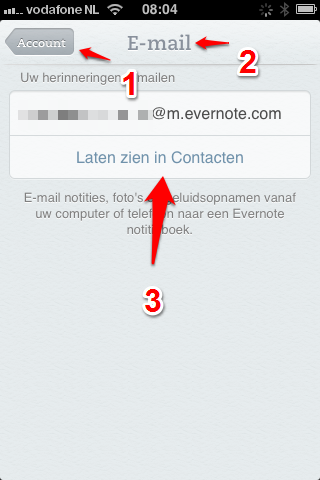
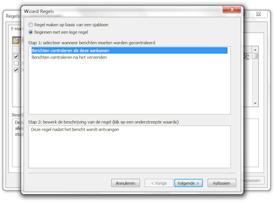
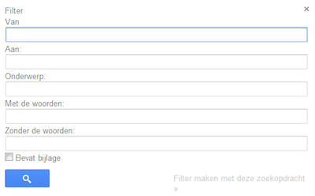
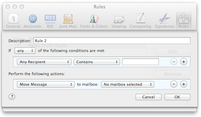

## Evernote en e-mailen

E-mailberichten die je wilt bewaren in Evernote kun je doorsturen naar je eigen Evernote e-mailadres. Omdat dat een ingewikkeld e-mailadres is om te onthouden is het sowieso handig om deze onder de naam "Evernote" toe te voegen als contactpersoon. Zo kun je snel iets doorsturen naar "Evernote".

Tip: Ben je Premium-abonnee, dan kun je via de klantenservice van Evernote een zelf te kiezen e-mailadres aanvragen: <code>[naamvanmijnkeuze]@m.evernote.com</code>.

In hoofdstuk 1.10 *Evernote en e-mail* staat meer te lezen over jouw unieke e-mailadres in Evernote.

### E-mailfilters gebruiken

De e-mailberichten die je periodiek ontvangt en altijd in Evernote wilt bewaren kun je ook *automatisch* laten doorsturen naar jouw Evernote. De meeste e-mailprogramma's hebben daar een filter-instelling voor, die kun je gebruiken om ervoor te zorgen dat niet ál je e-mail in Evernote terecht komt.

Met filters kun je berichten die in je Postvak IN verschijnen, maar handiger ter naslag in Evernote kunnen staan, daar vanzelf terecht laten komen. Bijvoorbeeld administratieve digitale post, zoals facturen van online winkels, afschriften van Paypal, de maandelijkse factuur van de App Store en terugkerende notificaties van diensten. Je wilt deze bewaren voor je eigen financiële administratie en het liefst op zo'n manier dat je er later altijd bij kunt. Daarvoor heb je Evernote.

Helaas kun je bij het automatisch doorsturen van e-mail het onderwerp niet uitbreiden met extra tekst om de notitie direct te voorzien van labels en in het juiste notitieboek te plaatsen. Je zult dat nog wel handmatig moeten doen in Evernote.

>Tip: Je kunt ook de webservice [IFTT.com](http://ifttt.com/wtf) gebruiken om informatie *automagisch* te laten doorsturen naar Evernote. Dan kun je wél een notitieboek en labels meegeven. In hoofdstuk 3.7 kun je hier meer over lezen.

Er zijn veel mailprogramma's en het is onmogelijk om voor elk programma apart de stappen uit te leggen. We beperken ons tot Microsoft Outlook, Google Gmail en Mail for Mac, drie veelgebruikte mailprogramma's.

#### Microsoft Outlook

Je kunt specifieke e-mailberichten doorsturen naar Evernote door een regel aan te maken in Outlook.

1. Kies uit het menu Extra de optie "Regels en waarschuwingen".
2. Selecteer "Beginnen met een lege regel" en klik op de knop Volgende.
3. Vink in het bovenste deel van het scherm (Stap 1) de opties aan met een zoekopdracht die de juiste e-mailberichten oplevert, bijvoorbeeld afkomstig van personen of distributielijst.
4. Klik in het onderste deel van het scherm (Stap 2) op de blauwe link en vul de waarden in, bijvoorbeeld het e-mailadres van de afzender. Klik op de knop Volgende.
5. Vink in het bovenste deel van het scherm (Stap 1) de optie "stuur het bericht door naar personen of distributielijst" aan.
6. Klik in het onderste deel van het scherm (Stap 2) op de blauwe link "personen of distributielijst" en vul het e-mailadres van Evernote in achter "Aan ->". Klik op de knop OK. Klik op de knop Volgende.
7. Vink in het bovenste deel van het scherm (Stap 1) de indien nodig uitzonderingen aan en specificeer deze weer nader in het onderste deel van het scherm (Stap 2). Klik op de knop Volgende.
8. Geef de regel een herkenbare naam en kies eventueel voor "Deze regel nu toepassen op berichten die al aanwezig zijn in Inbox". Klik op de knop Voltooien.
9. Sluit het scherm "Regels en waarschuwingen" met de knop "OK".

#### Google Gmail

Je kunt alleen e-mail doorsturen vanuit Gmail naar e-mailadressen die je na verificatie hebt toegevoegd aan Gmail. Om het e-mailadres van Evernote toe te voegen aan Gmail doorloop je de volgende stappen:

1. Achterhaal het e-mailadres van jouw Evernote-account via de [instellingen van Evernote](https://www.evernote.com/Settings.action).
2. Ga in Gmail naar Instellingen > Doorsturen en POP/IMAP.
3. Klik op "Een doorstuuradres toevoegen" en vul het Evernote e-mailadres in.
4. Gmail stuurt een bevestigingscode naar het e-mailadres van  Evernote om de toestemming te verifiëren. Open dit e-mailbericht, het is te vinden in het standaard notititieboek in Evernote.
5. Kopieer de bevestigingscode uit de notitie in Evernote (Ctrl+C) en plak deze in de instellingen van Gmail. Klik op "Controleren".

Zorg ervoor dat "Doorsturen uitschakelen" is gekozen, tenzij je wilt dat Gmail ál je e-mail doorstuurt naar Evernote. Je kunt specifieke e-mailberichten doorsturen naar Evernote door een filter aan te maken in Gmail.

Zo stel je vervolgens een filter in Gmail in:

1. Ga naar Instellingen > Filters
2. Kies "Nieuw filter maken".
3. Vul het formulier in met een zoekopdracht die de juiste e-mailberichten oplevert, bijvoorbeeld op basis van het e-mailadres van de afzender.
4. Test de zoekopdracht met de knop met het vergrootglas. Vanuit de zoekopdracht kun je via Meer > "Berichten zoals deze filteren" weer terug naar filterinstellingen.
5. Klik op "Filter maken met deze zoekopdracht".
6. Vink "Doorsturen aan" aan en kies het e-mailadres van Evernote. Je kunt het e-mailbericht ook direct als gelezen markeren, archiveren of verwijderen.
7. Kies je Evernote adres.

#### Apple Mail

Je kunt specifieke e-mailberichten doorsturen naar Evernote door een Rule aan te maken in Apple Mail.

1. Open de instellingen van Mail via Preferences en klik op het tabblad Rules.
2. Klik op de knop "Add Rule".
3. Geef de regel achter Description een herkenbare naam.
4. Voeg achter "If any/all of the following conditions are met" de velden "From" of "Subject" toe. Gebruik "Contains" als je op een deel van de tekst wilt filteren (bijvoorbeeld de domeinnaam "@bol.com"), gebruik "Is equal to" als je de hele tekst wilt vergelijken.
5. Voeg achter "Perform the following actions" de optie "Forward Message" toe en vul het e-mailadres van Evernote in achter "to". Klik op de knop OK.
6. Kies of je de regel wilt uitvoeren op de e-mailberichten die nú in je inbox staan (Apply) of niet (Don't Apply).
7. Sluit de instellingen.

### Evernote handmatig vullen via e-mail

Je kunt echt van alles wat digitaal is *via e-mail* opslaan in Evernote.

We geven 10 voorbeelden van informatie die je naar jouw e-mailadres in Evernote kunt sturen:

- **Afbeeldingen** e-mailen vanaf schijf of vanuit fotoalbums. Zo bewaar je in Evernote een enkele afbeelding of een heel album in een notitie.
* **Blogs en artikelen** e-mailen vanuit een feedreader. Zo bewaar je artikelen vanuitje feedreader in Evernote om later te lezen of beschikbaar te houden.
- **Documenten** e-mailen vanaf schijf of vanuit readers en tekstverwerkers. Zo bewaar je in Evernote tekst, downloads en e-books. 
- **E-mails** direct na ontvangst doorsturen vanuit jouw Postvak IN. Zo bewaar je in Evernote per e-mail ontvangen vergaderdossiers en andere e-mails, die je niet meteen afhandelt of verwijdert.
- **Knip-en-plak** selecties uit bestanden en vanaf het web in een lege e-mail. Zo bewaar je in Evernote gedeeltes van tekst of afbeeldingen uit documenten, e-mails en websites.
- **Notities** schrijven direct in een nieuwe bericht of in jouw favoriete tekstverwerker. Zo bewaar je in Evernote zelf geschreven notities in de door jou gewenste opmaak.
- **Presentaties** e-mailen direct na productie. Zo bewaar je in Evernote bijvoorbeeld presentaties direct vanuit Powerpoint.
* **Scans** e-mailen vanaf de scanner. Zo bewaar je bijvoorbeeld in Evernote scans van bonnetjes, knipsels of brieven. Zie ook hoofdstuk 3.3.
- **Tweets** e-mailen vanuit Twitter. Zo heb je die interessante tweets altijd in Evernote bij de hand. 
- **Webadressen** (URL's) vanuit een browser. Zo bewaar je in Evernote bookmarks waar je later nog wat mee wilt doen.

Evernote en e-mail passen goed bij elkaar. E-mail is altijd beschikbaar op PC, notebook, tablets en smartphones. Vanuit vele apps kun je informatie exporteren via e-mail. Informatie en gegevens in Evernote zetten gaat snel en gemakkelijk met e-mail. Staat jouw e-mailadres van Evernote eenmaal in je adresboek, dan zul je binnen de kortste keren de meeste e-mails naar dat adres versturen!
