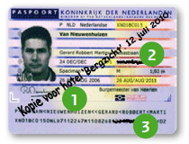
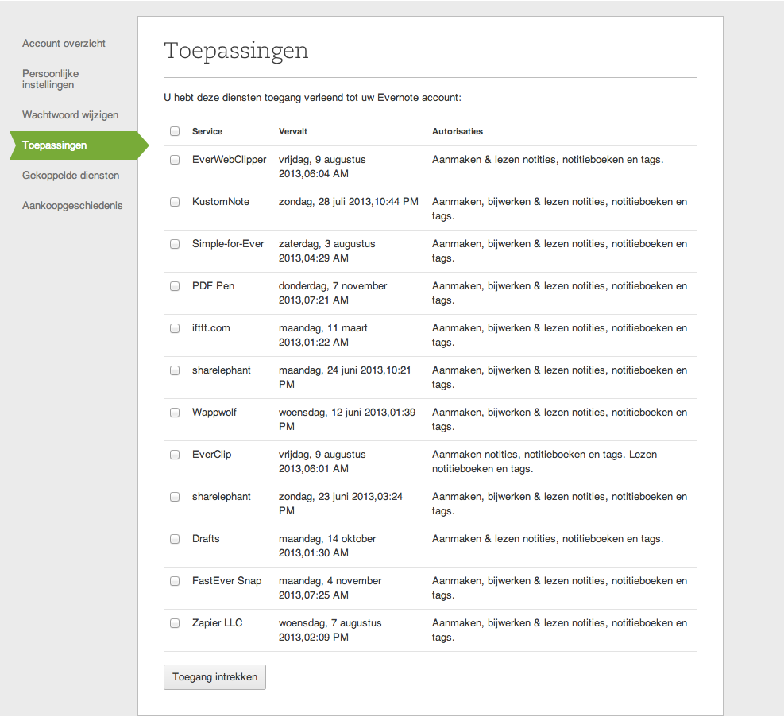

## Evernote en officiële documenten

>Een waargebeurd verhaal: Een docent staat in de Apple store in Amsterdam om een aankoop te doen. Omdat hij in aanmerking komt voor een onderwijskorting, had de medewerker een bewijs nodig dat hij  daadwerkelijk in het onderwijs werkzaam is. De docent had er niet op gerekend, dus had geen factuur, contract of ander bewijsmateriaal meegenomen. Ineens bedacht hij zich dat hij in Evernote al zijn contracten scant en opslaat. In de winkel kon hij inloggen op de website van Evernote en binnen 30 seconden had hij een PDF met het contract gevonden die de medewerker kon uitprinten om de korting te geven.

Evernote is ideaal om een backup te maken van officiële documenten. Je weet maar nooit wanneer je je paspoort, geboortecertificaat, btw-nummer, KvK-uitreksel of contract nodig hebt om te overleggen in een gesprek. Hoe kun je dit nu slim aanpakken? En moet je werkelijk *alles* inscannen aan officiële documenten? In dit hoofdstuk geven we je een aantal tips hoe je op een veilige en *bewuste* manier officiële documenten kunt gebruiken in Evernote. Tevens gaan we kort in op de veiligheid van Evernote.

### Welke documenten sla je op in Evernote?
In eerdere hoofdstukken hebben we je al laten zien dat je verschillende documenten in Evernote kunt opslaan. Uiteraard kun je hier diverse officiële documenten aan toevoegen. Zonder compleet te willen zijn, de volgende gegevens *kun* je in Evernote opslaan:

* Paspoort (inclusief het exemplaar van je partner)
* Identiteitskaart
* Medische informatie
* Verzekeringspolissen
* Zakelijke contracten
* Loyaltycards van winkelketens
* Rijbewijs
* Autopapieren
* Papieren voor de reisverzekering
* Kopie van reisbescheiden
* Garantiebewijzen
* Facturen
* Jaarafrekeningen van electriciteitsbedrijf
* Belastingpapieren
 
### Hoe zet je ze in Evernote? 
De meeste officiële papieren komen per post bij je binnen. Je kunt ze daarom het beste inscannen op je desktop PC of met een app als [DocScanner](http://clkuk.tradedoubler.com/click?p=24371&a=2064103&url=http%3A%2F%2Fitunes.apple.com%2Fnl%2Fapp%2Fdocscanner%2Fid312391317%3Fmt%3D8%26uo%3D4%26partnerId%3D2003) vanaf je mobiele apparaten.

De documenten die je als bijlage per e-mail binnenkrijgt, kun je naar het e-mailadres van jouw Evernote doorsturen. Maak hier slim gebruik van de onderwerpregel om de documenten direct op de juiste plaats te zetten en de juiste labels te geven.

*Stel*: je krijgt een polis voor je inboedelverzekering binnen als bijlage bij een e-mail. De onderwerpregel is "Uw verzekeringspolis voor 2012 - 2013". In plaats van dit direct door te sturen verander je de onderwerpregel in "Inboedelverzekering 2012 - 2013 @administratie #verzekering #polis".
Zo krijg je in Evernote in het notitieboek *administratie* een notitie met de titel "Inboedelverzekering 2012 - 2013" met de labels *verzekering* en *polis*. Met een opgeslagen zoekopdracht voor je verzekeringspapieren kun je zo direct de juiste polis weer tevoorschijn halen. Met diensten als IFTTT.com en Zapier.com kun je dit nog verder automatiseren. In hoofdstuk 3.7 vertellen we je hoe je dit nog makkelijker kunt doen.

### Hoe vind je ze terug?
 
De kracht van Evernote is het vlot en makkelijk terugvinden van de juiste documenten. Daarom bewaar je een digitale kopie in Evernote. Het open karakter van Evernote geeft je verschillende mogelijkheden om de documenten weer terug te vinden:
 
* **Apart notitieboek** - Sla al je belangrijke documenten op in een apart notitieboek "Officiele documenten" of een vergelijkbare term. Zo heb je alle documenten bij elkaar. 
* **Labels** - Geef je documenten dezelfde labels. Omdat Evernote labels automatisch aanvult kun je hier niet snel de mist mee in gaan. 
* **Opgeslagen zoekopdracht** - Met een opgeslagen zoekopdracht kun je met één druk op de knop complexe zoekopdrachten doen in je collectie notities. Wil je bijvoorbeeld alle inscande documenten verzamelen uit je Inbox met het label "factuur" van de laatste twee weken? Dan gebruik je de zoekopdracht "notebook:inbox tag:factuur created:week-2 resource:application/PDF". Deze zoekopdracht sla je op in Evernote zodat je er met één druk op de knop bij kunt.

De zoekopdracht ziet er misschien ingewikkeld uit. We breken hem op in delen:

* **Notebook:Inbox** - Hiermee zoek je in het notitieboek genaamd "Inbox".
* **Tag:factuur** - Je zoekt op een specifiek label.
* **Created:Week-2** - De zoekoperator "Created" zoekt op de aanmaakdatum van de notitie. Hiermee zoek je op alles wat tot twee weken terug is aangemaakt.
* **resource:application/PDF** - Met deze operator zoek je specifiek op een eigenschap van de notitie, namelijk dat hij een PDF bevat. We gebruiken hier de standaard MIME-types. Er zijn [honderden van deze types](http://hul.harvard.edu/ois/systems/wax/wax-public-help/mimetypes.htm), zodat je altijd wel het bestandsformaat van je gading terug kunt vinden.

Hoofdstuk 1.9 beschrijft in stappen hoe je een "Opgeslagen zoekopdracht" kunt maken, opslaan en wijzigen.

#### Gebruikscase
Eén van de manieren waarop je Evernote kunt gebruiken om naar een papierloze administratie te gaan is met de volgende werkstroom:

1. Scan alle binnenkomende, nog te betalen rekeningen in
2. Sla ze op in Evernote in de map "Administratie" en geef ze de juiste labels zoals de naam van de leverancier en mogelijk een extra categorie (belasting, dierenarts, verzekering etc)
3. Geef de rekening tevens het label "betalen". Dit betekent dat het een rekening is die nog openstaat
4. Maak een Opgeslagen zoekopdracht met de volgende termen: "notebook:administratie tag:betalen resource:application/pdf"
5. Sleep de Opgeslagen zoekopdracht naar je favorietenbalk in Evernote
6. Nu kun je elke week met één druk op de knop zien wat de openstaande rekeningen zijn. Hier kun je dan actie op ondernemen. Elke rekening die je betaalt geef je het label "betaald" en je verwijdert het label "betalen". Zo hou je het overzicht schoon.

### Aandachtspunten voor officiële documenten

Het is één om webknipsels en scans van je favoriete recepten in Evernote te zetten. Het is iets anders om officiële documenten in Evernote te plaatsen, waar mogelijk privacy-gevoelige informatie op aanwezig is. Wij raden iedereen aan om zelf de juiste en afgewogen beslissing te maken wat je wel en niet in software als Evernote plaatst en waar je je nog lekker bij voelt. Neem hierin de volgende overwegingen mee:

  * Evernote is *géén* vervanging voor de officiële papieren versies. Je hebt nog altijd je normale paspoort nodig als je door de douane wilt.
  * Denk aan het versleutelen (encrypt) van je documenten bij gevoelige informatie. Dit doe je door alles in je notitie te selecteren en met de rechtermuisknop te kiezen voor "Versleutel geselecteerde tekst".
  * Let op met wie je specifieke notitieboeken deelt als er gevoelige informatie in staat.
  * Maak specifieke notities offline beschikbaar op je mobiele telefoon voor snelle toegang zonder internetverbinding.
  * Je kunt niet *altijd* een scan van een officieel document gebruiken. Bij postagentschappen nemen ze gescande paspoorten of identiteitskaarten niet aan als je een pakket moet ophalen. Hiervoor *moet* je altijd het originele document bij je hebben.
  * Kies voor lokale notitieboeken. Deze worden niet gesynchroniseerd bij Evernote maar zijn wél lokaal doorzoekbaar.

> Tip: Maak met Skitch een "specimen" watermerk voor je officiële documenten. Je kunt tevens irrelevante gegevens, zoals een BSN-nummer, op je paspoort gerust doorstrepen. Bij veel instanties hebben ze die niet nodig. Op je paspoort staat tweemaal je BSN-nummer. Streep deze beide door en maak met Skitch een tekst over de scan heen die duidelijk maakt waar het voor is. De overheid heeft meer [tips om identiteitsfraude tegen te gaan met gescande documenten](http://www.overheid.nl/identiteitsfraude).

### Over de veiligheid van Evernote
Met deze methode zet je veel informatie in één applicatie bij elkaar. Van medische informatie tot je paspoort en contracten met rekeningnummers. Hier zit een risico aan. Als de accounts van Evernote worden gehackt door kwaadwillenden is het mogelijk dat je slachtoffer wordt van identiteitsdiefstal. Dit is een realistisch scenario gezien de groeiende populariteit van Evernote en het aantal aanvallen op grote netwerken en databases met persoonlijke informatie van gebruikers. Wij stellen daarom met klem dat je goed moet nadenken of je deze tips in zijn totaliteit volgt of dat je een afgewogen beslissing maakt om bepaalde documenten *niet* in Evernote op te slaan. Zeg niet dat we je niet hebben gewaarschuwd... 

Evernote doet er veel aan om *jouw* data veilig op te slaan en beschikbaar te stellen. Ze gaan hierbij uit van [drie regels](http://blog.evernote.com/2011/03/24/evernote%E2%80%99s-three-laws-of-data-protection/):

1. *Jouw data zijn van jou*: Evernote is niet de eigenaar van jouw data. Door data in Evernote te zetten, geef je ze wel toestemming om technische handelingen met je notities te verrichten zodat ze hun service kunnen verlenen. Zo mogen ze een backup van de data maken, ze indexeren voor zoekopdrachten, over een netwerk verzenden en op je telefoon tonen. Maar je blijft te allen tijden eigenaar van jouw eigen data.
2. *Jouw data zijn beveiligd*: Alles wat je in Evernote zet is standaard privé informatie. De medewerkers van Evernote kijken er niet naar, analyseren het niet, delen het niet, gebruiken ze niet om doelgericht te adverteren etcetera. Tenzij je specifiek toestemming geeft om dat te doen. Je bent niet verplicht om data te delen of te publiceren via gedeelde notitieboeken. Tevens kun je altijd [zien hoe je jouw data deelt met andere applicaties en een autorisatie intrekken](https://www.evernote.com/AuthorizedServices.action). Tenslotte neemt Evernote meerdere maatregelen om verlies en diefstal van je data tegen te gaan. Alles is opgeslagen in beveiligde data centers met meerdere servers, opslagmedia en *off-site* backups. Wachtwoorden worden niet op de server opgeslagen en communicatie tussen Evernote clients en servers is versleuteld via SSL industrie standaarden.
3. *Jouw data zijn draagbaar*: Evernote kent geen *data-lock*. Met de desktop software kun je al je notities exporteren in meerdere formaten. Jouw data staan zowel lokaal op je eigen computer als op de servers bij Evernote. Zo heb je altijd een eigen kopie van jouw data. Op de Mac zijn jouw data zelfs doorzoekbaar in Spotlight of in de Finder vindbaar. In de map 
/Users/USERNAME/Library/Application Support/Evernote/accounts/Evernote/ACCOUNTNAME/content vind je submappen met alle individuele notities. Hier kun je naar hartenlust in bladeren en rondkijken. Let wel op dat je geen items tussen de mappen verplaatst of verwijdert. Je loopt dan het gevaar dat de database corrupt raakt en Evernote niet goed meer functioneert. Uiteraard kun je deze mappen prima in je periodieke backup meenemen.

Een extra tip die we je willen geven als je besluit om meer persoonlijke data in Evernote te zetten. Gebruik een wachtwoord voor jouw Evernote dat:

1. Niet te onthouden is. Gebruik een wachtwoordmanager als Keepass of 1Password om het wachtwoord op te slaan.
2. Uniek is. Gebruik het wachtwoord *alleen* voor Evernote, niet in een ander programma.
3. Lang en onzinnig is, zodat het niet is te herleiden met standaard *dictionairy attacks* op databases met wachtwoorden.

Evernote als database voor je administratie. Het is goed mogelijk, als je de juiste voorzorgsmaatregelen neemt en jezelf een aantal regels aanleert over het gebruik van labels en notitieboeken. In hoofdstuk 3.9 vind je meer informatie over Evernote en de veiligheidsmaatregelen die ze nemen. 
