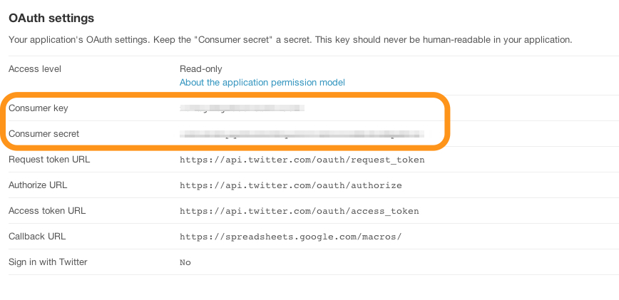
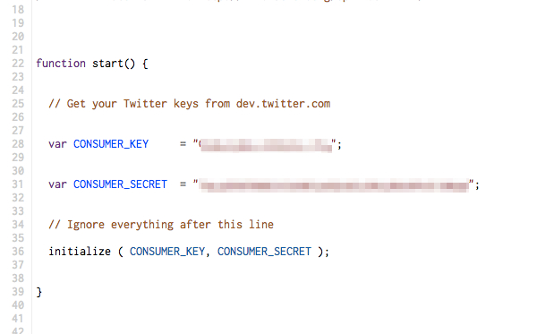
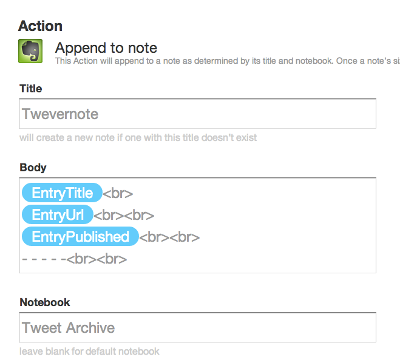

## Evernote en je Twitterarchief

Sinds enige tijd biedt Twitter de mogelijkheid om je complete archief met al je twitterberichten te downloaden. Dit is een statisch archief, dus je moet wel periodiek een nieuwe versie downloaden om je archief actueel te houden. Je kunt dit bestand met je tweets in Evernote opslaan als notitie, maar het nadeel is dat Evernote dan niet in de tekst van je tweets kan zoeken. Als je dat graag wilt, dan is het nodig om een directe koppeling te maken tussen Twitter en Evernote. Dat was tot op heden mogelijk met bijvoorbeeld IFTTT. Helaas maakt Twitter het steeds lastiger om je eigen data te exporteren op een manier die je zelf graag wilt. Ze maken geen RSS feeds meer beschikbaar voor je eigen feed waarmee je een eigen export kunt maken. Maar er is een alternatieve oplossing. Hiervoor is een *tussenpersoon* nodig in de vorm van Google Script. Met Google Script kun je het nieuwe formaat van Twitter (JSON) naar RSS omzetten na authenticatie bij Twitter en alsnog de feed op allerlei manieren exporteren en opslaan. Onderstaande stappenplan helpt je door het maken van de applicatie heen. 

### Maak een Twitterapplicatie

Omdat de nieuwe Twitter API verplicht dat je je moet identificeren bij Twitter, maken we eerst een mini Twitter applicatie die we later in Google Script gebruiken om te communiceren.

1. Ga naar de [Developers site van Twitter](https://dev.twitter.com/apps/new "Developers site van Twitter") en log in met je Twittergegevens. 
2. Maak een nieuwe Twitter applicatie via *My Application > Create a New Application* (rechtsboven bij je avatar)
3. Geef je applicatie een naam, omschrijving en kies een website. Het is niet zo belangrijk hoe je het noemt, als het voor jou maar duidelijk is.
4. Bij *Callback URL* vul je in: https://spreadsheets.google.com/macros/
5. Ga akkoord met de voorwaarden, vul de captcha in en klik op "*Create your Twitter Application*"
6. Op de volgende pagina zie je een lijst met sleutels. Maak een notitie van de *consumer key* en *consumer secret*

### Maak het Google Script

In deze stap gebruiken we een Google Script van de website Digital Inspiration. Dat kopieer je naar je eigen Google Drive en pas je aan. Vervolgens maak je er een web applicatie van.

1. Kies [dit script van Digital Inspiration](https://script.google.com/d/10GJT7YqOG41K9EUm1lcWQWuS1ju5W_Yrrqx6E0D1fiSrSF8pqJePIRg8/edit "Directe link naar script in Google Script"). Voor je een wijziging maakt maak je eerst een kopie van het script via *Bestand > Een kopie maken*. Hiermee opent het script in een nieuw venster of tabblad en staat het in je eigen Google Drive.
2. Zet de eerder genoteerde Consumer Key en Consumer Secret in regels 28 en 31.
3. Kies *Bestand > Versies Beheren* en kies *Nieuwe versie opslaan*. Geef eventueel een korte beschrijving wat je hebt gedaan ("Keys toegevoegd" bijvoorbeeld)
4. Ga nu naar *Publiceren > Implementeren als web-app*. In het volgende scherm laat je de URL staan, Projectversie staat standaard op degene die je net hebt opgeslagen. "De app uitvoeren als" staat op "ik (je emailadres)". Laat dit zo staan. Het kopje "Wie heeft toegang tot de app" wijzig je naar "Iedereen, zelfs anonieme gebruikers". Klik op "*Bijwerken*".

### Maak een RSS-feed

Nu is het zaak om het Google Script aan te zetten en de links naar de feeds te genereren

1. Ga naar *Uitvoeren > start* en geef toestemming in het scherm wat volgt.
2. Kies nogmaals *Uitvoeren > start*. Nu ga je naar Twitter om toestemming te geven. Als je dat hebt gedaan krijg je een email met links naar voorbeeld RSS-feeds.
3. Met deze voorbeeld feeds kun je je eigen feeds samenstellen op gebruikersnaam, favorieten, lijsten en zoekopdrachten. Test een feed in je favoriete RSS-lezer om te kijken of alles naar behoren werkt.

### Koppel de feed aan Evernote

Nu je een werkende RSS-feed hebt, is het zaak om hem in Evernote te krijgen. Dit kan via diensten als If This Then That of Zapier. Laatsgenoemde heeft een gratis dienst, maar de beperking dat je maximaal 100 taken per maand kunt doen. Als je een beetje flink Twittert zit je daar al snel aan. IFTTT is (nog) gratis, maar checkt de feed minder vaak.

1. In IFTTT kies je als Trigger de RSS-feed met *New Feed Item*. Vul de RSS-feed naar keuze in die je uit de email met voorbeelden haalt. 
2. Vervolgens koppel je deze aan je Evernote account met *Append To Note*. Standaard staat een formaat voor een notitie ingevuld. Deze zet de tweets dubbel in een notitie. Je kunt het beter aanpassen naar het onderstaande formaat.
3. Tevens kun je de naam van het notitieboek aanpassen en labels toevoegen. 
4. Klik op *Create Action* om alles op te slaan. 
5. Na enige tijd verschijnt een nieuwe notitie met je tweets in Evernote. Nieuwe tweets zullen automatisch aan deze notitie worden toegevoegd.

### Conclusie

Met Google Script is het mogelijk om je Twitterarchief naar Evernote te sturen en doorzoekbaar te laten. Het is echter wel de vraag in hoeverre de gratis diensten van Google en IFTTT blijven bestaan en je er gebruik van kunt maken.

