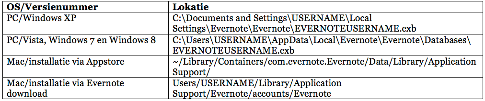
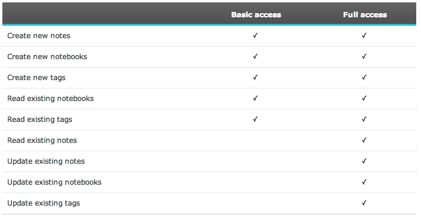

## Evernote en veiligheid

Evernote is een apart soort software. Het doel van de dienst is om je externe brein te worden. Je kunt er informatie in opslaan en organiseren zoals je zelf wilt en op allerlei manieren terugvinden. Hoe langer je Evernote gebruikt, hoe meer waarde het voor je krijgt. Het is dan ook begrijpelijk dat de veiligheid van de dienst veel vragen opwerpt. Wat gebeurt er met mijn notities? Wat zijn mijn rechten als gebruiker en wat doet Evernote om mijn notities veilig op te bergen? Wat gebeurt er als Evernote plotsklaps van de markt verdwijnt? 
In dit hoofdstuk willen we een aantal van deze vragen beantwoorden en wat meer achtergrond geven over de werking van Evernote. Specifiek de synchronisatiedienst en de toegang voor ontwikkelaars.
    
Wij willen duidelijk maken dat we geen advocaten zijn en geen juridische achtergrond hebben. Alle informatie uit dit hoofdstuk is online te vinden in diverse open bronnen zoals de juridische pagina's van Evernote. Wij nemen geen verantwoordelijkheid voor de volledigheid van deze informatie. We doen ons best zo duidelijk mogelijk te zijn. We geven geen moreel of ethisch advies wat te doen. De keuze ligt bij jou. Wij leggen uit hoe Evernote er mee om gaat. Heb je meer vragen over de veiligheid van Evernote, neem dan eens een kijkje in het [gebruikersforum](http://discussion.evernote.com/ "Evernote Forum") of stel je vraag in de [Nederlandse Facebookgroep](https://www.facebook.com/groups/evernote.nl/ "Facebook: Groep Evernote.nl") over Evernote. De auteurs beantwoorden hier geregeld allerlei vragen. 

### Drie wetten van databeveiliging
Op de website en weblog van Evernote is vaak te lezen over de *Three Laws of Dataprotection*. Dit zijn [drie wetten](http://blog.evernote.com/blog/2011/03/24/evernotes-three-laws-of-data-protection/) die men intern volgt aangaande het gebruik van en de veiligheid van de notities die jij in Evernote stopt. De wetten zijn:

* Your data is yours (Jouw data zijn van jou)
* Your data is protected (Jouw data zijn beveiligd)
* Your data is portable (Jouw data zijn draagbaar)

#### Jouw data zijn van jou

Phil Libin, algemeen directeur van Evernote, heeft in meerdere interviews en bij meer gelegenheden duidelijk gemaakt dat het verdienmodel van Evernote *niet* zit in het koppelen van jouw informatie aan andere partijen die er geld mee willen verdienen. Zowel de gratis gebruikers als de betaalde gebruikers van Evernote hebben de belofte dat Evernote niet aan *data mining* doet.

> "We will pledge to you that we will not engage in any data mining of your information or Content in order to target advertising at you." (Bron: [Gebruikersvoorwaarden](http://evernote.com/legal/tos.php "Evernote: Terms of Service") per 4 december 2012)

Daarnaast maakt Evernote in hun voorwaarden duidelijk dat jij het copyright hebt op de informatie die je in Evernote zet. Jouw data is dus echt van jou. Evernote zal nooit aanspraak maken op gebruik van jouw data voor commerciële doeleinden. Wat ze wel vragen is dat ze een beperkte toegang krijgen tot je data om de dienst werkbaar te maken. Om je notities bijvoorbeeld te synchroniseren tussen je apparaten, om het doorzoekbaar te maken, maar ook om het simpelweg op het scherm te mogen laten zien als je bent ingelogd. 

#### Jouw data zijn beveiligd

De data die je in Evernote zet is standaard privé toegankelijk. Dat betekent dat deze alleen voor jou te zien is, tenzij je zelf aangeeft dat het anders moet zijn. Evernote neemt de beveiliging van je informatie serieus. Ze nemen meerdere maatregelen om jouw informatie veilig op te slaan en niet toegankelijk te maken voor andere partijen tenzij je daar toestemming toe geeft.

Er zijn twee manieren om je notities op te slaan: In een lokaal notitieboek en in een gesynchroniseerd notitieboek. Lokale notitieboeken zijn *alleen* toegankelijk op de computer waar ze op is gemaakt en worden niet door de Evernote servers gezien of opgeslagen. Je bent dus zelf verantwoordelijk voor de backup en veiligheid van een lokaal notitieboek.   
Evernote biedt de mogelijkheid om notitieboeken te synchroniseren over meerdere apparaten. Deze notitieboeken slaat Evernote op in meerdere beveiligde servers en ze verzorgen *off-site backups*.

De servers staan in een fysiek beveiligde locatie waar 24 uur per dag medewerkers aanwezig zijn. Toegang tot de servers is geregeld via biometrische toegangspassen en is alleen toegestaan voor geautoriseerd personeel. Alle notities worden via SSL-verbindingen van en naar de servers gestuurd en alle authenticatie van inlogpogingen is versleuteld. Je Evernote wachtwoord is nooit zichtbaar voor medewerkers en is niet opgeslagen op de servers waar je notitieboeken en notities staan. 

Jouw data is opgeslagen op een server bij Evernote. Daarnaast heeft elke fysieke server een redundante server. Elke server is gekoppeld aan een *shard*, een methode om grote hoeveelheden data in een database te verspreiden over meerdere machines en de zoeksnelheid te verhogen. Evernote verzorgt dagelijks een offline backup van het datacenter. Al je notities staan op je lokale computer of op je smartphone/tablet als je offline notebooks hebt aangezet. Deze notitieboeken kun je eveneens backuppen. Dit betekent dat je data op vijf plaatsen staat (2 RAID servers, 2 servers per shard en de offline backup) en op je lokale computer(s). Dit maakt de kans op dataverlies kleiner maar niet onmogelijk zoals in [2010 bleek](http://news.cnet.com/8301-27076_3-20013093-248.html "Thousands of Evernote users affected by data loss") toen plusminus 6.000 gebruikers notities zijn verloren door een storing in de hardware. Zorg daarom *altijd* voor een eigen backup van je Evernote database.
Lees voor meer informatie de [uitgebreide uitleg van de server architectuur bij Evernote](http://blog.evernote.com/tech/2011/05/17/architectural-digest/ "A Digest of Evernote’s Architecture").

(Bron: [Evernote for Dummies](http://www.amazon.com/gp/product/1118107381/ref=as_li_ss_tl?ie=UTF8&camp=1789&creative=390957&creativeASIN=1118107381&linkCode=as2&tag=punkeycom-20 "Amazon: Evernote for Dummies"))

#### Jouw data zijn draagbaar

Mocht je besluiten na een tijd te stoppen met Evernote en bijvoorbeeld met je notities over te stappen op OneNote of Yojimbo, dan kan dat. Evernote heeft de mogelijkheid om al je data te exporteren als bestanden en het weer importeerbaar te maken in andere software. Natuurlijk wil men dat je graag blijft, maar de filosofie is dat je waarschijnlijk langer bij Evernote blijft als je weet dat je elk moment kunt vertrekken. 

Je kunt de database met notities fysiek op je computer terugvinden. Zo kun je deze map of deze bestanden meenemen in de periodieke backup van je computer.
Afhankelijk van je besturingssysteem en soort installatie staat de database van Evernote op de volgende plaats

### Exporteren van je notities
Wil je je data exporteren, dan kun je dat in Evernote zelf doen. Je kunt de notitie op twee manieren exporteren:

* .enex-bestand: Dit is het bestandsformaat voor Evernote. Je exporteert de geselecteerde notities in één enex-bestand wat je later in Evernote weer kunt importeren
* HTML: Hiermee maak je van elke notitie een aparte HTML pagina. Deze kun je in je browser bekijken. Tevens maakt Evernote een index-pagina met een overzicht van je geëxporteerde notities. 

Het belangrijkste verschil tussen de twee formaten is dat Enex al je metadata van de notitie behoudt. Enex is de beste manier om te exporteren als je de data weer in een ander programma wilt importeren. De HTML export gaat soms wat moeilijk om met vreemde tekens in de titel, dus de links in de index-pagina werken niet altijd. Maar de HTML export is weer beter leesbaar voor mensen. 

>Opmerking: De versies voor Windows en OSX lopen uiteen in de gebruikersinterface. Dit betekent dat je voor Windows op een *iets* andere manier de notities exporteert dan voor OSX. 

#### Exporteer alle notities
* (Windows) Klik in Evernote op het notitieboek Alle Notitieboeken en kies met de rechtermuisknop voor "Exporteer notities". 
* (OSX) Selecteer alle notities met Cmd-A en kies met de rechtermuisknop voor "Exporteer notities". 
* In het *Opslaan Als* scherm, geef je de export een logische naam. Dit wordt de naam van je folder als je een HTML export doet of de naam van het bestand bij een Enex-export.
* Kies de juiste map om je export in op te slaan en kies het juiste export formaat (Enex of HTML)

#### Exporteren van één notitieboek
* Rechtsklik in Evernote op het notitieboek wat je wilt exporteren
* Kies "Notities exporteren vanuit..."
* In het *Opslaan Als* scherm, geef je de export een logische naam. Dit wordt de naam van je folder als je een HTML export doet of de naam van het bestand bij een Enex-export.
* Kies de juiste map om je export in op te slaan en kies het juiste export formaat (Enex of HTML)

#### Exporteren van één of meerdere notities
* Selecteer de notitie of notities die je wilt exporteren.
* Met de rechtermuisknop kies je "exporteer notitie(s)"
* In het *Opslaan Als* scherm, geef je de export een logische naam. Dit wordt de naam van je folder als je een HTML export doet of de naam van het bestand bij een Enex-export.
* Kies de juiste map om je export in op te slaan en kies het juiste export formaat (Enex of HTML)

Als je je data exporteert en verwijdert uit Evernote en synchroniseert met de servers dan is het werkelijk verdwenen en niet meer terug te halen, tenzij je zelf een backup hebt gemaakt.

In het *Early Elephants VIP Notebook* bij dit e-book kun je meer scripts en how-to's vinden om je data te exporteren uit Evernote en in andere programma's op te slaan.

### Belangrijke wetenswaardigheden over je data
Als je dagelijks gebruik maakt van Evernote sta je er misschien niet bij stil, maar je hebt toestemming gegeven voor een aantal licenties en rechten voor het gebruik van Evernote. 
De gebruiksvoorwaarden van de dienst geven je in detail inzicht in wat er gebeurt met je persoonlijke gegevens, je data en welke rechten en plichten je hebt. Ik kan je aanraden om [deze gebruiksvoorwaarden](http://evernote.com/legal/tos.php "Evernote: Terms of Service") zelf goed door te nemen. Evernote heeft zich ingespannen om deze zo leebaar mogelijk te maken en zoveel mogelijk "gewone mensen taal" te gebruiken. 

### Evernote in Zwitserland
Speciaal voor alle gebruikers van Evernote die niet in de USA of Canada wonen, heeft Evernote een volle dochteronderneming in Zwitserland. Deze is de contractspartner voor jou, als niet-Amerikaanse of niet-Canadese gebruiker van Evernote. Dit betekent dat voor Nederlandse gebruikers van Evernote, je notities vallen onder de *Data Protection Act 1988* en Evernote zich moet houden aan de acht principes van data beveiliging. Meer informatie over deze 8 principes vind je onder andere op [Wikipedia](http://en.wikipedia.org/wiki/Data_Protection_Act_1998 "Wikipedia: Data Protection Act 1998").
Als je echter wilt dat Evernote je notitieboeken synchroniseert en doorzoekbaar maakt, dan verplaatst je data naar servers in de VS. Hiermee vallen je notities onder de Amerikaanse wetgeving. Hiermee kan het mogelijk zijn dat overheidsdiensten in de VS toegang kunnen vragen én krijgen tot notities van Nederlandse gebruikers van Evernote. 

### Safe Harbor Policy
Door het gebruik van internetdiensten als Evernote, Dropbox en Microsoft 365, is het steeds waarschijnlijker dat je data niet meer binnen de grenzen van de Europese Unie blijft. Om gebruik te maken van deze diensten, zal je informatie op servers in de VS staan. De Europese Unie heeft hiervoor de Safe Harbor Policy ontworpen, een gestroomlijnd proces voor bedrijven in de Verenigde Staten om te voldoen aan de Data Privacy Richtlijnen van de Europese lidstaten. Deze richtlijn regelt de verwerking van persoonsgebonden gegevens in de Europese Unie. Bedrijven in de Verenigde Staten moeten voldoen aan de Safe Harbor Policy om persoonsgebonden gegevens naar een veilig land buiten de EU te verzenden. Evernote voldoet aan deze richtlijnen en is [lid](http://safeharbor.export.gov/companyinfo.aspx?id=16934 "Safe Harbour: Evernote") van de Safe Harbor Policy.
Uitgebreid onderzoek van ZDNet [wijst echter uit](http://www.zdnet.com/blog/igeneration/summary-zdnets-usa-patriot-act-series/9233 "ZDNet's USA PATRIOT Act series") dat deze Safe Harbor Policy niet afdoende beschermt tegen de Patriot Act in de Verenigde Staten. Deze wetgeving maakt het mogelijk voor Amerikaanse overheidsdiensten om zonder rechterlijk bevel toegang te krijgen tot de data. De Safe Harbor Policy beschermt je gegevens tijdens het transport naar de servers van Evernote, maar eenmaal daar aangekomen vallen ze onder de wetgeving van de Verenigde Staten.

Zorg dat je goed op de hoogte bent over deze materie. ZDNet heeft een [zeer uitgebreid en gedetailleerd onderzoek](http://www.zdnet.com/blog/igeneration/summary-zdnets-usa-patriot-act-series/9233 "ZDNet's USA PATRIOT Act series") gedaan naar de Safe Harbor Policy en Patriot Act in het licht van *cloud*-diensten als Evernote. Lees het door en bepaal hierna zelf wat je wel en niet wilt synchroniseren in Evernote.

### Evernote en je privacy

Evernote heeft [een privacy policy](http://evernote.com/legal/privacy.php "Evernote: Privacy Policy") die uitlegt wat er met jouw data gebeurt, welke stappen je zelf kunt zetten. We raden je aan deze zelf te lezen en je eigen conclusies te trekken hoe je met Evernote om gaat en welke informatie je er in zet. 

#### Toegankelijkheid van notities
Evernote heeft niet de intentie om je persoonlijke informatie en je notities te verkopen of verhuren en er zo geld aan te verdienen. Wel geef je Evernote toestemming om rondom het technische proces van opslag en doorzoekbaarheid je notities te indexeren en op te slaan. Tenzij je zelf expliciet toestemming geeft, maakt Evernote niets publiek beschikbaar. 

Als je zelf een notitieboek publiek deelt, dan geef je Evernote toestemming om deze URL openbaar beschikbaar te maken. Hierdoor is het notitieboek vindbaar voor zoekmachines. Door te zoeken [op een gedeelte van de URL](https://www.google.com/webhp?q=site:https:%2F%2Fwww.evernote.com%2Fshard%2F "Google: Evernote Shared Notebooks") vind je diverse publieke notities. Hou hier rekening mee als je notities in publieke notitieboeken maakt.

#### Tips voor veilig gebruik van Evernote
Bovenstaande uitleg kan je wellicht weerhouden om gebruik te maken van Evernote. Het is niet onze bedoeling om je bang te maken, maar wel om je te laten zien dat Evernote er veel aan doet om jouw data veilig en vertrouwd op te slaan en weer te geven. Ondanks deze veiligheidsmaatregelen kan het nog steeds zijn dat je een extra laag van veiligheid over jouw data wilt leggen. Dit is mogelijk via encryptie. Je kunt geselecteerde tekst in notities versleutelen met een wachtwoord. 

\newpage

### Encryptie
Je kunt geselecteerde tekst in een notitie versleutelen. Dit doe je als volgt:

* Selecteer de tekst in de notitie die je wilt versleutelen
* Met de rechtermuisknop kies je Geselecteerde tekst versleutelen.	

* In het scherm kies je een wachtwoord en herhaal je dit nogmaals.

* Met de optie "Onthoud wachtwoord tot ik Evernote afsluit" aangevinkt kun je meerdere stukken tekst in meerdere notities met hetzelfde wachtwoord versleutelen. Als je dit niet wilt, zet je deze optie uit. 

* Na klikken op OK zie je de notitie met de versleutelde tekst. 

* Je kunt in alle installaties van Evernote de tekst weer leesbaar maken met het wachtwoord.

#### Encryptie via Truecrypt
Wil je een extra laag veiligheid op je lokale database, dan kun je deze bestanden versleutelen met Truecrypt. [TrueCrypt](http://www.truecrypt.org) is een gratis open-source encryptie programma, beschikbaar voor Windows, OSX en Linux. Met Truecrypt kun je een complete harde schijf versleutelen, partities of individuele bestanden. 

> Je kunt je Evernote data versleutelen met TrueCrypt, maar de data zal **altijd** onversleuteld op de servers van Evernote staan als je synchronisatie aanzet. Tevens zijn gedeelde notitieboeken altijd onversleuteld bij anderen zichtbaar. Beveiliging met TrueCrypt is dus alleen een beveiliging op je eigen computer.

\newpage

### Wat hoef je niet in Evernote te zetten
Evernote is een prima extern brein en een uitstekende database om je informatie in op te slaan en te organiseren. We raden je aan om goed na te denken wát je in Evernote zet en wát je echt nodig hebt op welke plaats en met wie. Omdat je informatie via gesynchroniseerde notitieboeken op servers buiten Europa staat, kun je er voor kiezen om niet alles via Evernote te synchroniseren. Je kunt gebruik maken van lokale notitieboeken om toch belangrijke informatie te organiseren en doorzoekbaar te maken.

Stel jezelf deze vragen als je iets in Evernote zet:

* Is het nodig om deze informatie *overal* te hebben?
* Is het nodig om deze informatie met anderen *te delen*?
* Is het nodig om deze informatie tot op de letter *doorzoekbaar* te hebben?

Lokale notitieboeken worden niet gesynchroniseerd door de servers van Evernote en blijven op je lokale computer staan. De notities zijn daarin nog steeds terug te vinden op tekst en labels. Evernote zal echter niet de toegevoegde PDF's kunnen OCR-scannen voor tekstherkenning. Je kunt eigen OCR-gescande documenten aan een lokaal notitieboek toevoegen. Deze is dan wél doorzoekbaar. Als je een koppeling maakt naar een notitie in een lokaal notitieboek, dan werkt deze alleen op het apparaat waar het lokale notitieboek staat.

Zo kun je er voor kiezen om documenten in een lokaal notitieboek te zetten die je alleen op een werkcomputer nodig hebt en niet per sé op je smartphone. De documenten blijven dan op je computer, maar zijn wel op tag en inhoud doorzoekbaar. Bij PDF's moeten deze dan wel via OCR zijn gescand.  Nadeel is wel dat je deze documenten niet kunt delen met anderen en dat de tekstherkenning *in* illustraties niet werkt. 

Wil je de documenten delen of moeten ze op een ander apparaat of de webversie van Evernote beschikbaar zijn? Overweeg dan de encryptie die Evernote zelf aanbiedt. Deze encryptie werkt door op alle apparaten inclusief de webversie. 

De volgende soorten informatie hoef je niet per sé in Evernote te plaatsen. Zoals we al eerder hebben gezegd, maak hier je eigen afgewogen beslissing

* Loginnamen en wachtwoorden - Gebruik hiervoor gespecialiseerde programma's als KeePass of 1Password
* Creditcard statements - Als je deze wel doorzoekbaar wilt hebben, of verzameld in Evernote, zet ze dan als OCR gescande PDF in een lokaal notitieboek. 
* Je paspoort. We hebben eerder gezegd dat je je paspoort wel in Evernote kunt zetten, maar doe dit met de nodige voorzorgsmaatregelen zoals het plaatsen van een watermerk. 

Voor zakelijke gebruikers, maak een goede afweging voor je onderstaande in een gesynchroniseerd notitieboek zet.

* Personeelsdossiers
* Medische data van patiënten
* Contracten en bankgegevens
* Gevoelige informatie van klanten en/of opdrachtgevers

Omwille van je administratie kun je als ondernemer bekijken welke informatie van opdrachtgevers je in Evernote plaatst. Maar denk dan na of je dit in een gedeeld notitieboek doet of in een lokaal notitieboek. Beslis of de informatie voor meer personen beschikbaar moet zijn. 

### Toegang door derde partijen en andere diensten

Evernote biedt een API aan voor ontwikkelaars om verder te bouwen op het Evernote platform. De afkorting API staat voor Application Programming Interface. Hiermee is voor ontwikkelaars van andere diensten en websites mogelijk om te "praten" met de data die in Evernote staat zonder dat ze volledige toegang nodig hebben tot alle informatie in je notitieboek. Door diensten via een API aan elkaar te knopen kun je rijkere informatiebronnen maken of makkelijk bestaande informatie uit de ene dienst in de andere zetten. Een voorbeeld is LinkedIn. Er zijn websites die je toegang vragen tot je LinkedIn profiel. Hiermee halen ze (vaak eenmalig) relevante data uit je profiel voor hun eigen dienst zodat jij het niet opnieuw hoeft in te typen.

Evernote heeft haar API rijk gedocumenteerd op hun [Developers site](http://dev.evernote.com/documentation/cloud/). Hier kun je direct aan de slag om je eigen dienst te koppelen aan Evernote. Tevens zie je een aantal interessante diensten die al gebruik maken van deze API koppeling met Evernote. 
Als je deze diensten gebruikt, krijg je bij het inloggen de vraag of ze een koppeling met je Evernote data mogen maken. Een ontwikkelaar kan basis toegang hebben of volledige toegang. In onderstaande tabel zie je welke mogelijkheden een ontwikkelaar heeft met deze toegang:

Je kunt in de [voorkeuren](https://www.evernote.com/AuthorizedServices.action "Evernote: Voorkeuren") (Evernote » Settings » Applications) op de Evernote site bekijken welke diensten en applicaties je toegang hebt gegeven en desgewenst deze toegang intrekken. 

Wij zijn positief over de richting en visie van Evernote en vertrouwen hun beleid. Maar we zijn sceptisch over de wetgeving omtrent dataverkeer en dataopslag in de Verenigde Staten. Omdat het onduidelijk is óf en hóe de overheidsdiensten in de Verenigde Staten omgaan met opgeslagen data in de VS van inwoners buiten de VS, is ons advies om niet direct je volledige papieren administratie gesynchroniseerd in Evernote te zetten.
