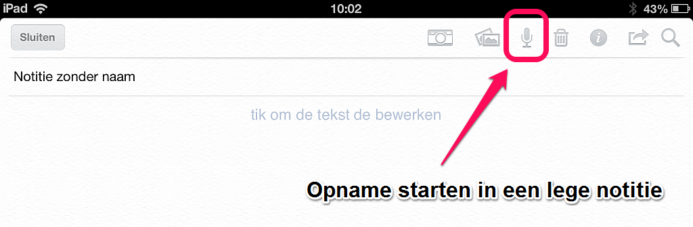
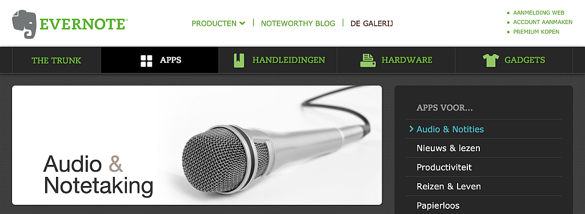

## Evernote en audio

Evernote gebruik je voor het bewaren van tekst, beeld en documenten. Minder bekend is dat er ook *geluid* zit in Evernote. Jij kunt audio opnemen, bewaren en afspelen met Evernote. We beschrijven hoe je geluid in Evernote stopt en wat je daar zoal mee kunt doen.

### Er zit geluid in Evernote

Met de [software van Evernote](http://evernote.com/intl/nl/evernote/) op een computer, tablet of mobiele telefoon kun je ook [geluid opnemen](https://support.evernote.com/link/portal/16051/16058/Article/538/How-can-I-create-audio-notes). 

Klik of touch in een (nog lege) notitie op het pictogram van de microfoon om jouw opname te beginnen. Na het stoppen van de opname slaat Evernote jouw geluid op als bijlage in die notitie.

Dit audiobestand krijgt het format [WAV](http://nl.wikipedia.org/wiki/WAV).  Je kunt dit bestand direct in Evernote openen en afspelen. In de Android-app van Evernote heb je zelfs een optie voor [Voice to text](https://support.evernote.com/link/portal/16051/16058/Article/3436/An-Overview-of-Evernote-for-Android-s-Voice-to-Text-Feature).

Deze audio-opname kan 2 uren duren. Premium-gebruikers kunnen 8 uur audio per notitie opnemen.

Je kunt aan deze notitie, met als bijlage het audiobestand, een eigen titel, labels en aantekeningen toevoegen. Deze notitie kun je daarna in Evernote eenvoudiger terugvinden.

> Tip: Alle notities met geluid selecteer je door te zoeken met de zoekopdracht <code>resource:audio/\*</code>. In combinatie met de zoekopdracht <code>-tag:\*</code> selecteer je jouw geluidsopnames, die je nog niet hebt voorzien van labels. Dat is handig om berichten te vinden, die je even tussendoor voor jezelf hebt ingesproken, maar waar je later op de tijd en het apparaat van jouw keuze nog wat mee wilt doen.

### Gebruik van audio in Evernote

Er zijn veel toepassingen voor de combinatie van geluidsopname en notities in jouw Evernote. We beschrijven er vijf. 

#### Memorecorder
Heb je ooit een memorecorder gebruikt? Dat is [zo'n apparaat](http://nl.wikipedia.org/wiki/Memorecorder) waarop je berichten inspreekt. Met Evernote maak je van je computer, tablet of smartphone een memorecorder. 

Vooral een  smartphone is een prettig apparaat om in combinate met Evernote te gebruiken als een memorecorder. Je kunt de geluidsopname in de Evernote-app op dezelfde manier inspreken als tijdens een mobiel telefoongesprek. Bedenk wel dat dit niet werkt *tijdens* het telefoneren. Een telefoongesprek kun je niet in Evernote opnemen.

Je smartphone met Evernote gebruiken als memorecorder  is vooral handig in situaties waarin je moeilijk kan typen. Bijvoorbeeld wanneer je weinig tijd hebt of aan de wandel bent of in de auto zit. Spreek dan even snel een boodschap aan jezelf in. Informatie waar je later iets mee wilt doen. Je doet dit bijvoorbeeld direct na het lezen van een e-mail of na een gesprek of een vergadering. Hierna hoef je het niet meer te onthouden. Later kun je die ingesproken aantekeningen rustig op je computer beluisteren en dan de informatie verwerken tot daden of taken in je planningssysteem.

Jij kunt je mobiel met Evernote ook gebruiken als memorecorder in huis. Leg je smartphone bijvoorbeeld voor het slapen gaan op het tafeltje naast bed. Schiet je bij het inslapen of ontwaken iets in gedachten: spreek dat dan meteen even in met Evernote.

#### Interview
Met je smartphone, tablet of computer kun je overal een of meer personen interviewen. Neem het interview gewoon op met jouw Evernote-app. 

Gebruik voor korte interviews of het opnemen van opmerkingen tijdens brainstormen je mobiele telefoon als microfoon en opname-apparaat. Op dezelfde manier kun je ook een geluidsfragment van een presentatie, of van een uitzending op radio of TV in Evernote opnemen.

Tijdens langere interviews maak je de opname in Evernote op een computer of op een tablet. Je kunt tijdens het interview aantekeningen typen in dezelfde Evernote-notitie, waarin je ook de opname maakt. Maak je die aantekeningen liever met pen, scan ze dan meteen in Evernote. Hiervoor is het [Evernote Smart Notebook van Moleskine](http://evernote.com/intl/nl/moleskine/) natuurlijk goed te gebruiken. Je hebt daarna zowel de geluidsopname als de aantekeningen van het interview overal in Evernote beschikbaar.

#### Voicemail
Het gesproken woord is vaak sneller en soms duidelijker dan getypte tekst. Wil je iemand een mondelinge mededeling toesturen, dan hoef je niet per telefoon een voicemail in te spreken. Maak gewoon een audio-notitie in Evernote.

Ben je nog niet tevreden over je bericht, dan kun je het nog verwijderen uit de notitie en opnieuw inspreken.

Is het bericht gereed, dan stuur je de audio-notitie per e-mail vanuit Evernote naar de persoon voor wie jij het bericht hebt ingesproken. Je kunt op die manier ook  hetzelfde bericht naar *meerdere* personen sturen.

Voor een bericht dat je vaker gebruikt in jouw communicatie, maak je van de notitie met het geluidsbestand een gedeelde notitie in Evernote. Bijvoorbeeld voor een korte presentatie of uitleg over iets. Je kunt jouw ingesproken toelichting in dezelfde notitie aanvullen met afbeeldingen en getypte tekst. Daarna kun je de URL naar die gedeelde notitie zo vaak je maar wil toesturen per e-mail of als link verspreiden via het web. 

#### Vergadering
Tijdens vergaderingen ben je niet voortdurend even geconcentreerd. Om te voorkomen dat je belangrijke informatie mist, kun je tijdens de bijenkomst in Evernote geluidsopnames maken. Je kunt ook direct na de vergadering de gemaakte afspraken zelf inspreken of met een kort interview nog eens duidelijk door anderen laten samenvatten. Zo krijg je duidelijker wat er van jou verwacht wordt. 

Deze audio-notititie kun je in Evernote bij jouw aantekeningen en vergaderstukken voegen. Ter naslag en om later nog actiepunten voor in je planningssysteeem uit af te luisteren.

#### Radio

Met Evernote kun je eenvoudig audio op het web publiceren. Je verzamelt het geluid door audio-bestanden op te nemen en te bewaren in Evernote. Met een selectie uit die bestanden voeg je vervolgens op jouw weblog audio toe aan berichten. Zo kun je zelfs Podcasts maken.

Heb je geen eigen website of blog, dan kun je een audionotie direct vanuit Evernote delen met iedereen op het web. Bijvoorbeeld via een link in een e-mailnieuwsbrief, op Twitter of op Facebook. Ook kun je een notitieboek vol audionotities delen en daar af en toe nieuwe audionotities aan toevoegen. Zo'n openbaar gedeeld notitieboek heeft een URL, die iedereen in een browser kan openen, om daar jouw audio te beluisteren. Je krijgt er van Evernote ook [een feed](http://www.quora.com/Evernote/How-can-I-get-an-RSS-feed-for-a-notebook) bij, waarop luisteraars zich kunnen abonneren met bijvoorbeeld een feedreader. Die feed heeft de URL van het notitieboek, met aan het eind daaraan toegevoegd: <code>/feed</code>. 

Zo maak je van Evernote jouw eigen radiostation.

### Andere apps gebruiken
Gebruik je voor geluidsopnames liever niet een Evernote-app, maar gaat je voorkeur uit naar een speciaal daarvoor gemaakte app, dan kun je de daarmee gemaakte geluidsbestanden ook bewaren in Evernote. 

Bewaren in Evernote kan meestal eenvoudig door het bestand naar jouw Evernote te versturen per e-mail. In hoofdstuk 1 lees je hoe je dat doet.

Een geluidsbestand kun je vanuit Evernote ook altijd openen in de app van jouw keuze.

Er zijn zelfs audio-apps die je direct aan jouw Evernote kunt koppelen. In de Galerij van Evernote vind je meerdere van die [apps om (audio)notities mee te maken](http://trunk.evernote.com/nl/category/audio-notetaking), met pictogram, beschrijving en downloadlink.

Praten gaat makkelijker dan typen. Luisteren naar audio kan op elk apparaat waar jouw Evernote op staat. Met audio kun je het verzamelen en naslaan van jouw geheugensteuntjes in Evernote eenvoudiger maken. Je kunt met Evernote en audio ook vlot informatie delen met anderen.
Evernote en geluid gaan goed samen. Probeer het eens. Je zult ervaren hoe makkelijk dat werkt.
