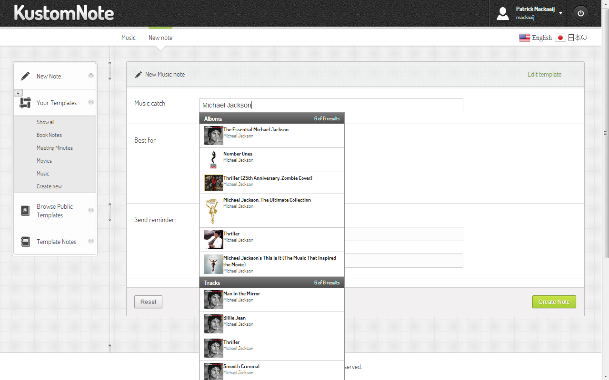

## Evernote en sjablonen

Als je Evernote gebruikt voor verslaglegging zoals notulen en gespreksnotities dan is het handig om snel een notitie met een vaste structuur op te kunnen roepen.

Evernote heeft standaard geen officiële mogelijkheid voor iets als sjablonen of templates maar er zijn verschillende manieren om dat te doen. In dit hoofdstuk laten we wat mogelijkheden zien: kopiëren, exporteren en weer importeren, via een aparte applicatie of een zelfgemaakt script.

### Notities kopiëren

Op de Windows- en OSX-clients is de meest eenvoudige manier om een sjabloon aan te maken een bestaande notitie kopiëren.

Maak eerst een notitie aan die als basis gaat dienen. Zorg indien gewenst voor een nette opmaak met tussenkopjes en gebruik tabellen, lijstjes, vinkjes en kleur. Om je sjabloon-notities snel te kunnen vinden is het handig om ze in een apart notitieboek te zetten en een snelkoppeling naar dit notitieboek te maken.

Om een notitie te kopiëren klik je erop met de rechtermuisknop. In het menu kies je voor Notitie kopiëren. Kies in het submenu het notitieboek waar de kopie terecht moet komen.

Evernote maakt een exacte kopie van de oorspronkelijke notitie aan, inclusief attributen zoals datum en tijd. De kopie kun je nu los van het oorspronkelijke sjabloon gebruiken.

### Notities exporteren

Een ander foefje op de Windows- en OSX-clients is exporteren.

Maak eerst een notitie aan die als basis gaat dienen. Zorg indien gewenst voor een nette opmaak met tussenkopjes en gebruik tabellen, lijstjes, vinkjes en kleur. Om je sjabloon-notities snel te kunnen vinden is het handig om ze in een apart notitieboek te zetten en een snelkoppeling naar dit notitieboek te maken.

Om een notitie te exporteren klik je erop met de rechtermuisknop. In het menu kies je voor Notitie exporteren. Onder Windows zit de optie om labels niet mee te exporteren verstopt onder de knop Opties. Druk op de knop Export en bewaar het .enex-bestand (**E**ver**n**ote **Ex**port) op een handige bestandslocatie. Bijvoorbeeld in een mapje op je bureaublad.

Als je nu vanuit de bestandslocatie dubbelklikt op het exportbestand dan maakt Evernote een nieuwe notitie aan in je standaard notitieboek. De datum en tijd van aanmaak komen overeen met het moment van importeren. De kopie kun je nu los van het oorspronkelijke sjabloon gebruiken.

Je kunt ook meerdere notities exporteren. Selecteer ze voor het exporteren door ze aan te klikken met de knop Ctrl (Windows) of Cmd (OSX) ingedrukt. Evernote maakt van de geëxporteerde notities één exportbestand. Als je dubbelklikt op dat bestand dan maakt Evernote de notities los aan in je standaard notitieboek.

### Notities aanmaken via KustomNote

[KustomNote](http://kustomnote.com "KustomNote: Professional note taking for Evernote")  is een applicatie die slim gebruik maakt van de Evernote Cloud API waar we in hoofdstuk 1 over schreven. [KustomNote won de Evernote Silver Devcup Award in 2012](http://blog.evernote.com/2012/09/26/trunk-spotlight-kustomnote-adds-structure-to-notes-wins-silver-devcup-award/ "Trunk Spotlight: KustomNote Adds Structure to Notes, Wins Silver Devcup Award") als waardering voor hun applicatie.

Na het inloggen in KustomNote kun je met één klik een nieuwe notitie op basis van een sjabloon aanmaken. Zelfs vanaf een smartphone of tablet en in de toekomst ook offline. KustomNote kan je vragen in welk notitieboek je de nieuwe notitie wilt aanmaken en een voorstel voor de titel geven.

KustomNote helpt je met het gestructureerd vastleggen van informatie. KustomNote heeft verschillende thema's om je notitie een professionele opmaak mee te geven. Je kunt met KustomNote velden in je notitie opnemen, net als in een formulier. De velden helpen je je notities consequent in te vullen. Velden kun je van standaardwaarden voorzien en verplicht stellen.

Met zogenaamde SmartFields vult KustomNote je notitie automatisch aan met informatie over bijvoorbeeld films en muziek terwijl je typt. Zodat je snel de titel, foto van de cover en andere details van een film uit de IMDb (Internet Movie Database) in je notitie over kunt nemen. KustomNote werkt aan SmartFields voor Amazon, FourSquare, GitHub, Facebook en Twitter. KustomNote werkt eraan uitbreidingen van SmartFields door andere ontwikkelaars mogelijk te maken. Naast muziek en films kun je ook al gebruik maken van je contactpersonen en agenda in Google.

KustomNote-templates kunnen worden gedeeld binnen KustomNote. Er zijn al duizenden templates gedeeld, onderverdeeld in categoriën zoals Movies, Music, Workout, Kids Art en Meeting Minutes. Je kunt een template van een andere gebruiker overnemen (clone) en naar wens aanpassen.

### Notities aanmaken via standaardteksten

Met programma's als [TextExpander (Mac)](http://smilesoftware.com/TextExpander/index.html "TextExpander") of [Fingertips (Windows)](http://getfingertips.com/ "Fingertips") kun je voor stukken tekst die je vaak intypt een afkorting gebruiken. Dit sleutelwoord "klapt uit" naar een zinsnede of een hele lap tekst.

Dit kun je ook gebruiken om sjablonen voor notities te maken. Op de Mac of PC werken de afkortingen universeel. In ieder programma - dus ook in Evernote - zal je afkorting worden vervangen door een langere tekst.

Op een iPhone of iPad hebben applicaties niet zonder meer toegang tot andere applicaties. [TextExpander is er ook voor iOS](http://clkuk.tradedoubler.com/click?p=24371&a=2064103&url=https%3A%2F%2Fitunes.apple.com%2Fnl%2Fapp%2Ftextexpander%2Fid326180690%3Fmt%3D8%26uo%3D4%26partnerId%3D2003 "TextExpander") en stelt andere apps in staat ermee te integreren. Evernote gebruikt deze mogelijkheid helaas niet. Je kunt er wel in Drafts ([iPhone](http://clkuk.tradedoubler.com/click?p=24371&a=2064103&url=https%3A%2F%2Fitunes.apple.com%2Fnl%2Fapp%2Fdrafts%2Fid502385074%3Fmt%3D8%26uo%3D4%26partnerId%3D2003 "Drafts for iPhone"), [iPad](http://clkuk.tradedoubler.com/click?p=24371&a=2064103&url=https%3A%2F%2Fitunes.apple.com%2Fnl%2Fapp%2Fdrafts-for-ipad%2Fid542797283%3Fmt%3D8%26uo%3D4%26partnerId%3D2003 "Drafts for iPad")) of [Writing Kit](http://clkuk.tradedoubler.com/click?p=24371&a=2064103&url=https%3A%2F%2Fitunes.apple.com%2Fnl%2Fapp%2Fwriting-kit-research-write%2Fid426208994%3Fmt%3D8%26uo%3D4%26partnerId%3D2003 "Writing Kit") een tekst mee schrijven en die kopiëren of e-mailen naar Evernote.

### Notities importeren via AppleScript of ENScript

Je kunt ook notities aanmaken door zelf gebruik te maken van de Evernote Local API op de Windows- en OSX-clients. Op internet zijn er veel voorbeelden van andere gebruikers te vinden die je als basis kunt gebruiken. Zoek voor Mac op "Evernote AppleScript" en voor PC op "Evernote ENScript".

Zo is er bijvoorbeeld [een AppleScript om nieuwe notities aan te maken op basis van notities uit een notitieboek met de naam "Templates"](http://blog.nik.me/post/32694120684/evernote-create-new-note-from-template "Evernote: Create New Note from Template").
