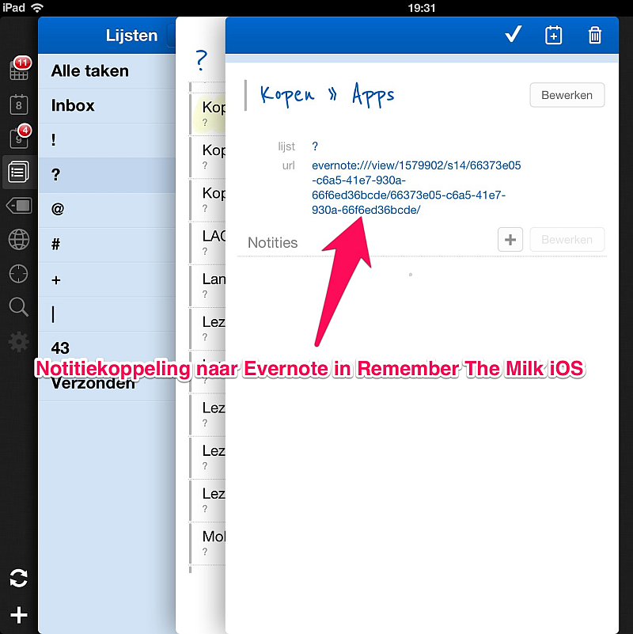
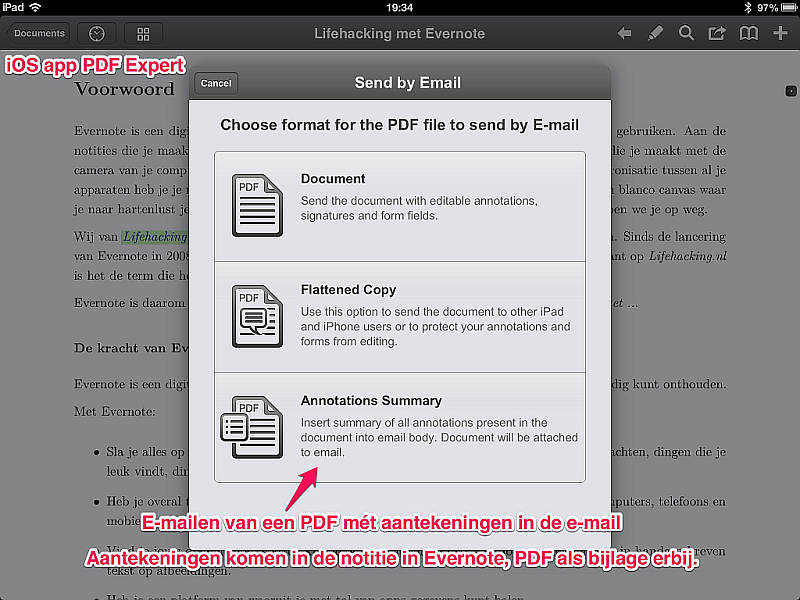

## Evernote en documentenbeheer

Evernote is bij uitstek geschikt om documenten in te bewaren én snel in te kunnen opzoeken. Gebruikte je daarvoor nog hangmappen, archiefdozen, papierstapels, ordners, of meer recent Windows Explorer, OSX Finder, het netwerk op kantoor of een USB-stick, dan kun je nu al die bewaarplaatsen vervangen door Evernote. 

Wat kun je doen om van Evernote jouw persoonlijk systeem voor het beheer van documenten te maken?

We beschrijven in dit hoofdstuk de vele manieren waarop je in Evernote documenten kunt opslaan, zodat je een keuze kunt maken voor een documentmanagementsysteem dat past bij jouw gebruik van documenten. We geven uitleg hoe je eenvoudig jouw documenten in Evernote kunt combineren met afspraken en taken, hoe je teksten bewerkt en hoe je die toevoegt aan Evernote. We eindigen met uitleg over het beginnen van een papierloos leven met Evernote.

### Een premium-abonnement is handig voor documentenbeheer

Een gratis account bij Evernote voldoet als cloudservice om je documenten in te bewaren. Je kunt alle bestandstypen als bijlagen aan een notitie toevoegen.

Evernote Premium maakt jouw documentenbeheer echter wel handiger. Wil je Evernote gebruiken als archief voor je documenten dan zijn vooral deze extra Premium-opties praktisch:

- *Dossiers*: je kunt een notitie opvullen met vier keer meer documenten dan bij het gratis abonnement. Dat is handig als je gewend bent met omvangrijke dossiers te werken.
- *Mobiel*: Je kunt één of meer notitieboeken offline op je telefoon en/of tablet zetten. Prettig als je onderweg altijd je documenten razendsnel bij de hand wilt hebben, zelfs wanneer je geen verbinding hebt met internet. Bovendien kun je Evernote op je mobiele apparaat op slot zetten met een pincode.
- *Papier*: je kunt zoeken in papier, dat je tot PDF hebt gescand en in Evernote hebt bewaard.

### Evernote geeft documenten metadata

In Evernote kun je documenten op twee manieren bewaren:

1. Een notitie kan het document zijn. Je zet dan de tekst - kaal, of met opmaak en afbeeldingen - in een notitie.
2. Je kunt een of meer bestanden van documenten als bijlage in een notitie zetten. Dit bestand behoudt dan de oorspronkelijke naam en de eigen opmaak, bijvoorbeeld Word of PDF.

De notitie in Evernote is wat een hangmap in een archiefkast was, of een map in Windows Explorer of Mac Finder. In een hangmap of in een digitale map bewaar je documenten. In Evernote bewaar je een of meer bestanden van een document als bijlage(n) in een notitie.

Gebruik een notitieboek in Evernote niet als map met documenten, maar als een map met gelijksoortige notities. Dat kunnen notities met bestanden van documenten zijn, of andere notities, waar je geen documenten als bijlage aan hebt toegevoegd.

Een notitie is in Evernote goed te gebruiken als map voor één of meer documenten. Dit is een slimme map. Want in Evernote kun jij een notitie voorzien van metadata: extra kenmerken, naast de titel, waardoor je die notitie later makkelijker kunt opzoeken of selecteren binnen een verzameling. Metadata van een map (notitie) in Evernote zijn:

* De datum waarop de notitie is aangemaakt,
* de datum waarop de notitie is bijgewerkt,
* de auteur,
* de locatie (met een geotag), 
* één of meer zelf te bedenken metadata: jouw labels.

In hoofdstuk 1.3 staat meer informatie hierover.

Die metadata maken juist Evernote zo handig voor documentenbeheer. De mogelijkheden om je archief in Evernote slim doorzoekbaar te maken zijn vrijwel onbeperkt. De notitie is zelfs nog meer dan alleen een map of dossier met documenten en metadata. Het is tevens een *notitie* waarin je sleutelwoorden, samenvattingen en aantekeningen kunt schrijven, die het zoeken naar de notitie eenvoudiger maken. Elke notitie in Evernote heeft een eigen notitiekoppeling, die je als link in een andere notitie kunt zetten. Notitiekoppelingen kun je in Evernote Windows en OSX kopiëren naar het klembord. Zo kun je notities (lees in dit verband: mappen, dossiers) direct aan elkaar koppelen.

### Evernote als documentmanagementsysteem 

Je kunt in Evernote notitieboeken gebruiken als mappen om documenten in te verzamelen. Als je dat zo gewend bent door jarenlang gebruik van mappen op een PC, dan kun je die mappenstructuur gebruiken voor notitieboeken in jouw Evernote. 

> Tip: Als je graag jouw desktopcomputer of notebook wilt blijven gebruiken als documentmanagementsysteem (DMS) en Evernote slechts gebruikt als één van vele plekken in de cloud, waar je bestanden opslaat, dan kun je terecht bij [Social Folders](https://socialfolders.me). Met die webservice kun je al je bestanden synchroniseren met meerdere cloudservices, zoals Evernote.

De overstap naar Evernote voor het beheer van je documenten biedt méér mogelijkheden dan alleen de mappenstructuur, die je wellicht nu nog gebruikt. Je kunt in Evernote jouw documentmanagementsysteem opnieuw en anders inrichten. Denk eens na over een taxonomie. Evernote biedt daarvoor vele opties.

Bijvoorbeeld een indeling waarbij je dossiers met documenten in één notitie verzamelt, beschrijft en van aantekeningen voorziet. Daarvoor heb je geen apart notitieboek nodig. Notities kun je met elkaar groeperen door er een gelijk label aan te hangen. Bijkomend voordeel van labels is, dat je verschillende labels aan één notitie kunt hangen. Daardoor kun je eenzelfde notitie deel uit laten maken van diverse sorteringen. 

Het is mogelijk om in Evernote notities met documenten in verschillende notitieboeken te verzamelen, in combinatie met labels om daaruit documenten te sorteren. Bijvoorbeeld kun je de notities met jouw verzekeringspolissen voorzien van het label *polis*. Daarmee verzamel je eenvoudig al je polissen. Je kunt die notities eveneens in een notitieboek *polissen* te plaatsen. Maar daardoor maak je het sorteren wel nodeloos ingewikkeld. Want wil je vervolgens je polissen kunnen sorteren op één van de meerdere verzekeringsmaatschappijen waar je een verzekering hebt, dan zou je daarvoor dan weer wel een *label* moeten gebruiken. Of de titel van al je notities met polissen beginnen met de naam van de verzekeringsmaatschappij. Of per verzekeringsmaatschappij de polissen bij dat bedrijf in één notitie bijeen plaatsen. Of ... er zijn vele mogelijkheden.

Daarom: denk voor het inrichten van documentenbeheer in jouw Evernote na *hoe* je het wilt doen. Wat past het beste bij jouw activiteiten en de documenten die je daarbij zo eenvoudig mogelijk wilt kunnen naslaan in Evernote. De keuzes die je daarbij maakt kun je afstemmen op jouw eigen gebruik van documenten. Evernote biedt meerdere manieren om documenten systematisch te archiveren. Je kunt meerdere manieren combineren tot een systeem van je eigen keuze.

Het is in Evernote mogelijk om:

- Documenten in notities van gelijke soort te *verzamelen* in notities. Die notitie is een soort dossier. Je kunt al je polissen verzamelen in één notitie.
- Documenten in notities van gelijke soort te *sorteren* met  behulp van labels. Zoveel als voor jou handig is, maar niet meer dan dat. Je hebt hiermee een keuze. Je kunt de polissen toch verspreiden over meerdere notities, bijvoorbeeld een notitie per verzekeringsmaatschappij. Die notities verzamel je met het label *polis*. Je kunt één dossier (notitie) maken met alle polissen, waaraan je labels toevoegt voor de verzekeringsmaatschappijen waarvan je polissen bewaart en de de dingen die daarmee verzekerd zijn.
- Documenten in notities vlot op te *zoeken* door in de tekst van de notitie een korte beschrijving te typen, met daarin de sleutelwoorden waarmee je het document later waarschijnlijk zult opzoeken. Type bijvoorbeeld de naam van de verzekeringsmaatschappij en de naam van de verzekering in de notitie. Hierdoor kun je het aantal labels beperken. Als bijvoorbeeld documenten van een verzekeringsmaatschappij slechts in één of twee notities staan, dan volstaat de naam van die verkeringsmaatschappij in de notitie en hoef je er niet nog eens een label voor te maken.
- Documenten direct aan elkaar te *koppelen* door een of meer notitiekoppelingen in de tekst van de notitie te plakken. Daarmee maak je een soort Wiki binnen jouw Evernote. Zoek je later iets terug, dan zie je in het eerste zoekresultaat meteen in die notitie verwijzingen naar gekoppelde informatie in andere notities. Heb je bijvoorbeeld een schadegeval gehad, dan kun je de notitie met de gegevens daarover met een link koppelen in de notitie met de bijbehorende polis.
- Documenten in notities die bij een locatie behoren *in kaart* te brengen door er een geotag aan toe te voegen. Aan de notitie met de polis van je inboedelverzekering kun je bijvoorbeeld de locatie van je woning toevoegen.

### Afspraken combineren met documenten in Evernote

Er staat een afspraak in je agenda, waarbij je een of meer documenten nodig zult hebben. Vergaderstukken, vragen voor een interview, het kaartje van de metrolijnen in de stad die je bezoekt, de hotelreservering, het kan van alles zijn. Hoe help je jezelf om tijdens de afspraak juist *die* documenten snel en eenvoudig in je Evernote te kunnen vinden?

Je kunt de notitie(s) met de documenten koppelen aan de afspraak door in het notitieveld van je digitale agenda een of meer notitiekoppelingen te plakken. Daarmee kun je de notitie met het document snel openen. Maar dan moet je van tevoren wel die notitiekoppelingen knippen-en-plakken. Dat kan weer niet met de Evernote-apps op mobiele apparaten en niet als je een papieren agenda gebruikt.

Handiger is om direct in de notitie in Evernote metadata te zetten, waarmee je de notitie met document(en) koppelt aan de locatie en/of datum van de afspraak. Dat laatste doe je met een datumlabel in de opmaak *jjjmmdd*. Bijvoorbeeld: 20140310 is 10 maart 2014. Heb je een document nodig wanneer je op locatie bent - bijvoorbeeld de PDF met de metrolijnen in een stad - dan kun je de notitie op de kaart in Evernote opzoeken. Met het datumlabel sorteer je alle notities met documenten die relevant zijn voor de afspraken die je op die dag hebt.

> Tip: Bij gebruik van een datumlabel is het handig om meteen na gebruik of in elk geval kort *na* die dag dat label van de notitie te verwijderen. Je zult immers nooit meer op die datum een notitie nodig hebben. Bijkomend voordeel van die handeling is dat je de notitie kort na de afspraak weer even onder ogen krijgt en dan meteen aantekeningen vanuit de afspraak kunt toevoegen of samenvoegen met die notitie. Gelijktijdig kun je de niet meer benodigde documenten uit de notitie verwijderen en nieuwe labels toevoegen, bijvoorbeeld voor de datum van een vervolgafspraak waarbij je deze notitie bij de hand wil hebben.

### Taken combineren met documenten in Evernote

Als jij jouw takenlijsten in Evernote zelf bewaart, dan kun je de bij de taak te gebruiken documenten of de notitiekoppeling naar de notitie met dat document, direct toevoegen in de notitie met jouw takenlijst.

Wanneer jij taken in takenlijsten zet in een andere app, gebruik dan bij voorkeur notitiekoppelingen naar de documenten die je bij die taak nodig hebt. Zet de koppeling(en) ergens in een veld bij de taak in jouw systeem. Je hoeft dan verder geen metadata over die ene taak aan de notitie in Evernote toe te voegen. Heb je de taak uitgevoerd en afgevinkt, dan hoef je in Evernote verder niks te wijzigen.

Gebruik je takenlijsten op papier, dan kun je daaraan geen notitie koppelen. De notitiekoppelingen van Evernote zijn te lang om op te schrijven. De link eerst afkorten tot een shortURL is niet praktisch. Zet dan eenvoudig een label *taak* bij de notitie met een bij de taak behorend document. Weet je zeker dat je de taak op een specifieke datum zult uitvoeren kun je een datumlabel gebruiken. Vergeet niet na het uitvoeren van de taak het label weer uit de notitie in Evernote te verwijderen.

### Documenten bewaren in Evernote als PDF

In Evernote hebben documenten met de opmaak Portable Document Format (PDF) een streepje voor. Evernote indexeert deze documenten zodat je *in* het PDF document op tekst kunt zoeken. Dit werkt het best voor Premium-abonnees en van gescande documenten worden alleen de eerste 100 pagina's in de index gezet.

Bewaar je documenten, die niet meer in bewerking zijn, dan is het de moeite waard om die te converteren tot PDF. Maak dan meteen een herkenbare bestandsnaam, waaruit je later kunt aflezen wat er in het document staat. Geef de notitie waarin het document als bijlage is geplaatst niet alleen jouw labels, maar tevens een beschrijvende titel en type in de notitie een tekst met een korte samenvatting van de inhoud van het document. Je kunt het daardoor later makkelijker weer terugvinden in Evernote.

Documenten maak je met een tekstverwerker. Tekstverwerkers zijn meer en meer verbonden aan een online service om documenten op te slaan, een cloudservice. Populaire cloudservices zijn Dropbox, SkyDrive en Google Drive. Documenten waar je nog aan sleutelt en die tijdens die bewerkingen opgelagen zijn in een cloudservice, hoef je natuurlijk niet tegelijk in Evernote te bewaren. Doe dat pas wanneer je iets anders gaat doen met die tekst, bijvoorbeeld over de tekst praten op een vergadering.

Ben je klaar met je tekst, sla hem dan als PDF-document op in Evernote. Om later nog aanpassingen te kunnen maken bewaar je het oorspronkelijke tekstdocument door het bestand met de originele opmaak aan de notitie toe te voegen.

### Bewerken van de documenten in Evernote

Evernote is dus geen tekstverwerker. Je kunt de tekst in notities in Evernote opmaken. Maar de tekst van een document dat je als bijlage aan een notitie hebt toegevoegd kun je niet met Evernote wijzigen.

Op een computer met Windows of OSX kun je in Evernote een document vanuit een notitie openen in de tekstverwerker van jouw keuze. Daarin wijzig je de inhoud van het document. Bewaar tijdens de bewerking het gewijzigde document en sluit de tekstverwerker af wanneer je de tekst gewijzigd hebt. Die gewijzigde versie staat direct als gewijzigde bijlage in die notitie.

In de mobiele apps (Android en iOS) van Evernote werkt dat anders. Daar kun je vanuit een notitie een document openen in de tekstverwerker van jouw keuze. Maar dan open je een kopie van het document in je tekstververwerker. Nadat je dat bestand hebt gewijzigd, kun je het als nieuwe bijlage in een notitie opslaan. In iOS *Open in...* je het gewijzigde bestand in Evernote. In Android open je de *File* als attachment.

### E-mailen van documenten naar Evernote

Je kunt een of meer documenten makkelijk in Evernote zetten door deze als bijlage te e-mailen naar het e-mailadres van jouw Evernote. Je kunt met zo'n e-mail meteen metadata toevoegen: een titel en tekst in de notitie en labels. Zo kun je met e-mail de notitie met document(en) laten plaatsen in een ander notitieboek dan het standaardnotitieboek. Hoe je dat precies doet hebben we in hoofdstuk 1.10 beschreven. 

Dit is vooral handig wanneer je:

- Via e-mail documenten ontvangt. Stuur *die* e-mail door naar Evernote, voorzien van metadata. Bijvoorbeeld: ontvang je per e-mail een agenda plus stukken voor een vergadering, pas dan de onderwerpregel aan (titel) en voeg een #datumlabel toe met de vergaderdatum. Daarna kun je die e-mail weggooien in de Prullenbak.
- Via e-mail een document stuurt naar Evernote vanuit een tekstverwerker. Bijvoorbeeld: op je tablet heb je in een PDF aantekeningen en markeringen geschreven met een app. Vanuit dergelijke apps kun je die PDF versturen per e-mail en daarbij in de tekst van die e-mail automagisch een samenvatting laten plaatsen van jouw aantekeningen. Die komen dan keurig in de notitie in Evernote bij de PDF te staan.

### Foto's zijn documenten in Evernote

Evernote kan de geschreven tekst in foto's lezen en indexeren. Zo kun je de tekst op een foto later terugvinden. Let wel, indexeren met OCR gebeurt op de Evernote-servers. Voor Premium-abonnees gaat dit sneller dan voor gratis abonnees.

Maak van geschreven aantekeningen op papier, van beschreven whiteboards en flipovers of van tekst op dia's van een presentatie, meteen ter plekke een foto. Plaats die foto's daarna met e-mail, voorzien van metadata, in een notitie in jouw Evernote.

Er zijn apps, waarmee je tekst van papier in een PDF scant en in Evernote plaatst. In hoofdstuk 2 hebben we de belangrijkste apps beschreven. Markeer gescande documenten met een *s*, dan kun je later meteen zien welk document een scan is.

### Documenten laten inzien vanuit Evernote

Documenten op de hier beschreven wijze beheren in Evernote heeft nog een voordeel: je kunt ze eenvoudig delen met bijvoorbeeld familie, kennissen of klanten. Daarvoor hoeven zij geen gebruiker van Evernote te zijn.

Zelfs al wil je een document delen met iemand die nog een wat onwennige digibeet is: als ze iets kunnen met een digitaal document, dan kunnen ze omgaan met e-mail en een browser. Je documenten staan in notities. Met een bestandsnaam, notitietitel en notitietekst die duidelijk maken wat de inhoud is van het document of van het dossier (notitie) vol documenten. Die notitie kun je in zijn geheel vanuit Evernote als e-mail naar iemand toesturen. Is het een omvangrijk dossier, waarvan je vreest dat de e-mail door de omvang de documenten in de bijlage(n) niet aan zal komen, dan kun je in Evernote een koppeling maken naar een mooie webpagina waarop de notitie wordt getoond. Die koppeling (hyperlink) stuur je per e-mail toe en de ontvanger kan het dossier online met een browser inzien en desgewenst documenten downloaden.

In hoofdstuk 1.14 vind je meer uitleg over het delen van notities.

### Papierloos met Evernote: hoe te beginnen?

Je wilt zoveel mogelijk zonder papier door het leven gaan en daarvoor Evernote gebruiken. Hoe doe je dat zonder al te veel gedoe?

Begin gewoon, schakel voor je documentenbeheer op enig moment over op Evernote.

Wellicht heb je nog zoveel documenten op papier bewaard, dat je er tegenop ziet die allemaal uit te zoeken en te scannen. En op de harde schrijf van je computer staan nog vele mappen vol documenten. Hoe krijg je dat allemaal in jouw Evernote? Dat is niet nodig.  

Plaats om te beginnen in Evernote alleen scans van papieren documenten en bestanden uit mappen op je computer, die je zeer waarschijnlijk de komende maanden nog snel wilt kunnen opzoeken en inzien.

Oude documenten zet je op een andere manier in Evernote:

- De documenten die je waarschijnlijk niet of zelden nog zult naslaan, maak je in Evernote vindbaar door ze samen te voegen tot één gecomprimeerd bestand. Digitale mappen met documenten comprimeer je tot een ZIPbestand. Die bestanden zet je als bijlage in een notitie in Evernote, voorzien van een korte beschrijving. Zet in de tekst van die beschrijving sleutelwoorden waarmee je dit archiefdossier later snel kunt opzoeken. 
- Papieren documenten, waarvan het niet de moeite waard is om ze naar Evernote te scannen, verzamel je in archiefdozen of plastic boxen. Schrijf er een uniek nummer en een korte beschrijving van de inhoud op. Maak daar een foto van en plaats die foto in een notitie in Evernote, met een vindbare titel, een beschrijving van de locatie van de doos of box en een geotag van die locatie.

Zo kun je jouw oude archief en documenten waarvan je een papieren exemplaar moet bewaren, toch  altijd vlot terugvinden in en via jouw Evernote.

Documenten kun je  allemaal bewaren in Evernote. Heb je een voor jou prettige manier bedacht en er jouw oude documenten in opgeslagen, stop daarna alle nieuwe digitale documenten en scans of foto's van papieren documenten meteen in jouw Evernote. 

In Evernote heb je die documenten altijd en overal snel bij de hand.
