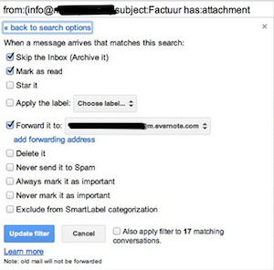
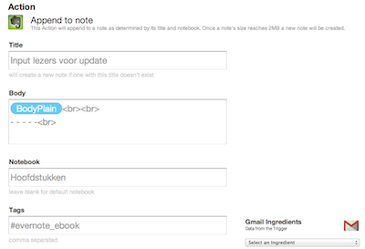

## Evernote voor ondernemers

In dit hoofdstuk gaan we in op de mogelijkheden van Evernote voor ondernemers. We geven een aantal handvatten hoe je Evernote kunt inrichten voor je bedrijf en hoe je slim met de mogelijkheden om kunt gaan.

Evernote heeft zich de afgelopen jaren voornamelijk gericht op individuele gebruikers en non-profit organisaties zoals scholen. De cloud-gebaseerde gedachte van Evernote maakt het lastiger om grote bedrijven geïnteresseerd te krijgen om Evernote grootschalig te gebruiken. Om goed gebruik te maken van alle mogelijkheden in Evernote, is het noodzakelijk om je notities te synchroniseren met de webservers van Evernote.

Het is te begrijpen dat dit voor veel bedrijven een onbegaanbaar pad is. Data-veiligheid en privacy  staan hier op het spel, evenals concurrentiegevoelige informatie die op andere servers staat. Inmiddels is [Evernote Business](http://evernote.com/business/) gelanceerd maar het is nog niet bekend wanneer dit in Nederland beschikbaar is. Het grootste verschil met de reguliere versie van Evernote is de mate van controle die een IT-afdeling of systeembeheerder over de applicatie heeft. Bedrijven kunnen groepsaccounts aanschaffen en eigenaarschap over data beter controleren, aldus Libin in een interview. In Hoofdstuk 3 vind je meer informatie over de veiligheid van Evernote.

### Evernote voor je binnenkomende facturen en bonnen

Je kunt Evernote goed gebruiken om bonnen en facturen op te slaan die je zakelijk binnen krijgt. Krijg je een bonnetje bij een zakelijke aankoop, maak een foto met je smartphone en e-mail deze naar je eigen Evernote-mailadres met de juiste labels en notitieboek in de onderwerpregel. Bijvoorbeeld: "Koffie klant xyz @Administratie #ProjectXYZ". Zo komt de foto direct in het juiste notitieboek met de juiste labels. 
Een alternatieve methode is het gebruik van apps zoals DocScanner (zowel [iOS](http://clkuk.tradedoubler.com/click?p=24371&a=2064103&url=http%3A%2F%2Fitunes.apple.com%2Fnl%2Fapp%2Fdocscanner%2Fid312391317%3Fmt%3D8%26uo%3D4%26partnerId%3D2003) als [Android](https://market.android.com/details?id=docscanner.main)) of [DroidScan](https://play.google.com/store/apps/details?id=com.trans_code.android.droidscan) (Android) waarmee je een foto/scan maakt van je bonnetje. Meer en meer mobiele scanners hebben een directe koppeling met Evernote, zodat je de foto meteen in Evernote plaatst. Meer informatie over scannen en Evernote vind je in Hoofdstuk 3.3.

Krijg je facturen per e-mail binnen? Stuur deze handmatig door of maak een filter aan in je mailprogramma om dit te automatiseren. In onderstaande screenshot zie je als voorbeeld hoe je in *Gmail* een filter maakt om alle facturen van *Moneybird* automatisch naar Evernote te sturen. 

Een derde mogelijkheid is via de dienst IFTTT.com, waarmee je berichten die in je Gmail binnenkomen kunt filteren en doorsturen naar Evernote. Het voordeel van IFTTT ten opzichte van een eigen filter is dat je in IFTTT specifiek kunt aangeven in welk notitieboek de factuur moet staan en met welke labels. Dit bespaart je weer een extra handeling.
Weet wel dat IFTTT (nog) niet kan omgaan met opgemaakte (HTML) e-mail. Het zal je e-mail dus als platte tekst doorsturen. Dit kan tot gevolg hebben dat je e-mail niet goed opgemaakt in Evernote komt en niet leesbaar is. Test deze optie dus eerst goed.

> Tip: Werk je met een accountant of boekhouder? Geef je facturen nog een extra label voor de teruggaaf van btw. Label ze met BTWQ1, BTWQ2, BTWQ3 of BTWQ4 om aan het einde van elk kwartaal direct al je facturen te verzamelen voor je boekhouder. Hier kun je natuurlijk een *Opgeslagen zoekopdracht* voor gebruiken, zodat je snel alles bij de hand hebt. 

>Tip 2: Je kunt Evernote eveneens gebruiken om te kijken welke facturen je nog moet betalen en welke al zijn betaald. Gebruik het label TeBetalen (of een vergelijkbare term) om al je te betalen facturen bij elkaar te zien. Met de *Opgeslagen zoekopdracht* "Notebook:Administratie label:TeBetalen Resourcetype:application/PDF" krijg je direct alle PDF's (facturen, bonnen) die je nog moet betalen te zien in je notitieboek Administratie. Let wel op: Als je ze hebt betaald, voeg dan het label Betaald toe en verwijder het label TeBetalen zodat je geen onnodige overboekingen doet!

Als je een online aankoop doet, krijg je vaak de factuur als e-mail binnen. Je hebt hier de keuze om de e-mail direct door te sturen naar Evernote. Het kan dan echter gebeuren dat de opmaak van de e-mail niet perfect in Evernote komt. Een alternatieve methode is om de factuur van het scherm te printen als PDF of als screenprint en deze in Evernote op te slaan als ontvangen factuur. 

### Evernote als documentopslag

Waar is de handleiding voor je scanner? Of waar is het contract van die ene klant uit 2008? Je kunt Evernote prima gebruiken als documentopslag voor specifieke zaken in en om het kantoor. Zo kun je handleidingen van veel kantoorapparatuur online vinden als PDF. Sla deze op in Evernote in een notitieboek "Handleiding" of met het label "Handleiding" en bespaar ruimte in je kantoor. Denk ook aan interessante artikelen in papieren magazines of uit de krant. Met je smartphone kun je ze direct aan Evernote toevoegen.

Voor de opslag van contracten en andere mogelijk gevoelige informatie dien je rekening te houden met het gegeven dat Evernote je notities online opslaat op eigen servers. In hoofdstuk 3 lees je hoe Evernote (veilig) met jouw data omgaat. Het is je eigen keuze of je projectinformatie zoals contracten, financiële informatie en businessplannen in Evernote opslaat om ze elders weer beschikbaar te hebben. De twee vragen die je je kunt stellen is: 

1. Heb ik deze informatie mogelijk op een andere plaats nodig waar ik niet bij mijn eigen computer kan? 
2. En is het dan noodzakelijk om die informatie *per direct* opvraagbaar te hebben? 

### Evernote als boodschappenlijst voor kantoor
Gebruik Evernote om de boodschappen voor kantoor te verzamelen. Je kunt in een apart notitieboek "Kantoorartikelen" zaken opslaan als

1. Welke printercartridge gebruik ik?
2. Welk merk hangmappen gebruik ik?
3. URL's van online kantoorwinkels.
4. Research voor grotere aankopen zoals een nieuwe randapparatuur of kantoormeubilair.

Maak een to-do lijst voor je kantoorboodschappen zodat je makkelijk kunt afvinken wat je nog nodig hebt. Door deze lijst met je telefoon te synchroniseren kun je in de winkel direct alles vinden en afvinken van je lijst.

### Evernote voor congressen

Ga je geregeld naar congressen? Dan kun je Evernote prima gebruiken voor, tijdens en na de reis en bijeenkomst. 

#### Voorbereidingen
Sla in Evernote belangrijke papieren op zoals je toegangskaart voor het congres, je ticket of een hotelreservering. Maak een inpaklijst zodat je kunt afvinken of je alles in je koffer of tas hebt zitten. Sla belangrijke adressen op in Evernote zoals de locatie van het congres of je hotel waar je verblijft. Een plattegrond van de locatie(s) kun je annoteren met belangrijke plekken en opslaan. Je kunt Evernote ook prima gebruiken om tijdens een lange reis eens bij te lezen.

#### Tijdens

Tijdens een congres sla je foto's op van belangrijke slides, handouts die je krijgt, relevante informatie uit goodie-bags. Aantekeningen kun je direct bij de juiste workshop plaatsen, evenals mogelijke notities uit een netwerkgesprek. Tevens kun je [Evernote Hello](http://evernote.com/hello/) gebruiken om nieuwe contacten direct op te slaan. Visitekaartjes neem je uit beleefdheid uiteraard wel aan maar scan je daarna naar Evernote zodat ze doorzoekbaar worden. 

#### Naderhand

Na je reis of congres kun je de bonnetjes en andere declarabele documenten direct uit je notitieboek halen en delen met je werkgever of opdrachtgever. Wellicht staan er nieuwe to-do's in je notitieboek die je kunt opvolgen zoals contact met mensen die je hebt ontmoet of ideeën voor een volgende reis die in een ander notitieboek kunnen.

### Welke documenten kun je in Evernote opslaan?

In een niet zo ver verleden kreeg je als ondernemer enorm veel papierwerk op je bureau. Helaas is dat niet compleet verdwenen, maar met behulp van een goede scanner en slim labellen kun je goed richting een papierloos kantoor gaan. Welke documenten krijg je nog als papier binnen of heb je op papier en kun je prima in Evernote opslaan? 

1. Contracten.
2. Facturen.
3. Handleidingen.
4. Vakliteratuur.
5. Verzekeringspolis.
6. Belastingen.
7. Correspondentie met klanten.
8. Correspondentie met KvK.
9. Branchenieuws.
10. Archief van projectmateriaal.
11. Werkdocumenten en templates.
12. Onderzoeksmateriaal en knipsels.
13. Notulen van vergaderingen.
14. Contactgegevens zakenpartners.
15. Gegevens zakenreizen.
16. Gegevens congressen.
17. Persmateriaal.
18. Licenties en serienummers.
19. Garantiebewijzen.
20. Regelgeving in je branche of werkveld.
21. Dossiervorming.
22. Templates van veelgebruikte documenten of teksten.
23. Standaard routebeschrijving.
24. Abonnementgegevens leveranciers (bv mobiele telefoon).
25. Ontvangen VAR-verklaringen van freelancers.

Uiteraard zijn er meer soorten documenten te bedenken. Met bovenstaande lijst heb je al op een begin, om eens mee naar je eigen documenten te kijken en te beslissen of en hoe je al dat papier in Evernote opslaat. Hou hierbij rekening met een consistente manier van labellen en maak duidelijke notitieboeken aan. 

> Bij de Belastingdienst heb je als ondernemer een [fiscale bewaarplicht](http://www.belastingdienst.nl/wps/wcm/connect/bldcontentnl/belastingdienst/zakelijk/ondernemen/administratie/administratie_opzetten/hoe_lang_moet_u_uw_administratie_bewaren) van zeven jaar voor je documenten. Overleg met je zakelijk adviseur of accountant hoe dit voor jouw administratie geldt en of je de papieren versie na inscannen moet bewaren.
