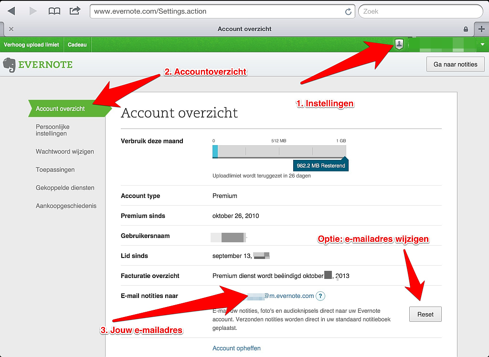
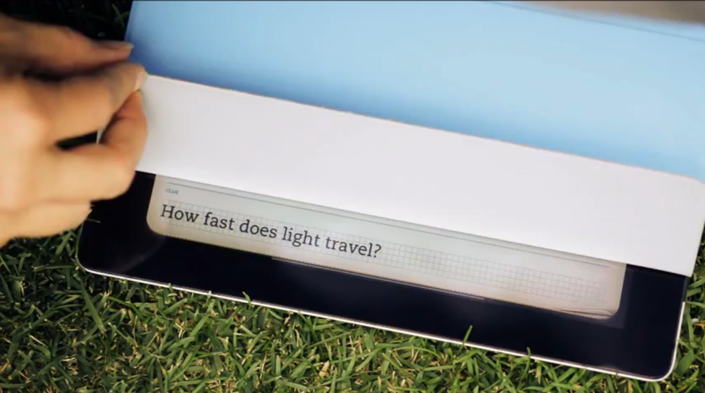

## Evernote voor studenten

We laten je zien hoe je Evernote in je studie kunt gebruiken en op welke momenten in je studie Evernote een trouwe metgezel kan zijn.

### Waarom Evernote gebruiken?

Een student, die Evernote gebruikt om allerlei knipsels, interessante sites en belangrijke bestanden op te slaan, vroegen wij *waarom* hij daar Evernote voor gebruikt. Zijn  antwoord was: "Ik heb het nu nog niet nodig, maar later misschien wel."

Dat is de kern van Evernote - het biedt je ruimte en instrumenten om bepaalde informatie alvast op te slaan en te organiseren voor toekomstig gebruik. Of dat nu voor een presentatie is, een toekomstige carrière die je ambieert of vakantieplannen, Evernote biedt een veelzijdig canvas aan mogelijkheden om knipsels en informatie op te slaan. 
Dit geldt eveneens voor studenten. Evernote kan een centrale rol spelen voor de belangrijke momenten in een studentenleven. De knipselmogelijkheden voor online onderzoek, een foto met een whiteboard vol belangrijke informatie of een audiobestand van dat ene belangrijke hoorcollege. Studenten kunnen optimaal gebruik maken van alle mogelijkheden. Evernote is ideaal voor samenwerking. Studenten kunnen er makkelijk mee samenwerken, ongeacht of ze op een PC of Mac werken. 

#### Wat is het verschil met Dropbox?
Veel studenten maken gebruik van Dropbox om bestanden met elkaar te delen en samen te werken aan een project. [Dropbox](http://dropbox.com/) is een uitstekende manier om dat te doen, maar Evernote biedt zoveel meer dan dat. Binnen Evernote kun je ook met elkaar aan een document werken en bestanden delen via de gedeelde notitieboeken. Daarnaast biedt Evernote de mogelijkheid om je online onderzoek op één plek op te slaan, te organiseren en weer terug te vinden. Dit kunnen bestanden zijn zoals je in Dropbox opslaat, maar je kunt eveneens webknipsels, eigen audio-opnamen en foto's verzamelen, annoteren en weer terugvinden. In dit hoofdstuk zullen we je een aantal van deze mogelijkheden laten zien. 

#### Evernote is niet perfect

Het moet duidelijk zijn dat Evernote niet perfect is. Zo is het geen volwaardige tekstverwerker met alle opmaakmogelijkheden, het is geen beeldbewerkingsprogramma zoals Photoshop, audio-editor of wetenschappelijk notatieprogramma. Evernote is met name geschikt als *onderzoeksinstrument*, voor opslag van notities en om op simpele manier notities te maken.

Andere punten van aandacht als je met Evernote aan de slag gaat zijn:

* Het maken van lijsten op meerdere niveaus kan zo nu en dan niet goed werken,
* Tabellen zijn minimaal ondersteund,
* Complexe opmaak van pagina's is niet makkelijk en zelfs af te raden,
* Er zijn weinig mogelijkheden om met lettertypen te werken,
* Het biedt geen solide ondersteuning voor sjablonen anders dan het zelf aanmaken en dupliceren van een *template-notitie*. In hoofdstuk 3.10 kun je diverse hacks lezen om toch gebruik te maken van sjablonen.

Ondanks, of misschien wel dankzij die belemmeringen is Evernote prettig te gebruiken voor studenten.

Evernote erkent de rol die het kan en wil spelen in het onderwijsveld en biedt daarom een groepskorting aan voor scholen die kan oplopen tot 50%. Je kunt alle informatie vinden op: [Evernote voor Scholen](http://evernote.com/intl/nl/schools/).

### Praktisch gebruik van Evernote in je studie

Een nadeel van traditionele notities op papier is dat ze niet direct doorzoekbaar zijn en dat het lastig kan zijn om na langere tijd weer de juiste aantekeningen terug te vinden op een belangrijk onderwerp. In Evernote kun je per vak of cursus een notitieboek maken waarbinnen alle notities worden geïndexeerd. Labels maken het je makkelijk om direct over meerdere notitieboeken de juiste informatie terug te vinden. 
De notitie die je hebt gemaakt geef je de juiste labels. Zorg voor een consistent gebruik van labels en notitieboeken. Je kunt verschillende strategieën kiezen, maar *kies* er in elk geval een. Een paar mogelijkheden:

1. Maak per studiejaar een notitieboek en geef de notities een label per cursus.
2. Maak per cursus een notitieboek en label per studiejaar.
3. Maak één notitieboek voor je studie en geef labels voor zowel studiejaar als cursus (bv jaar1 en Engels).
4. Maak een Stapel per studiejaar en aparte notitieboeken per cursus.

Kies de manier die het beste bij je past. Probeer de verschillende opties een week en kijk wat er blijft hangen. Na een week is het nog relatief makkelijk om te wisselen van strategie. Welke mogelijkheid je kiest, maak een aantal *Opgeslagen zoekopdrachten* aan om snel in je notitieboeken te zoeken als je studeert. Een *Opgeslagen zoekopdracht* maak je als volgt aan:

1. Maak de zoekopdracht in Evernote. Bijvoorbeeld: Notebook:jaar1 label:engels resource:application/PDF created:week-2 assignment. Deze zoekopdracht geeft alle PDF documenten terug uit het notitieboek voor jaar 1, met het label engels, aangemaakt in de afgelopen twee weken, waar de term "assignment" in voorkomt.
2. Bekijk de resultaten. Krijg je terug wat je zoekt, bijvoorbeeld het huiswerk wat je de afgelopen twee weken voor Engels hebt opgekregen?
3. Klik op Nieuw Opgeslagen zoekopdracht.
4. Geef je zoekopdracht een logische naam.

Vanaf nu kun je met één klik bij de juiste documenten. Op deze manier kun je snel en eenvoudig je studiemateriaal opslaan en weer terugvinden. 

> Tip: Kies voor één manier om je studiemateriaal op te slaan en hou je er aan. Je kunt in het begin nog wel switchen van werkwijze, maar de ervaring leert dat later overstappen veel werk met zich meebrengt. Zoek in de eerste week van je studie(jaar) welke manier prettig voor je werkt en ga daar mee verder.

#### Teksten op foto's zoeken

Evernote zoekt niet alleen in de titels en labels van je notities, maar eveneens in de tekst van de notitie. Als je een [Premium](http://evernote.com/intl/nl/premium/)-abonnement hebt indexeert Evernote zelfs PDF-bestanden.

Stel je voor dat je een foto maakt van het whiteboard na een intensief college. Het whiteboard staat vol met aantekeningen en relevante verbanden tussen onderwerpen. Maak een goede foto met je smartphone en sla hem op in Evernote. De tekst op de foto wordt geïndexeerd en is daarna doorzoekbaar. Dat geldt eveneens voor teksten op foto's van bijvoorbeeld de kroegen die je hebt bezocht, het telefoonnummer wat je even op je hand kliedert (al kun je die net zo goed direct in Evernote zetten via je smartphone) of een interessante studentenaanbieding die je op een abri ziet. Maak foto's van je omgeving en Evernote indexeert ze en maakt ze doorzoekbaar.

### Evernote als studiehulp

Door slim gebruik te maken van labels bij je notities kun je tijdens het studeren snel de juiste informatie terugvinden. Zoals eerder genoemd, geef je notities het label mee van je studiejaar en/of de cursus. Maar denk er eens aan om notities tevens een studieweek mee te geven in de labels. Zo kun je allerlei relevante informatie bundelen per week en makkelijk terugvinden. Tevens kun je vooruit werken. Als je weet dat in je cursus Marketing een les over mobile marketing voorbij komt in week 4, dan kun je in voorgaande weken al gemakkelijk wat voorbeelden en ideeën voor die les opslaan in Evernote met de labels "jaar2" "marketing" en "week4". 

Sla relevante documenten op in Evernote. Download de cursushandleiding van je cursus van het intranet en sla hem op in Evernote. Zo heb je hem altijd bij de hand en hoef je niet op cruciale momenten na te denken welk pad op het intranet je moet volgen om bij de studiehandleiding te komen. Hetzelfde kun je doen met andere relevante documenten zoals een overzicht van belangrijke telefoonnummers en namen van medewerkers (decaan, studieloopbaanbegeleider, etcetera) of reglementen rondom examens en toetsing. Krijg je handouts tijdens je college? Maak er een scan of foto van en zet hem in Evernote. Doe dit ook met readers en ander materiaal die je bij een cursus krijgt aangereikt.

Projectgroepen kunnen Evernote prima gebruiken om via de gedeelde notitieboeken informatie met elkaar uit te wisselen. Of een volledige klas maakt een gedeeld notitieboek om gezamenlijk te leren en profiteren van de gedeelde kennis tijdens de cursus.

### Online onderzoek met Evernote

Evernote kun je prima gebruiken als je tijdens je studie onderzoek doet voor een werkstuk. Er zijn een aantal wegen die je extra informatie kunnen geven of je een makkelijke manier geven om informatie weer op te slaan.

#### Webclipper

Met de [Evernote Webclipper](http://evernote.com/intl/nl/webclipper) kun je snel een pagina, een artikel of een URL opslaan in Evernote. We hebben in Hoofdstuk 1.15 beschreven hoe je de webclipper installeert en kunt gebruiken. Als je de webclipper gebruikt, leer jezelf dan aan om direct de juiste labels te geven aan de notities die je maakt. Dit maakt organiseren en terugvinden een stuk eenvoudiger.

Een extra onderdeel van de webclipper is de mogelijkheid om bij elke zoekopdracht in Google, Bing of Yahoo direct in je Evernote te zoeken. Deze mogelijkheid werkt alleen onder Google Chrome voor Windows en OSX.

Interessant voor iOS-gebruikers zijn de [EverWebClippers](http://clkuk.tradedoubler.com/click?p=24371&a=2064103&url=http%3A%2F%2Fitunes.apple.com%2Fnl%2Fapp%2Feverwebclipper-hd-for-evernote%2Fid527035125%3Fmt%3D8%26uo%3D4%26partnerId%3D2003) voor iPad en iPhone.

#### E-mailadres

Met je Evernote-account krijg je een eigen e-mailadres. Dit e-mailadres kun je altijd gebruiken om iets naar Evernote te sturen. Bijvoorbeeld een bericht over het tentamenrooster. Stuur het door naar Evernote via je Evernote mailadres. Je kunt je e-mailadres vinden op [de instellingen-pagina van Evernote](https://www.evernote.com/Settings.action). In hoofdstuk 1 beschrijven we dit.

Krijg je elke maand een nieuwsbrief van je vereniging met de agenda en wil je deze in Evernote bewaren? Of ben je geabonneerd op een nieuwsbrief rondom je onderzoeksonderwerp? Maak een filter aan in je mailprogramma om bepaalde standaard emails altijd naar Evernote door te sturen. Stel het filter in om binnenkomende mail op afzender of onderwerp te monitoren en door te laten sturen naar je mailadres. Het verschilt per mailprogramma hoe je dit exact dient in te stellen. Meer informatie over het gebruik van je privé Evernote-mailadres vind je in Hoofdstuk 3.2.

#### Doorsturen via IFTTT

Je kunt specifieke emails ook via IFTTT.com door laten sturen. Hiermee heb je het voordeel dat je in de onderwerpregel van de mail nog extra informatie kunt plaatsen zoals de labels die het in Evernote krijgt en in welk notitieboek te plaatsen. Hiermee maak je de workflow nog makkelijker voor jezelf. Met IFTTT kun je tevens RSS-feeds van belangrijke sites of nieuwsbrieven direct in je Evernote notitieboek laten lopen. De informatie verzamelt zichzelf als het ware. Kijk voor meer informatie over IFTTT in Hoofdstuk 3.7 Hou er rekening mee dat IFTTT vooralsnog alleen werkt met Gmail.

#### Smartphone
Met je smartphone kun je direct foto's aan Evernote toevoegen. Via de iPhone app [FastEver Snap](http://clkuk.tradedoubler.com/click?p=24371&a=2064103&url=http%3A%2F%2Fitunes.apple.com%2Fnl%2Fapp%2Ffastever-snap-camera-app-for%2Fid386955086%3Fmt%3D8%26uo%3D4%26partnerId%3D2003) maak je direct een foto die in een standaard notitieboek komt te staan. Zo kun je direct een foto maken van papieren informatie zoals een studierooster, openingstijden van de bibliotheek en kan het vaak fungeren als een alternatief voor het inscannen van papier. 

### Aanvullende apps en programma's

[Everstudent](https://play.google.com/store/apps/details?id=com.olegvaskevich.everstudent) is een gratis app voor het Android besturingsysteem. Je kunt in de app per semester klassen aanmaken en per klas de opdrachten opslaan inclusief notities en overige relevante informatie. Deze synchroniseer je met Evernote waar je aparte notitieboeken krijgt per semester. 

[Quill](https://play.google.com/store/apps/details?id=com.write.Quill) is een Android app (betaald) om handgeschreven notities mee te maken. In plaats van het toetsenbord kun je met je vingers of een stylus zelf je aantekeningen maken en als PDF exporteren naar Evernote.

[Handrite Note Pro](https://play.google.com/store/apps/details?id=my.handrite.prem&feature=search_result#?t=W251bGwsMSwxLDEsIm15LmhhbmRyaXRlLnByZW0iXQ..) is eveneens een populaire notitie-app voor Android. De gratis versie ondersteunt drie Handrite notitieboeken, de betaalde versie heeft geen restricties.

Voor iOS biedt Evernote een eigen handschrift-app, [Penultimate](http://clkuk.tradedoubler.com/click?p=24371&a=2064103&url=http%3A%2F%2Fitunes.apple.com%2Fnl%2Fapp%2Fpenultimate%2Fid354098826%3Fmt%3D8%26uo%3D4%26partnerId%3D2003). Penultimate is nog niet volledig geïntegreerd in Evernote maar dit zou wel eens in de nabije toekomst kunnen gebeuren. Penultimate maakt het eveneens mogelijk om meerdere notitieboeken te maken en deze te synchroniseren met Evernote en Dropbox.

Probeer ook eens [Noteshelf](http://clkuk.tradedoubler.com/click?p=24371&a=2064103&url=http%3A%2F%2Fitunes.apple.com%2Fnl%2Fapp%2Fnoteshelf%2Fid392188745%3Fmt%3D8%26uo%3D4%26partnerId%3D2003) eens op de iPad, met dezelfde mogelijkheden als Penultimate en andere apps.

### Evernote Peek

Speciale aandacht willen we geven aan [Evernote Peek](http://evernote.com/peek/). De ontwikkelaars van Evernote vonden de magnetische beschermhoes Smart Cover (vanaf Apple iPads 2) erg leuk om mee te spelen. Zó leuk dat ze er een applicatie bij hebben bedacht. Eentje die de accessoire inzetbaar maakt als extensie van de iPad. De naam “Peek” (spieken) was gemakkelijk bedacht en de applicatie volgde.
Met Evernote Peek ([App store](http://clkuk.tradedoubler.com/click?p=24371&a=2064103&url=http%3A%2F%2Fitunes.apple.com%2Fnl%2Fapp%2Fevernote-peek%2Fid442151267%3Fmt%3D8%26uo%3D4%26partnerId%3D2003)) kun je jezelf op een leuke manier overhoren om te leren en te studeren voor toetsen. Bekijk [de video over Evernote Peek](http://youtu.be/vqVjruCt6yg) voor de werking.

#### Hoe werkt Peek

Als je de Smart Cover een stukje optilt verschijnt de vraag. Het antwoord verschijnt als je de Smart Cover verder oprolt. Sluit de Smart Cover en til ‘m weer een stukje op voor de volgende vraag. Deze verschijnt naar wens willekeurig of gesorteerd op datum of titel. Vragen waarbij je de checkbox “Incorrect” aantikt krijg je later nog een keer voorgeschoteld. Evernote Peek maakt natuurlijk gebruik van Evernote. De vraag formuleer je in maximaal 50 tekens in de titel van een notitie, het antwoord in maximaal 250 tekens als notitie. Je kunt ook geluid toevoegen aan een notitie – Evernote Peek speelt deze dan af bij de vraag. Er worden een aantal notitieboeken door Evernote en *StudyBlue* meegeleverd zodat je direct met de applicatie aan de slag kunt. 

#### Maak een Peek studiegroep

Evernote Premium gebruikers kunnen hun notitieboeken ook met Evernote Free users delen, handig om één student of zelfs de docent de notities te laten hosten voor de rest. Zo kun je met een groep studenten de studiestof verdelen om samen te vatten. Laat iedereen een onderdeel kiezen waar hij het beste in is en verdeel zo de studiestof. Met weinig inspanning heb je zo alle studiestof tot je beschikking. Spreek een schrijfwijze met elkaar af zodat je alle stof direct in Evernote Peek kunt gebruiken. 

### Evernote en Dropbox

Kun je of wil je niet betalen voor de premiumversie van Evernote, dan kun je het in combinatie met een gratis Dropbox account inzetten om alsnog meer of grote(re) bestanden te delen met je studiegenoten, docent of verenigingsleden. 
De gratis versie van Evernote laat je maximaal 60Mb per maand uploaden. Als je een flink aantal bestanden deelt met studiegenoten kun je snel aan de grens zitten. De gratis versie van Dropbox geeft je 2 Gb schijfruimte. Dit kun je nog verhogen door links naar Dropbox te delen via Facebook en andere sociale netwerken of door je mobiele foto's op Dropbox op te slaan.
In Dropbox kun je eveneens bestanden delen. Je kunt van bestanden of van mappen met bestanden de "Share link" opvragen en deze plakken in een notitie in Evernote. Tegelijkertijd deel je de bestanden met je medestudenten. Op deze manier hebben zij de bestanden én staat in Evernote gedocumenteerd wat je met wie deelt.

### 25 mogelijkheden met Evernote voor studenten

Wat kun je als student met Evernote doen? We zetten 25 mogelijkheden en tips op een rij voor je:

1. Verzamel al je materiaal voor een portfolio in één notitieboek.
2. Maak notities in de klas in Evernote in plaats van op papier.
3. Gebruik [Skitch](http://www.skitch.com) in (gedeelde) notitieboeken om delen van je notities te verduidelijken.
4. Maak notities in PDF's van de reader of handout en sla deze weer op in Evernote.
5. Maak een inhoudsopgave van de belangrijkste notities met de *koppelingen* naar die notities.
6. Kom je onderweg inspirerende momenten tegen voor je college? Maak een foto en sla hem op in Evernote.
7. Importeer handgeschreven notities of krabbels via een scanner of met een app op je smartphone.
8. Gebruik je *Evernote e-mailadres* om snel belangrijke email door te sturen naar Evernote.
9. Maak een audio-opname van het college voor later gebruik en voeg de presentatieslides van de docent er aan toe.
10. Sla referentiemateriaal op. Evernote onthoudt automatisch de URL zodat je er altijd naar kunt refereren.
11. Gebruik de Evernote webclipper om snel online onderzoek te doen.
12. Gebruik je smartphone om snel notities en ideeën in Evernote op te slaan.
13. Organiseer je studiemateriaal per notitieboek en met de juiste labels.
14. Deel notitieboeken met je klas of projectgroep.
15. Sla ideeën, adressen en namen op voor een afstudeeropdracht.
16. Maak een notitieboek voor je zoektocht naar een studentenkamer. Inclusief links, tekst, relevante telefoonnummers, routebeschrijving en foto's van de kamer.
17. Maak een aantal notitieboeken offline beschikbaar op je tablet of mobiele telefoon zodat je de informatie altijd bij de hand hebt. 
18. Maak een to-do lijst tijdens je zelfstudieweken.
19. Maak een foto van dat ene telefoonnummer op het bierviltje.
20. Sla serienummers op van hardware, elektronica en software die je hebt aangeschaft.
21. Maak een opslagplaats voor veelgebruikte teksten, stukken code die je nodig hebt of wiskundige formules.
22. Vergeet die dikke boeken en readers, maak foto's van de pagina's die je nodig hebt, of scan met een aantal medestudenten de reader in. Of haal je docent over om alles digitaal aan te bieden.
23. Gebruik Evernote om informatie te verzamelen over de stad waar je gaat studeren, inclusief studieverenigingen, sportclubs en belangrijke plaatsen.
24. Scan je studentenkaart in en sla hem op in Evernote.
25. Maak een wensenlijst voor bijvoorbeeld kleding, gadgets, boeken en andere zaken die je nog eens wilt aanschaffen als je genoeg geld hebt na je studie.
