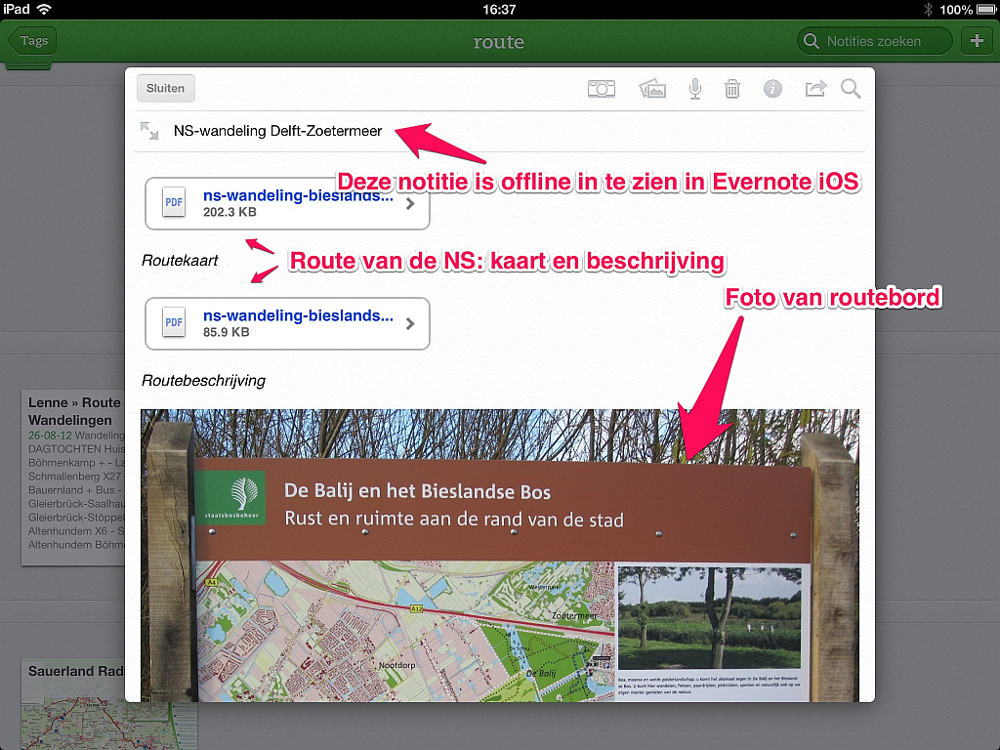

## Evernote voor de wandelaar

Ben je een liefhebber van wandelen, dan is Evernote een handige naslag voor alle mogelijke informatie die bij deze hobby goed van pas komt. Tijdens de voorbereidingen en gedurende de wandeling heb je alles wat je zou willen weten bij de hand. Je kunt de verzamelde kennis ook nog eens delen met anderen, aangevuld met jouw indrukken en beelden van de wandelingen. 

### Hoe

Jij kunt van alles voor je wandelhobby in Evernote zetten. Voor je daaraan begint is het handig te bedenken *hoe* je die informatie wilt opslaan. Je kunt de informatie verdelen over meerdere notitieboeken. Je kunt die notitieboeken ook onderverdelen in stapels. Of je gebruikt in één notitieboek het label *wandelen* voor al je notities voor je wandelhobby. Of met verschillende labels in een notitieboek *wandelen*. Wat wil je bij elkaar zetten? Wat wil je snel kunnen selecteren? Maak een keuze hoe *jij* informatie aan jouw wandelgeheugen in Evernote wilt toevoegen. In dit hoofdstuk werken wij de optie van een notitieboek met verschillende labels verder uit.

Begin daarna met het verzamelen van de wandelinformatie die je al - her en der verspreid - hebt verzameld en nog regelmatig gebruikt. Daarna zul je als vanzelf alle nieuwe informatie daaraan toevoegen.

### Naslag

Wie van wandelen houdt leest ook over wandelspullen, wandelgebieden en wandelroutes. Op internet, in tijdschrijften en in wandelgidsen. Die informatie kun je onthouden met Evernote voor het moment dat je het nodig hebt. Websites over wandelen, wandelingen of wandeluitrusting kun je met URL als bookmark bewaren. Had je dergelijke bookmarks ook al in je browser of bij een webservice verzameld, dan kun je die importeren in Evernote.

Artikelen uit tijdschriften of weblogs over wandelen kun je met een scanner vanaf papier of met de Evernote [webclipper](http://evernote.com/webclipper/ "Evernote webclipper") of vanuit Chrome met [Evernote Clearly](http://evernote.com/clearly/ "Evernote Clearly") vanaf het web in zijn geheel als notitie in Evernote zetten. Zo wordt Evernote jouw digitale schoenendoos vol knipsels over jouw wandelhobby. In hoofdstuk 1.15 vind je meer informatie over webclippen. In hoofdstuk 1.16 vind je meer informatie over Clearly.

Doe je als wandelsporter mee aan georganiseerde wandeltochten, dan kun je de [kalenders met evenementen](http://www.nwb-wandelen.nl/wandelagenda) en webclips van de websites van de organisatoren bewaren. Heb je besloten om deel te nemen aan een evenement, voeg dan het label met de datum (jjjjmmdd) toe aan de notitie met gegevens daarover. Gebruik je een trainingsschema in de voorbereiding op een lange wandeltocht, zet dan dat schema ook in Evernote met voor elk van de geplande voorbereidende wandelingen een label met de datum (yymmdd). Noteer na de wandeling jouw aantekeningen daarbij. Zo wordt Evernote ook jouw wandelsportkalender en trainingslogboek. Door deze opmaak van het label met de datum worden de dagen keurig chronologisch gesorteerd ergens bovenin jouw rij labels in Evernote.

### Uitrusting

Kleding, schoenen, rugzak en andere speciale wandeluitrusting is er volop. De informatie van jouw favoriete merken kun je in Evernote bewaren. De winkels waar je wel eens uitrusting koopt kun je met locatie, URL en openingstijden toevoegen. 

Wanneer je nieuwe uitrusting hebt gekocht kun je de kassabon scannen en als garantiebewijs met aankoopdatum in een notitie zetten. Maak foto's van de aankoop en bijgeleverde gegevens zoals bijvoorbeeld de sticker op de doos, het wasvoorschrift, het label met de maat of de kartonnetjes met specificatie van het materiaal. Voeg daarbij nog een webclip van de productpagina op de website van de fabrikant - en je hebt echt alle informatie die je later nog eens wilt kunnen opzoeken. Een handleiding in PDF kun je downloaden en als bijlage aan de notitie toevoegen. Het staat nu allemaal in Evernote, dus je kunt alle verpakkingsmateriaal en de bijgeleverde papieren informatie weggooien. Wanneer de fabrikant zijn producttypes verandert en dus ook zijn website, dan staat alle informatie over jouw aankoop nog gewoon in Evernote.

In de notitie met de gegevens over jouw wandelschoenen kun je later ook noteren welke wandelkilometers je erop hebt gelopen. Je kunt zo bijhouden wanneer je weer nieuwe zou moeten kopen. Sommige uitrusting gebruik je slechts af en toe. Bijvoorbeeld je sneeuwschoenen. Je legt ze na gebruik weer maandenlang ergens hoog op zolder weg of in een krat in de kelder. Voorkom dat je vergeet waar je ze ook alweer hebt weggelegd: met een foto en korte beschrijving in Evernote van de plek waar ze opgeslagen zijn.

### Voorbereiding

Of het nu een dagwandeling in Nederland of een wandeltocht door ver buitenland is, je zult van tevoren meestal de nodige informatie willen verzamelen. Dat is deel van het plezier en kan goed van pas komen tijdens de wandelingen zelf. 

Welke uitrusting heb je nodig? Wat moet op de checklist met spullen die je in je (rug)zak wil hebben? Hoe gaat de reis naar het wandelgebied? Waar kun je langdurig parkeren bij het wandelgebied? Of wat zijn de reistijden van het openbaar vervoer ernaartoe? Waar kun je verblijven? Wat zijn de contactgegevens van het verblijf? Welk reisbureau biedt de beste wandelreis? Waar haal je eten en drinken? Wat je zo allemaal uitzoekt in de voorbereiding op het wandelen, telt al gauw op tot heel wat informatie. Zet het allemaal in Evernote. Je hebt het dan altijd bij de hand, zodra je het nodig hebt.

Wanneer de wandeling of wandelreis bevalt, wil je deze later wellicht nogmaals doen. Dat kan dan met een minimum aan voorbereiding, want met Evernote weet je het meeste al.

### Wandelingen

Ben je eenmaal op op pad, dan biedt een Premium-abonnement op Evernote extra gemak. Je kunt dan tijdens de voorbereidingen via Wi-Fi vlot complete notitieboeken met jouw wandelinformatie opslaan voor *offline* gebruik op je smartphone. Gegevens die je over jouw wandeling hebt bewaard in Evernote kun je dan, zonder kosten voor mobiel dataverkeer, toch altijd snel inzien op je mobiele apparaat. Ook op afgelegen locaties waar zelfs geen mobiele dataverbinding aanwezig is.

Plaats voor vertrek de informatie over de wandeling in een notitie op je smartphone. Denk daarbij aan:

* **De route**. Die kun je in elk gewenst format in Evernote zetten. Gebruik je nog een papieren *wandelkaart*, met van die handige details erin gedrukt? Maak daar een scan van en het papier is PDF geworden. Soms kun je zo'n PDF ook wel ergens op internet downloaden. Met [Skitch](http://evernote.com/skitch/) kun je gemakkelijk jouw aantekeningen erbij zetten. Deze PDF van de route bewaar je als bijlage in de notitie in Evernote van de wandeling. In hoofdstuk 1.16 vind je meer informatie over Skitch.
Gebruik je een navigatieapparaat of een navigatie-app op je smartphone? Dan kun je de *digitale routegegevens* ([GPX](http://www.topografix.com/)) downloaden en als bijlage in de notitie zetten om tijdens de wandeling (ook offline) te kunnen gebruiken. Je kunt dit bestand dan onderweg direct vanuit Evernote openen in jouw GPX-app.   
Wandel je liever aan de hand van een *routebeschrijving*? Ook die kun je uit een folder van de VVV of uit een wandelgids van de bibliotheek *scannen* of direct ergens als PDF vanaf het web downloaden. Tijdens de wandeling open je in de app van Evernote de notitie van de wandeling en vervolgens lees je van daaruit de PDF van de beschrijving op het scherm van je telefoon.

* **Horeca.** Wil je onderweg ergens wat drinken of eten, dan is het handig te weten waar dat mogelijk is. Soms staat dat op de routekaart, maar vaak onvolledig. Voeg tevoren ook die gegevens - locatie, openingstijden, foto, menu - toe in de notitie van de wandeling.
Neem je zelf eten en drinken mee in je rugzak? Noteer dan op welke mooie plekken picknicktafels en wandelbanken langs de route staan.
* **Bezienswaardigheden**. Zijn er langs of nabij de wandelroute speciale leuke dingen te zien of te bezichtigen: noteer het in Evernote! Onderweg kun je dan de details erover snel opzoeken en zul je niks missen.

Tijdens en na de wandeling kun je de notitie van de wandeling verder uitbreiden met informatie die je niet wilt vergeten. Zoals:

* **Aantekeningen** over en speciale herinneringen van deze wandeling. Van wat losse krabbels tot een compleet wandeldagboek of blogbericht, het past allemaal in Evernote.
* **Beelden**. Foto's of video's van de wandeling. Met de app van Evernote op je smartphone kun je foto's maken en direct opslaan met locatie-coördinaten. Maak je tijdens de wandeling foto's of video met jouw eigen camera, dan kun je die beelden later in Evernote toevoegen aan de notitie van de wandeling. Een selectie van de mooiste opnamen of een backup (bijvoorbeeld gecomprimeerd tot een ZIP-bestand) van het gehele album. Plek genoeg in jouw Evernote. Je kunt natuurlijk ook eenvoudig in die notitie een link toevoegen naar het album van de wandeling op webservices als [Panoramio](http://nl.wikipedia.org/wiki/Panoramio), [Flickr](http://nl.wikipedia.org/wiki/Flickr) of [Google+](http://www.google.com/intl/nl_ALL/+/learnmore/photos/).
* **Blogs**. Maak je verslagen van jouw wandelingen in een webog of bij wandelcommunities zoals [EveryTrail](http://nl.everytrail.com/ "EveryTrail"), dan kun je een webclip van het bericht als kopie in Evernote plaatsen. Heeft jouw blog een RSS-feed, dan kun je die berichten via IFTTT zelfs automagisch aan jouw Evernote laten toevoegen. In hoofdstuk 3.7 vind je hierover informatie. 

Heb je in verschillende notities informatie verzameld over eenzelfde wandeling, kun je die in Evernote OSX, Windows of [Web](http://blog.evernote.com/2011/10/13/evernote-web-new-multi-select-lets-you-move-email-and-merge-notes-fast/) *samenvoegen* tot die ene complete wandelingnotitie. Zo'n notitie bevat alles over een wandeling: bookmarks, beschrijvingen, kaart, digitale route, horeca, duur, opvallende punten, (links naar) foto's en video's.

### Delen

Wanneer je van alles over je wandelhobby in Evernote onthoudt, kun je die herinneringen ook delen met anderen. Een notitie over een wandeling deel je direct vanuit Evernote via e-mail, Facebook en Twitter. De link naar een gedeelde notitie kun je ook gebruiken om de detailinformatie te koppelen aan jouw blogbericht over die wandeling.

> Tip: Deel je een *notitieboek* vol notities, maak dan een aparte notitie als *Homepage*. In Evernote op de desktop kun je voor elke notitie een eigen notitiekoppeling maken. Plak je die koppeling uit het geheugen in je Homepage-notitie, dan verschijnt daarin de titel van de gekoppelde notitie, met een hyperlink naar die notitie. Zo bied je een handig overzicht van de informatie in het notitieboek.

Ben je lid van een wandelvereniging of wandel je samen met een groep, dan kunnen jullie samen gebruik maken van een gedeeld notitieboek. Daarin deel je dan samen alle informatie over de activiteiten van de vereniging of de wandelingen van de wandelgroep. Je kunt in dit notitieboek ook de afspraken van de groep gemakkelijk met elkaar delen.

Wie wandelt vindt dat leuk. Combineer deze hobby met jouw persoonlijk geheugen in Evernote en het wordt nog leuker. Je voorbereiding wordt perfect en je maakt het hoofd leeg om de wandeling met volle aandacht te kunnen beleven.
