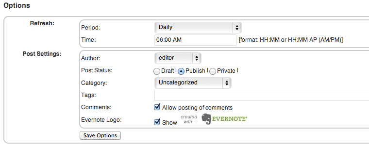
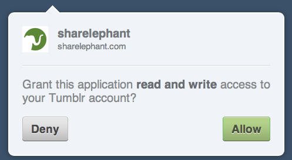
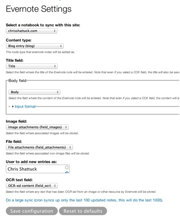
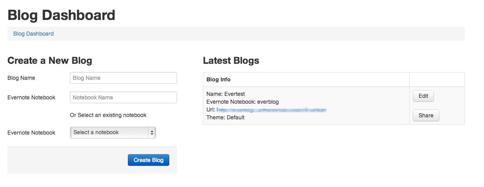
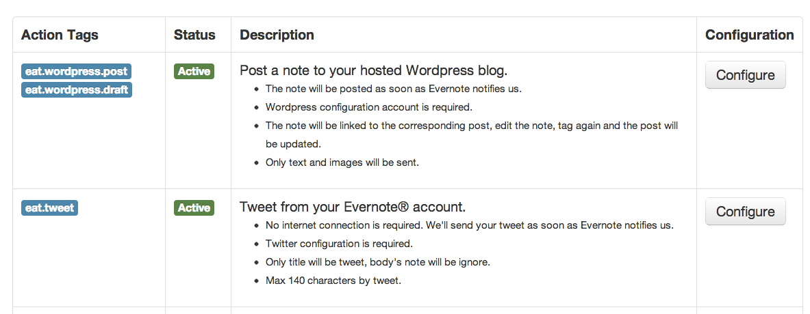

## Evernote voor bloggers

Als blogger kun je Evernote prima gebruiken in je workflow. Je kunt het inzetten als digitaal notitieboek om je ideeën en inspiratie in op te slaan of om je blogpost voor te bereiden. Het is mogelijk om Evernote te gebruiken als blogsoftware. In dit hoofdstuk zetten we de opties op een rij. 

### Evernote als verzamelplaats

Gebruik Evernote als een grote archiefkast om ideeën, inzichten en mogelijke onderwerpen te verzamelen. Je krijgt gedurende de dag allerlei prikkels die als onderwerp voor een blogpost kunnen dienen. Een gebeurtenis op straat, een nieuwsbericht, een uitspraak in een gesprek of een interessante mail. Het helpt om dan een 'Swipe File' aan te leggen, een doorlopende verzameling met knipsels en ideeën voor mogelijke blogposts. 
Maar in je Swipe File kun je meer opslaan. Je kunt stijlfiguren opslaan uit andere blogposts, koppen die goed werken, quotes die je mogelijk gebruikt en interessante beelden. 
Tevens is je Swipe File een prima verzamelplaats voor relevante informatie rondom je weblog. Denk aan de exacte dimensies van te plaatsen illustraties, of de juiste manier om een video in te sluiten. 

Stijlfiguren kunnen je helpen om uit de standaardschrijfmodus te komen op je blog. Als je al een tijdje bezig bent krijg je een eigen ritme en manier van schrijven. Die voelt prettig en je lezers kunnen het waarderen, maar misschien wil je wel eens losbreken van dat standaardformaat. Waarom niet een andere stijlfiguur kiezen? Verzamel interessante vormen uit boeken, tijdschriften en andere sites in je Swipe File en je krijgt na verloop van tijd een inspirerende collectie waar je uit kunt kiezen. Wikipedia biedt een [ruime verzameling aan stijlfiguren](http://nl.wikipedia.org/wiki/Lijst_van_stijlfiguren) die als startpunt voor je zoektocht kunnen dienen.

Een voordeel van Evernote als verzamelplaats is dat het onafhankelijk werkt van je weblogsoftware, je er op verschillende apparaten aan kunt werken (van telefoon tot desktop, via notebook en tablet) en dat je vanzelf een verzameling ideeën opbouwt die je altijd kunt hergebruiken. 

### Evernote als rangeerterrein

Je blogpost kan altijd op dezelfde manier zijn opgebouwd. In dat geval is het goed om een template of sjabloon te maken van je blogpost die je gebruikt als startpunt voor je artikel. Dit sjabloon zet je in Evernote en kopieer je steeds als je een nieuwe blogpost maakt. In hoofdstuk 3.10 vind je een aantal manieren om handig een sjabloon in Evernote te gebruiken. Een sjabloon kan bijvoorbeeld uit de volgende onderdelen bestaan:

**Onderwerp**
Wat is het onderwerp van mijn blogpost?

**Centraal thema**
Is er een centraal thema in mijn blogpost?

**Bronnen**
Welke bronnen gebruik ik?

**Beeldmateriaal**
Plak hier relevante beelden inclusief de bron URL en originele eigenaar.

**Relevante links**
Wat zijn relevante links in mijn post.

**Eerste versie**
Conceptversie van je tekst.

**Titelideeën**
Een aantal mogelijke titels

Je sjabloon kun je maken zoals je zelf wilt. Misschien zijn bronnen voor jou niet relevant maar labels wel. Pas het aan naar je eigen situatie en wees niet bang om zo nu en dan je sjabloon te herzien. 

Het voordeel van een sjabloon is dat je losse ideeën voor een blogpost direct een plaats geeft. Voor elk idee maak je een nieuwe notitie aan op basis van het sjabloon. Je krijgt een lijst met artikelen die in verschillende stadia van publicatie zijn. Zo kun je op vaste momenten direct verder met al lopende artikelen in plaats van per keer te bedenken waar je over schrijft.

### Evernote als blogsoftware

Er zijn veel soorten weblogsoftware op de markt. Al is Evernote hier origineel niet voor bedoeld, je kunt Evernote als blogsoftware gebruiken. Zo kun je een publiek notitieboek aanmaken en gebruiken als je weblog. Je schrijft in Evernote steeds een notitie als blogpost en deze publiceer je in je publieke notitieboek. Het voordeel is dat er automatisch een backup van je blog is gemaakt in Evernote en je altijd je blog bij de hand hebt, zelfs op je mobiel. Je blog heeft automatisch een RSS-feed waar lezers zich op kunnen abonneren. Dit leesabonnement maakt Evernote automatisch aan als je een notitieboek publiek beschikbaar maakt. De URL is opgebouwd als: *http://www.evernote.com/pub/GEBRUIKERSNAAM/NAAM NOTITIEBOEK/feed*. Meer informatie over RSS en Evernote vind je in hoofdstuk 1.

Er zijn wel een aantal zaken waar je rekening mee moet houden:

* Opmaak – Je blog heeft een standaard opmaak in Evernote. Omdat het in Evernote is gepubliceerd zal het er altijd uitzien als een gedeeld notitieboek.
* Reacties – Er zijn geen manieren om direct te reageren op notities in Evernote. Je bent dus afhankelijk van reacties op bijvoorbeeld Twitter of andere netwerken. 
* Multimedia – Illustraties zijn geen probleem in Evernote, maar je kunt geen Youtube video of Soundcloud audio bestand integreren in je blogpost. 

Er zijn inmiddels een aantal diensten beschikbaar waarmee je Evernote aan weblogsoftware koppelt of waarmee je meer configuratiemogelijkheden hebt.

#### Weblogplugins voor Evernote

**Everpress** is een [Wordpress plugin](http://wordpress.org/extend/plugins/everpress/) die de RSS-feed van je publieke notitieboek gebruikt. Elke notitie wordt een artikel op je weblog. Hiermee kun je dus in Evernote je blogpost schrijven en toch in een Wordpressomgeving publiceren. De plugin biedt een aantal opties: 

* De tijd en frequentie van het updaten, 
* Welke auteur op Wordpress de posts publiceert, 
* De status van de post (Draft, gepubliceerd, privé), 
* De categorienaam, 
* Relevante labels, 
* Wil je wel of geen reacties bij je post,
* De vraag of bij elke post een Evernote logo staat met link naar de originele notitie in je gedeelde notitieboek.

Een voordeel van Everpress is dat het als opensource-plugin op je eigen server draait en je de controle hebt over wat er naar je blog gaat. Je hoeft geen verbinding te maken met Evernote om het te laten werken, het opgeven van de RSS-feed van een publiek notitieboek is voldoende. De plugin maakt tevens blogposts in Wordpress van de notities in Evernote. Je kunt dan de blogposts onafhankelijk in Wordpress verder aanpassen.

Maar er is een belangrijk nadeel: De plugin gebruikt de RSS-feed van je publieke notitieboek als bron. Deze feed is afgekapt op plusminus 1024 karakters en alle opmaak gaat verloren. De RSS feed neemt illustraties mee, maar links en andere opmaak verschijnen niet op je Wordpress blog. Standaard zet de plugin een link naar de originele notitie, waar deze opmaak nog wel staat.
Everpress is daarom een prima plugin voor korte berichten met weinig tot geen opmaak. Voor volledige artikelen met veel links, subkoppen en extra materiaal kun je deze plugin beter niet gebruiken.

\newpage

**Sharelephant.com** is een dienst om je Evernote notities te publiceren via Tumblr. Je meldt je aan bij [Sharelephant](http://sharelephant.com/) door het aan Evernote te koppelen. Let wel, hierbij geef je dus *niet* je inloggegevens aan Sharelephant, maar je laat weten dat ze toegang krijgen tot je notities en notitieboeken. Daarna koppel je je Tumblr-blog aan de dienst.

Vanaf dat moment zijn de twee diensten aan elkaar gekoppeld en kun je notities maken in elk gewenst notitieboek. Als het maar een gesynchroniseerd notitieboek is. Wil je een notitie publiceren op Tumblr, dan geef je deze het label -sharelephant en optioneel of het tekst (-text), foto (-photo), video (-video) of audio (-audio) bevat. De video en audio moeten losse bestanden zijn zoals een MP3 bestand of een .avi voor video. Tumblr zorgt voor de conversie van deze bestanden en de juiste weergave op je blog. 
Wil je een Tumblr post met alleen een link, dan maak je een notitie met de labels -sharelephant en -link. In de metadata van je notitie vul je de link in bij het veld URL. De metatdata van een notitie zie je met de sneltoets Ctrl-Shift-I (Windows) of Cmd-Shift-I (Mac). In de notitie kun je nog commentaar bij de link geven. Na synchronisatie staat de link op je Tumblr-blog.

Sharelephant is een fraaie verbinding tussen Tumblr en Evernote maar mist nog extra instellingen om bijvoorbeeld de verbinding tussen je Evernote en Tumblr te verbreken of aan te passen. Uiteraard kun je dit in Evernote zelf doen op [deze pagina](https://www.evernote.com/AuthorizedServices.action), maar het zou mooi zijn als Sharelephant daar melding van maakt. Verder is de opmaak van de posts niet optimaal. Een artikel met een illustratie als ondersteuning werkt niet goed. Sharelephant categoriseert een notitie als tekst óf als foto met ondertitel maar niet als tekst met een aparte afbeelding.

**Drupal plugin** voor Evernote. [Deze plugin](http://chrisshattuck.com/blog/updates-drupal-evernote-module-play-it-now-github) voor het CMS van Drupal maakt een directe verbinding met Evernote zoals Sharelephant. Hiermee kun je in de instellingen van de plugin direct aangeven uit welk notitieboek de artikelen komen, samen met een aantal andere instellingen.

Deze plugin heeft wat extra installatie en programmeerkennis nodig, dus hou daar rekening mee als je er mee aan de slag wilt gaan.

#### Weblogdiensten voor Evernote

**Eveblo** koppelt Evernote aan Blogger. Na inloggen op [Eveblo.com](http://eveblo.com) koppel je Evernote aan de dienst en je logt in via Google op je Blogger-account. Dit account geef je eveneens toegang tot Eveblo. Vanaf nu publiceert elke notitie met het label “eveblo” in Evernote automatisch op je Blogger-weblog. De opmaak is echter beperkt en bijlagen als tekst, video of audio komen niet terug in de blogpost.
De uitleg bij de dienst is in erg gebrekkig Engels, wat vertrouwen in de betrouwbaarheid en de duurzaamheid van de dienst niet ten goede komt. 

**Everblog** is een standalone blogoplossing die na registratie op [de website](http://everblog.us/) een verbinding met Evernote maakt.  Je komt na het verbinden automatisch in het instellingenscherm waar je een naam maakt voor je nieuwe blog. Deze blog koppel je aan een bestaand notitieboek in Evernote of aan een nieuw aan te maken notitieboek. Na het opslaan via “Create Blog” heb je direct een weblog in standaard opmaak die je kunt vullen met notities uit Evernote.

Everblog is de meest uitgebreide van de blogdiensten. Je kunt zelf een kleurenschema voor je blog kiezen en de zijbalk beperkt aanpassen met links en andere teksten.     
Voor Everblog gelden dezelfde beperkingen met notities uit Evernote: Embedded video en audio werkt niet, evenals bijlagen die je meestuurt. De opmaak blijft redelijk goed behouden en de interface werkt erg prettig. Als je van plan bent om te gaan bloggen via Evernote, dan is Everblog een goede dienst om mee te beginnen.

**EverAction[Tags]** is een oplossing als je gebruik wilt maken van Wordpress. Door middel van labels(tags) trigger je het aanmaken van artikelen. Dit kan via gedeelde notitieboeken. Na registratie op [de site](https://eatags.com/) krijg je toegang tot een serie labels die je kunt gebruiken in je Evernotenotities. Met deze labels kun je bijvoorbeeld een Wordpressdraft maken voor een blogpost of zelfs een tweet versturen. Hiervoor moet je de diensten wel verbinden aan EverAction. Voor Wordpress betekent dit dat je het beste een aparte gebruiker aanmaakt die geen administratieve rechten heeft op je weblog. 

Nadat je blog is gepubliceerd verandert EverAction de labels in je notitie van "eat.wordpress.post" naar "eaten: [posted]".    
De functionaliteit van EverAction werkt aardig, maar een nadeel is het opslaan van de Wordpress login gegevens bij EverAction. Zorg daarom dat de gebruiker die via Evernote publiceert geen administratierechten heeft, dan kan de schade minimaal zijn als de gegevens toch openbaar komen.

### Evernote als archief

Wil je Evernote gebruiken om je blogposts te archiveren? Gebruik dan diensten als If This Then That of Zapier om je blog en RSS feed aan Evernote te koppelen. Met elk nieuw artikel krijg je een nieuwe notitie in Evernote. 
IFTTT heeft al een aantal fraaie “recipes” die je direct kunt gebruiken om je weblog met [Wordpress](https://ifttt.com/recipes/search?q=Wordpress+evernote) of bij ([Blogger](https://ifttt.com/recipes/search?q=Blogger+evernote) of [Tumblr](https://ifttt.com/recipes/search?q=tumblr+evernote)) aan Evernote te koppelen. Hiermee maak je een archief van je blogposts aan zoals je zelf wilt. Het is mogelijk om IFTTT te gebruiken als doorgeefluik tussen Evernote en je weblog, waarbij je blogposts via Evernote publiceert. Maar de mogelijkheden zijn hier wederom beperkt in opmaak en koppelen van bestanden. Het is beter om een van de bovenstaande diensten te gebruiken.

Zapier biedt eveneens de mogelijkheid om je Wordpressblog te archiveren in Evernote. Je kunt dit doen met de Hookpress-plugin nodig, maar een simpeler oplossing is om in Zapier de RSS-feed van je blog te zetten. Deze wordt dan automatisch in Evernote gearchiveerd. 

### Meer tips

Tenslotte enkele laatste tips om Evernote als blogger te gebruiken:

* Blog je met meerdere auteurs? Gebruik een gedeeld notitieboek om schrijfafspraken te delen met elkaar. Hierbij moet één van de auteurs wel een Premium account hebben. 
* Hou in Evernote een notitie bij met je publicatieschema. 
* Post je op andere blogs als gastblogger? Hou in Evernote een overzicht bij met de links, zodat je deze makkelijk kunt bekijken en delen met anderen. 
* Hou in Evernote een overzicht bij van relevante zoekwoorden voor je weblog. 
* Gebruik verschillende labels om de “staat” van je blognotitie aan te geven. Bijvoorbeeld blog.idee, blog.versie1 en blog.publicatie. 
* Maak een checklist om bij te houden op welke social media je je nieuwe artikel wil aankondigen. Inclusief directe links naar de inlogpagina of naar een invoerpagina.

Zoals je ziet zijn er verschillende manieren om Evernote aan je weblog te koppelen. Dit kun je doen door Evernote echt als webloginstrument te gebruiken of door Evernote als digitaal notitieboek te gebruiken voor je ideeen, inspiratie en praktische informatie over je weblog.

Als blogger kun je Evernote prima gebruiken als digitaal archief of rangeerterrein voor je blog. Wij raden nog niet aan om Evernote als de motor achter je weblog te gebruiken. De geboden diensten zijn nog niet volledig uitgewerkt en missen cruciale functionaliteiten om een volwaardig weblog te publiceren.
