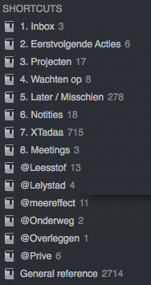

## Evernote voor GTDers

Getting Things Done (GTD) is een populair productiviteitssysteem. Het geeft je ruimte om *over* dingen na te denken in plaats van *aan* ze te denken. Grondlegger David Allen heeft Getting Things Done geleidelijk vormgegeven door patronen te herkennen tijdens werkzaamheden die soepel verlopen. Deze stappen heeft hij vervolgens zover mogelijk geoptimaliseerd.

Getting Things Done blijkt universeel toepasbaar. Overal ter wereld, in Nederland, USA, in Japan, India of China schrijven mensen tijdens de seminars gretig mee. GTD blijft actueel, met bijvoorbeeld social media gaat de frequentie waarop we berichten ontvangen nog verder omhoog maar de manier van verwerken blijft effectief. Het systeem is dus veel breder dan de next actions/projects die je vaak hoort en door David Allen samengevat op één pagina in de [GTD workflow map](https://secure.davidco.com/store/catalog/GTD-WORKFLOW-MAP-SET-p-16554.php "GTD workflow map").

### Wat is GTD

Met de zes *horizons of focus* van Getting Things Done zoom je helemaal uit om een ander perspectief op je bezigheden te krijgen:

1. Purpose / Principles: Wat vind je belangrijk in het leven? Wat wil je bereiken?
2. Vision: In welke richting begeeft de wereld om jou heen zich?
3. Goals: Wat wil jij de komende twee tot drie jaar bereiken?
4. Areas of focus: wat zijn jouw rollen en functies?
5. Projects: welke acties van meer dan één stap wil je in de gaten houden?
6. Actions: wat wil je daarvoor concreet doen?

In de volgorde hierboven zoomen we steeds verder in tot op de dagelijkse werkzaamheden. De kracht van GTD is dat je juist daar kunt beginnen met orde in de chaos te scheppen om vervolgens inzicht op de hogere niveaus te verkrijgen. De volgende vijf processtappen hebben GTD grote bekendheid gegeven:

1. Capturing: Opschrijven wat je bezighoudt zodat je er over kunt denken in plaats van er aan.
2. Clarifying: Nadenken en beslissen over wat je wilt bereiken en de eerstvolgende actie bedenken om dat in gang te zetten.
3. Organizing: De resultaten van je denkwerk organiseren in een systeem dat je vertrouwt.
4. Reflecting: Bekijken wat je te doen hebt.
5. Engaging: Doen wat je op dit moment op deze locatie het beste kunt doen.

Eén van de onderdelen van Getting Things Done is een archief waarin je snel materiaal terug kunt vinden. Het gaat dan om materiaal wat je nodig hebt om een taak uit te voeren en om materiaal ter referentie te archiveren. Evernote is een goede kandidaat voor beide. Het zou mooi zijn als je taken, agenda en referentiemateriaal in één systeem onder kunt brengen. Toegankelijk op iedere apparaat, online en offline.

### GTD en Evernote

[Evernote CEO Phil Libin verwijst regelmatig naar to-dos of ondersteuning voor GTD](http://lifehacker.com/5982051/im-phil-libin-ceo-of-evernote-and-this-is-how-i-work "Phil Libin: I use Evernote, which isn't particularly great for to-dos yet. Yet.") als toekomstige ontwikkeling en [David Allen gebruikt Evernote](https://twitter.com/gtdguy/status/289179425197674496 "David Allen: Amazed by the personal customer service I got on real time chat windows today, from Citi to Evernote! Game changing."). [Evernote heeft de startup Minds Momentum overgenomen](http://techcrunch.com/2012/01/24/evernote-bought-four-companies-last-year-and-almost-nobody-knew-about-it/ "Evernote Bought Four Companies Last Year And (Almost) Nobody Knew About It"), maker van to-do app [Egretlist](http://blog.evernote.com/blog/2010/05/26/egretlist-a-great-to-do-list-app-powered-by-evernote/ "Egretlist: A great to-do list app powered by Evernote"). Interessante ontwikkelingen voor een mogelijke toekomstige integratie van GTD in Evernote !

Zolang Evernote nog geen eigen GTD-oplossing heeft zijn wij van mening dat Evernote niet geschikt genoeg is als [totaal-oplossing (GTD-systeemtool)](http://www.intentsoft.com/overview/gtd/ "Breadth of application categories which could be involved in a GTD workflow"). Evernote is van origine een systeem voor het opslaan, organisatie en terugvinden van notities. Dit maakt Evernote wel geschikt voor het onderdeel referentie (naslag) in het GTD-schema en de stap *capture*, maar niet voor de agenda en de lijsten. Vrijwel ieder systeem om taken in te registreren ([Remember The Milk](http://www.rememberthemilk.com "Remember The Milk"), [Toodledo](http://www.toodledo.com "Toodledo"), [Asana](http://asana.com "Asana"), [Wunderlist](https://www.wunderlist.com "Wunderlist")) heeft een veld voor aantekeningen. Hier plakken wij wel linkjes naar de betrokken notities in Evernote. Sommige systemen zoals [Nozbe](http://nozbe.com "Nozbe") en [Get It Done App](http://getitdoneapp.com "Get It Done App") integreren hun aantekeningen zelfs met Evernote. [IQTELL](http://iqtell.com "IQTELL") en [Everdo.it](http://everdo.it/ "Everdo.it") gaan een stapje verder en laten je tevens notities afhandelen.

Veel Evernote-gebruikers houden hun takenlijsten al wel bij in Evernote. De agenda blijft dan een los systeem.Wij hebben ons verdiept in een aantal inrichtingen van Evernote en die voor je samengevat. Wie weet voldoet een van deze systemen voor jou prima!

De methodes [The Secret Weapon](http://www.thesecretweapon.org/ "The Secret Weapon") (TSW) en [Ruud Hein](http://ruudhein.com/evernote-gtd "Evernote GTD How To van Ruud Hein") maken gebruik van labels. Het gevaar hierin is dat je deze met een typefoutje snel per ongeluk aanmaakt. Slepen met de muis is trager en foutgevoelig - je laat de muis wel eens boven het verkeerde label los. Of je haalt een label weg om een andere toe te kennen waardoor de onderhanden notitie even uit je overzicht verdwijnt. Dan kan het zijn dat je een actie over het hoofd ziet. Als je zelf veel labels gebruikt voor het organiseren van je notities dan raak je het overzicht daarin sneller kwijt.

De [methode van Brett Kelly](http://nerdgap.com/evernote-essentials-update-available-now/ "Evernote as a Task Manager van Brett Kelly") vereist iedere dag wat extra handelingen waardoor je wel direct een soort dagboek hebt. Fokke Kooistra heeft [de meest praktische implementatie](http://www.fokkekooistra.nl/blog/2008/11/30/evernote-and-gtd-1/ "Evernote and GTD van Fokke Kooistra"). Voor Windows-gebruikers is het daarbij jammer dat er geen sneltoetsen zijn om een notitie te verplaatsen naar een ander notitieboek en om een notitieboek te selecteren.

### The Secret Weapon

Op [de website van The Secret Weapon](http://www.thesecretweapon.org/ "The Secret Weapon") zijn de werkwijze en instellingen van Evernote uitgebreid gedocumenteerd. De documentatie en video's leggen het probleem uit waar Getting Things Done de oplossing voor is en leiden je stap-voor-stap door de interface van Evernote. Hieronder richten we ons op de instellingen voor Evernote zodat je met achtergrondkennis van Getting Things Done snel aan de slag kunt. Voor vragen en PowerTips kun je terecht op [het forum van The Secret Weapon](http://www.thesecretweapon.org/forums "The Secret Weapon: Forum").

De combinatie van de ideeën van Getting Things Done met de beschikbaarheid van Evernote inspireerden tot de naam The Secret Weapon.

Voor The Secret Weapon maak je drie *notitieboeken* aan:

1. Cabinet (Archief)
2. Action Pending (taken)
3. Completed (afgeronde taken)

Als je je afgeronde taken niet wilt bewaren dan kun je het notitieboek Completed achterwege laten. Als je ze wel allebei wilt bewaren dan kun je Action Pending en Completed bij elkaar houden in de stapen "Taken".

Vervolgens maak je onderstaande *labels* aan. Omdat het er aardig wat zijn kun je dat het beste vanuit een nieuwe notitie doen, dan kun je gewoon op ENTER drukken na ieder label. Als je de labels hebt aangemaakt dan kun je de notitie weggooien - de labels blijven. Groepeer ze daarna onder elkaar op deze manier:

* .What
	* .Active Projects
	* .Inactive Projects
	* Read/Review
* .When
	* !Daily
	* 1-Now
	* 2-Next
	* 3-Soon
	* 4-Later
	* 5-Someday
	* 6-Waiting
	* 7-Weekend
* .Where
	* @home
	* @work
	* @town
* .Who
	* Namen van familieleden
	* Namen van collega's

Onder .Who maak je eveneens wat labels aan voor famieleden of collega's waar je vaak samen taken mee uitvoert.

Projecten maak je als labels aan onder .What. De projectlabels kun je groeperen onder .Active Projects of juist .Inactive Projects. Door de naam van een projectlabel te beginnen met een punt kun je deze snel intypen dankzij het automatisch aanvullen van Evernote.

In Evernote sorteer je op label waardoor je ziet welke notities nog geen labels hebben. Je kunt er een opgeslagen zoekopdracht voor gebruiken. De benodigde labels onder .When, .What, .Where en .Who sleep je met de muis op de notitie of typ je handmatig in. Let op: het slepen van de notitie naar de muis is erg foutgevoelig, je laat de muis al snel net op het verkeerde label los.

Op deze manier kun je verschillende dwarsdoorsnedes maken van je taken en projecten. Bijvoorbeeld taken die je "1-Now" wilt doen gecombineerd met "@work". Dwarsdoorsnedes die je vaak gebruikt kun je als Opgeslagen zoekopdracht bewaren in Evernote. Door de notities weer te geven in lijstweergave en te sorteren op label staan je taken in volgorde van prioriteit.

Doordat Evernote standaard de datum van aanmaak en wijziging van een notitie bijhoudt kun je daar een oogje op houden. Voor taken waarbij je op iemand anders wacht (6-Waiting) pas je de datum aanmaak aan naar de datum waarop je actie wilt ondernemen.

#### E-mailberichten afhandelen

Om je inbox én het archief van e-mailberichten overal beschikbaar te hebben stel je je e-mailprogramma zo in dat deze de berichten op de server bewerkt (met het IMAP-protocol).

Conform The Secret Weapon kopieer je e-mailberichten waar je iets mee moet doen uit je inbox naar Evernote. Als je Microsoft Outlook en Windows gebruikt dan heeft Evernote daar een handige toolbar voor in Outlook geïnstalleerd. Gmail-gebruikers kunnen een kijkje nemen naar [Powerbot for Gmail](http://gmail.powerbotapps.com/ "Powerbot for Gmail"). Vervolgens verplaats je de e-mailberichten naar je e-mailarchief - een mapje per jaar.

Van e-mailberichten waarop je een reactie verwacht stuur je een BCC naar je Evernote e-mailadres. Binnen Evernote geef je ze het label 6-Waiting mee. Gerelateerde notities voeg je samen in Evernote.

De video waarin The Secret Weapon uitlegt dat je Evernote Premium nodig hebt om alle bestandstypen te kunnen importeren in Evernote is inmiddels achterhaald. Evernote Free gebruikers kunnen eveneens alle bestandstypen importeren.

### Evernote GTD How To van Ruud Hein

Ruud Hein beschrijft in [Evernote GTD How To](http://ruudhein.com/evernote-gtd "Evernote GTD How To") hoe je met één notitieboek uit de voeten kunt. Het systeem leunt op labels, opgeslagen zoekopdrachten en selectievakjes om af te vinken wat je hebt gedaan. In het artikel geeft Ruud Hein antwoorden op veelgestelde vragen. Daar lees je dat Ruud voor start- en/of vervaldagen en terugkerende taken zijn agenda gebruikt.

In het systeem van Ruud Hein geef je notities labels met korte namen zodat je ze snel kunt intypen. Belangrijke labels zijn @mit (Most Important Tasks), sd (Someday/Maybe), @project en @wf (Waiting For).Tevens maak je per context een label (@pc, @work, @home en namen van overleggen, familieleden en collega's).

Met opgeslagen zoekopdrachten haal je de juiste lijstjes naar voren. De namen hiervan mogen langer zijn want je hoeft ze niet in te typen. *@ MIT*, *@ Projects* en *@ Waiting For*. De spatie achter het apenstaartje zorgt ervoor dat Evernote deze belangrijke lijsten bovenaan zet.

De zoekopdracht voor Most Important Tasks die het label @sd buiten beschouwing laat is dan:

> todo:false tag:@mit -tag:sd

Voor projecten en waiting for kun je hetzelfde stramien gebruiken.

Om ál jouw openstaande taken boven tafel te halen zoek je naar notities met een label die met @ beginnen en negeer je projecten en taken waar je op wacht met een zoekopdracht als "@All Next Actions":

> todo:false tag:@* -tag:sd -tag:@project -tag:@wf

Per context maak je een zoekopdracht:

> todo:false tag:@*context* -tag:sd -tag:@project

Een opgeslagen zoekopdracht __Someday sorteert deze onder de contexten:

> todo:false tag:sd

En wat je hebt gedaan kun je daaronder opsommen met een opgeslagen zoekopdracht __What Was Done:

> todo:true

Notities hebben in dit systeem dus altijd een label, tenzij je gewoon even snel iets in Evernote hebt opgeslagen om later te labellen (capture). Vandaar een zoekopdracht "Untagged Notes" om notities zonder label boven tafel te halen:

> -tag:*

Als je Evernote breder inzet dan voor dit systeem en daar geen labels bij gebruikt, dan zoek je voor "Untagged Notes" naar notities zonder label maar met selectievakje:

> todo:false -tag:*

#### Tijdsinschatting

Je kunt taken een tijdsinschatting als meegeven, bijvoorbeeld: 5, 15, 30, 45, en 60. Als je de tijdsinschatting wilt gebruiken dan maak je zoekopdrachten voor iedere hoeveelheid, bijvoorbeeld "05 min.":

> todo:false tag:5 -tag:sd

Om de notities zonder tijdsinschatting op te sommen maak je de zoekopdracht "Untimed Actions":

> todo:false tag:@* -tag:@project -tag:@wf -tag:5 -tag:15 -tag:30 -tag:45 -tag:60

#### Sneltoetsen

Met onderstaande sneltoetsen kun je snel een nieuwe notitie aanmaken en labels bewerken:

1. Nieuwe notitie aanmaken: Ctrl+Alt+N (Windows) of Ctrl+Cmd+N (Mac).
2. Selectievakje invoegen: Ctrl+Shift+C (Windows) of Ctrl+Shift+T (Mac).
3. Labels toevoegen: Ctrl+Shift+T (Windows) of Cmd+' (Mac).
4. Notitie afsluiten: Esc (Windows) of Cmd+W (Mac).

Je kunt labels later toevoegen vanuit de zoekopdracht "Untagged Notes". Als je een notitie labelt met "sd" (Someday) dan verdwijnt deze uit alle opgeslagen zoekopdrachten, op "__Someday" na. Met dat label verhuis je taken eenvoudig van je "next action"-lijsten naar "someday".

### Evernote as a Task Manager van Brett Kelly

In het e-boek [Evernote Essentials](http://nerdgap.com/evernote) beschrijft Brett Kelly onder "Evernote as a Task Manager" hoe je Evernote kunt inzetten voor Getting Things Done. Hij werkt met één notitieboek, drie notities om overzicht te houden, een notitie per dag en selectievakjes.

Brett Kelly somt alle lopende projecten in één losse notitie met het label "projecten list" op. Projecten die je misschien eens wilt oppakken zet je in een aparte notitie met het label "someday list". De projecten geef je een korte naam, het gaat echt om een opsomming. Maak een notitie met label "waiting" om taken op te sommen die je bij anderen hebt belegd.

> In plaats van labels toepassen kun je de notities bij snelkoppelingen bewaren.

Iedere dag maak je een notitie aan met een naam als "Taken - 01-01-2013". Je kunt deze notitie de avond van tevoren als voorbereiding aanmaken, of aan het begin van de dag zelf. De taken die je wilt gaan doen verzamel je uit de notities van de vorige alinea. Kijk even in de notitie van de vorige dag of er taken zijn blijven liggen. Verdeel de notitie in subkopjes voor contexten zoals thuis en werk. Deze notitie houdt je de hele dag open om in te werken.

Aan het einde van de dag kijk je naar taken die niet afgevinkt konden worden na. Ga je de taak niet doen? Streep de tekst dan door en vink af. Verplaats je de taak? Verander het selectievakje dan in een pijltje en kopieer de tekst naar een andere notitie.

In de notitie van een dag kun je tevens wat losse opmerkingen noteren en het zo als dagboek gebruiken.

### Evernote and GTD van Fokke Kooistra

Fokke Kooistra beschrijft in een serie artikelen onder de naam [Evernote and GTD](http://www.fokkekooistra.nl/blog/tag/evernote/ "Evernote and GTD") een snelle en eenvoudige manier van werken gebaseerd op het verplaatsen van notities tussen notitieboeken. Met actiegerichte titels heeft hij met de lijstweergave snel een overzicht.

Fokke maakt een aantal notitieboeken voor taken:

1. Inbox (standaard notitieboek om snel notities vast te leggen)
2. Eerstvolgende acties
3. Projecten
4. Wachten op
5. Later / Misschien
6. Notities (die je snel bij de hand wilt hebben)
7. XTadaa (met afgeronde taken)
8. Meetings

Aanvullend heeft Fokke notitieboeken voor taken die je in een specifieke context kunt uitvoeren. Naast plaatsnamen zie je hier @Overleggen waarin Fokke een notitie per persoon waarmee hij regelmatig overlegt aanmaakt. "General reference" bevat alle overige notities in Evernote.

Door de notitieboeken onder snelkoppelingen op te sommen heb je ze altijd snel bij de hand. Evernote op de Mac heeft handige sneltoetsen om notities te verplaatsen naar een ander notitieboek (Ctrl+Cmd+M). Type een deel van de naam van het notitieboek en druk op ENTER. Met Cmd+J kun je snel een ander notitieboek openen.

### Capture-apps voor iPhone

Een belangrijke stap in Getting Things Done is direct opschrijven wat je bezighoudt zodat je er over kunt denken in plaats van er aan. Door hetgeen in je opkomt meteen ergens op te schrijven kun je daarna weer verder. Een ander voordeel is dat je hersenen je eraan blijven herinneren op een moment dat je daar weer ruimte voor hebt. Helaas vaak op een onhandig moment waardoor je er niet direct naar kunt handelen. Bijvoorbeeld onder de douche. Of op een verkeerde locatie zoals thuis denken aan lege batterijen en in de winkel aan de was die je nog even wilde ophangen.

Met een smartphone kun je snel tekst noteren, een foto maken of wat inspreken. Als je de Evernote app start dan kun je snel de knop daarvoor vinden. Op Android geeft de app Evernote Widget je voor deze taken een paar handige knoppen die je op je startpagina kunt plaatsen. Zo heb je de functies om een nieuwe notitie aan te maken direct onder handbereik.

Op iPhone is deze behoefte ingevuld door ontwikkelaars die niet gelieerd zijn aan Evernote. Met onderstaande apps kun je sneller even een notitie aanmaken in Evernote:

* [Braintoss](http://clkuk.tradedoubler.com/click?p=24371&a=2064103&url=https%3A%2F%2Fitunes.apple.com%2Fnl%2Fapp%2Fbraintoss%2Fid576226036%3Fmt%3D8%26uo%3D4%26partnerId%3D2003 "iTunes: Braintoss"): snel een audiofragment (maximaal 18 seconden), foto of stukje tekst versturen. Braintoss probeert de gesproken tekst te herkennen en de afbeelding te beschrijven. Gebruik als bestemming je Evernote e-mailadres.
* [Audiopad](http://clkuk.tradedoubler.com/click?p=24371&a=2064103&url=https%3A%2F%2Fitunes.apple.com%2Fnl%2Fapp%2Faudiopad%2Fid534105189%3Fmt%3D8%26uo%3D4%26partnerId%3D2003 "iTunes: Audiopad"): verstuurt alleen audio maar kent niet de limiet van Braintoss 18 seconden. Gebruik als bestemming je Evernote e-mailadres.
* [Captio](http://clkuk.tradedoubler.com/click?p=24371&a=2064103&url=https%3A%2F%2Fitunes.apple.com%2Fnl%2Fapp%2Fcaptio-email-jezelf-met-1-tik%2Fid370899391%3Fmt%3D8%26uo%3D4%26partnerId%3D2003 "iTunes: Captio"): verstuurt alleen tekst. Gebruik als bestemming je Evernote e-mailadres.
* [Drafts](http://clkuk.tradedoubler.com/click?p=24371&a=2064103&url=https%3A%2F%2Fitunes.apple.com%2Fnl%2Fapp%2Fdrafts%2Fid502385074%3Fmt%3D8%26uo%3D4%26partnerId%3D2003 "iTunes: Drafts"): verstuurt tekst naar diverse bestemmingen. Integreert met Evernote.
* [EverClip](http://clkuk.tradedoubler.com/click?p=24371&a=2064103&url=https%3A%2F%2Fitunes.apple.com%2Fnl%2Fapp%2Feverclip-clip-to-evernote%2Fid536058926%3Fmt%3D8%26uo%3D4%26partnerId%3D2003 "iTunes: EverClip"): draait in de achtergrond en verstuurt alles wat je naar het klembord kopieert automatisch naar Evernote.

De Mac OS X client van Evernote heeft een voorziening om snel een nieuwe notitie aan te maken (Quick Note). Via het Evernote-pictogram rechtsboven op de menubalk of met de sneltoetsen Ctrl+Cmd+N (Nieuw) en Cmd+Enter (Opslaan).

### Conclusie

Evernote is een zeer goede kameraad als je aan de slag gaat met GTD. Maar verwar het niet als hét instrument voor een complete GTD oplossing. Andere diensten zoals we hebben genoemd zijn hier meer geschikt voor en zullen je minder hoofdbrekens geven als er zich net een uitzondering voordoet in je acties of als het nét niet in je eigen *workflow* past. Evernote is prima als opslagmedium en archief. Totdat Evernote de aankoop van Egretlist heeft geïntegreerd kun je bovenstaande systematieken eens proberen of één van de vele anderen die online zijn te vinden. In het begeleidende Evernote notitieboek bij dit e-book vind je meer bronnen voor GTD systemen in en rond Evernote.
