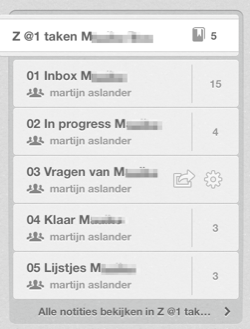

## Evernote van gebruikers

Evernote helpt jou van alles te onthouden. Die herinneringen zijn persoongebonden, gaan over jouw verleden en helpen jou bij de dingen die jij doet. Elke gebruiker van Evernote heeft wel weer andere manieren om Evernote te gebruiken bij werk, hobby en huishouden. Die voorbeelden kunnen jou aan het denken zetten over nieuwe manieren om Evernote te gebruiken. 

Gebruikers van Evernote hebben al veel ervaringen online gezet. Tijdens het schrijven van dit e-book kregen wij van lezers voorbeelden van hoe zij Evernote gebruiken.

In dit subhoofdstuk beschrijven wij enkele van die ervaringen van gebruikers, die wij lazen op het web of ontvingen van lezers van dit e-book. We geven waar mogelijk links naar meer informatie in de Nederlandse of Engelse taal.

### Ervaringen en voorbeelden via Evernote

Evernote geeft zelf vele tips over toepassingen voor zijn dienst. In de beginjaren werden die verzameld door medewerker [Ron in een Tumblrblog](http://evernote.tumblr.com/ "Ron’s Evernote Tips"). Je kunt soortgelijke tips nu vinden in het eigen weblog van Evernote, [in de categorie Tips + Guides](http://blog.evernote.com/blog/category/tips-guides/). Speciaal voor de gebruikers van Evernote Zakelijk verzamelt Evernote op een speciale webpagina [Case Studies](http://evernote.com/business/resources/case_studies/).

De meeste en op persoonlijke ervaringen gebaseerde gebruikerstips worden echter verzameld door gebruikers van Evernote die deelnemen aan de [community van Evernote-ambassadeurs](http://evernote.com/community/). In het volgende hoofdstuk geven we hier een reeks voorbeelden van.

Op Twitter kun je tips om Evernote praktisch in te zetten volgen op [@evernotelife](https://twitter.com/evernotelife "Twitter: @evernotelife").

### Lijsten met van alles en nog wat

**Pierre Journel** | [@pjournel](http://twitter.com/pjournel "Twitter: @pjournel") is een Franse social media manager, die in de Engelse taal veel informatie geeft over Evernote via zijn blog [The Elephant Channel](http://elephantchannel.net). Laat je inspireren door zijn persoonlijke gebruikstips in het artikel:

* [1000 and one use cases for Evernote](http://elephantchannel.net/2012/01/1000-and-one-used-cases-for-evernote/)

Pierre deelt ook tips over Evernote via een [openbaar notitieboek](http://www.evernote.com/pub/pjournel/theelephantchannel) in Evernote.

**Andrew Christopher Maxwell** | [@hekainteractive](http://twitter.com/hekainteractive "Twitter: @hekainteractive") is een Amerikaanse webontwikkelaar. Hij schreef een populair lijst met maar liefst:

* [100 Different Evernote Uses](http://www.andrewcmaxwell.com/2009/11/100-different-evernote-uses/)

Als Lifehackers noemen wij gebruikerstips soms *Evernote-hacks*. In 2010 schreven we een [wedstrijd](http://lifehacking.nl/web20/wat-is-jouw-beste-evernote-hack-win-een-boek/) uit. Lees nog eens de uitslag:

* [De 10 beste Evernote hacks](http://lifehacking.nl/algemeen/de-10-beste-evernote-hacks-winnaars-boek/)

Wij stelden onszelf voor het schrijven van dit e-book dezelfde vraag. Zo kwamen wij op *Onze 111 dingen van vroeger die nu in Evernote staan*. We somden deze allemaal op aan het begin van hoofdstuk 3 over Evernote-hacks. Hoe we dat doen beschreven we in dit e-book.

### Een boek schrijven

**Elja Daae** | [@elja1op1](http://twitter.com/elja1op1 "Twitter: @elja1op1") geeft marketingadvies, organiseert webinars voor Frankwatching.com en schrijft. Voor haar boek over bloggen maakte ze veel gebruik van Evernote.

> Ik heb heel veel praktische informatie rondom het schrijven van het boek in Evernote staan:

* Aantekeningen van mijn gesprekken met de uitgever
* Aantekeningen van gesprekken met anderen
* Een inhoudsopgave, die ik op aanraden van mijn uitgever gemaakt heb voordat ik begon met schrijven
* Een overzicht van hoeveel woorden ik per versie heb. Ik mik op een bepaald aantal woorden, en ik heb in een aparte notitie opgeschreven wat ook al weer mijn richtlijn is en hoe ver ik ben. Anders vergeet ik het en moet ik het weer ergens anders opzoeken.
* De stukken die ik er uit knip maar misschien later nog nodig heb
* Een overzicht van de mensen die ik wil bedanken en de bronnen die ik gebruik
* Een overzicht van voorbeelden die ik wil geven en hoe ik die wil groeperen
* Een notitie met alle versies van mijn word-documenten. Als ik beneden op de laptop werk, kan ik altijd verder met de laatste versie, ook als ik boven op de PC heb zitten werken.

Lees meer in haar blogpost: [Een boek schrijven met behulp van Evernote](http://www.eljadaae.nl/persoonlijk-2/een-boek-schrijven-met-behulp-van-evernote/).

### Reizen

**Niek Krouwel** | [@niekkrouwel](http://twitter.com/niekkrouwel "Twitter: @niekkrouwel") is ambtenaar. Hij schreef ons hoe hij Evernote gebruikt voor het plannen van en tijdens vakantiereizen.

> Ik gebruik Evernote heel veel voor reizen. Ik sla alle websites inzake bepaalde bestemmingen op voor later nalezen. Bovendien sla ik PDF's op van alle reisbescheiden voor een bepaalde trip: tickets, reserveringen, itineraries, timetables, maps of plattegronden. Ik plan momenteel mijn fietsvakantie door Europa. Ik ben recent overgestapt op de premiumversie om ook tijdens de reis alle verzamelde gegevens bij de hand te hebben, ook zonder netwerk. Ik maak op de iPad met Maps snapshots van de routekaarten. Daar plak ik info van websites omheen, met overnachtingsmogelijkheden en bezienswaardigheden.

### Genealogisch onderzoek

**Frank Daelmans** | [+Frank Daelmans](https://plus.google.com/114115870720950557115/about "Frank op Google+") is DIV-medewerker. Hij schreef ons over gebruik van Evernote voor genealogisch onderzoekers.

> Als onderzoeker naar onze familiegeschiedenis maak ik veelvuldig gebruik van Evernote. De OCR-functie in Evernote zorgt ervoor dat ik heel snel de door mij verzamelde gegevens terug vind. Tijdens mijn onderzoek in het Regionaal Historisch Centrum Limburg heb ik ook veel gebruik gemaakt van de fotofunctie op de Android-applicatie. In plaats van alles te noteren in een schrift, maak ik liever een duidelijke foto van het oude document en tag ik dit met de meest belangrijke kenmerken. Zodra ik thuis kom synchroniseer ik mijn android met de desktopapplicatie en heb tijd genoeg om mijn onderzoek voort te  zetten. In het begin zijn de aantal documenten nog wel te overzien, maar na een paar weken/maanden onderzoek kom je er achter dat je stapels met documenten hebt en vraag je je af: "Waar heb ik dat ook al weer gezien". Dankzij Evernote stel ik mij die vraag bijna nooit.

Frank deelt ook tips over Evernote via een [openbaar notitieboek](https://www.evernote.com/pub/fdaelmans1/Evernote-resources) in Evernote.

### Klanten en offertes

**Patrick Loonstra** | [@buxx](http://twitter.com/buxx "Twitter: @buxx") is grafisch vormgever. 

> Ik heb verschillende klanten. Waarvan ik verschillende soorten gegevens heb en krijg. En ook dingen maak. Daarvoor maak ik een paar notities aan in Evernote. De basis van alle losse notities zijn de 'klantnaam' en het 'offertenummer'. Op die manieren kan ik snel bij alle gegevens.

Patrick gaaf ons enkele voorbeelden van zijn aanpak:

* Gegevens klantnaam (klantnaam)  
Dit is de basisnotitie. Daarin staan de contactgevens van de klant in en de contactpersonen.

* Moodboard (klantnaam, 2013-0004)  
Tijdens het ontwerpen ga ik eerst de stijl bepalen, alles wat ik tegenkom, op het web en in het echt, stop ik in een moodboard.

* Opdrachtomschrijving, klantnaam (klantnaam, 2013-0004)  
De briefing gaat hierin, de deadlines die we gaandeweg bespreken. En als er een contactmoment is geweest dan gaat dat als een soort van logboek ook in deze notitie. Hiervoor gebruik ik ook [Typinator](http://www.ergonis.com/products/typinator/), zodat ik met een paar klikken een hele tekst kan typen. ~data geeft de huidige datum in 20130203 format, zodat ik direct daarachter kan typen wat er gedaan is.

* Teksten ((klantnaam, 2013-0004)
Ik werk veel met aangeleverde teksten. Aangeleverd in Word of per mail. Die verzamel ik allemaal in 1 notitie. Ook de wijzigingen en correcties gaan daarin. En zodra iets is doorgevoerd, maar ik het bold, zodat ik kan zien wat er nog gedaan moet worden.

### Huisartsenpraktijk

**Bart Timmers** | [@burtonbartijn](http://twitter.com/burtonbartijn "Twitter: @burtonbartijn") is huisarts/opleider. Hij schreef ons over zijn gebruik van Evernote als huisarts:

> Wij gebruiken Evernote in onze groepspraktijk van drie huisartsen, huisarts-in-opleiding, vijf assistentes, drie POH's, en co-assistent. Ik heb een eigen account en we hebben een gezamenlijk groepspraktijk-account. Ik heb een map "medische artikelen" die ik deel met de rest van de praktijk. En omgekeerd deel ik in mijn eigen account de documenten van de praktijk. Daarin opgeslagen: onder meer notulen van het werkoverleg. Protocollen (onderverdeeld in medische protocollen en "gebruiksprotocollen"). Interessante artikelen. Werkdocumenten als voorbereiding voor brainstormbijeenkomsten. Eerder maakten we gebruik van "gedeelde documenten", maar dat is veel minder gebruikersvriendelijk omdat je alleen namen van documenten ziet. Evernote is visueler. Met name het feit dat je in de PDF's kunt zoeken op woorden maakt dat het erg gemakkelijk is om in de notulen te zoeken naar gemaakte afspraken.

Op het web zijn meer gebruikerservaringen van Bart te lezen. Zo schreef hij daarover een [artikel in de Digitale Zorggids](http://www.digitalezorggids.nl/gids/evernote/expert-reviews/bart-timmers/je-verlengde-brein-ultieme-informatietool) en gaf hij [een presentatie](http://lifehacking.nl/algemeen/evernote-meetup-3-11-december-2012/) op een Evernote-meetup.

### Per blog en boek een notitieboek

**Jan Willem Alphenaar** | [@jwalphenaar](http://twitter.com/jwalphenaar "Twitter: @jwalphenaar") is Kennisdeler. Hij gebruikt Evernote als verzamelbak. Daarnaast gebruikt hij Evernote om ideeën te bewaren die hij later verwerkt in zijn presentaties en boeken. Hij koos voor Evernote Premium omdat hij meer schijfruimte nodig had én graag betaalt voor een product met toegevoegde waarde.

Jan Willem gebruikt Evernote op zijn Android smartphone, iPad en MacBook. Naast Evernote gebruikt Jan Willem de Web Clipper om snel informatie van webpagina's in Evernote te bewaren.

Via de categorieën in [Zite](http://www.zite.com/ "Zite") komt Jan Willem interessante artikelen voor zijn doelgroepen op het spoor. Deze artikelen bewaart hij in Evernote. Onderweg maakt Jan Willem foto's en audionotities ter herinnering. Bijvoorbeeld notities ter inspiratie om later uit te werken. Maar ook  hele praktische aantekeningen. Bijvoorbeeld foto's van een whiteboard, aantekeningen op papier of een visitekaartje. Door deze informatie in Evernote te bewaren heeft Jan Willem geen papier nodig wat kwijt kan raken.

Qua organisatie heeft Jan Willem Evernote per blog en boek een notitieboek aangemaakt. De blogs werkt hij snel genoeg uit waardoor sorteren op de laatst aangemaakt notitie voldoende ordening is. Voor het schrijven van een boek neemt hij op zijn gemak de aangemaakte notities door.

### Workflow

**Martijn Aslander** | [@resourcerer](http://twitter.com/resourcerer "Twitter: @resourcerer") is een verkenner van de netwerksamenleving, mede-oprichter van Lifehacking.nl, betrokken bij de Quantified Self beweging in Nederland en zeer actief gebruiker van Evernote. Hij gebruikt Evernote sinds juli 2008 op zijn Mac, iPhone en iPad.

> Evernote is echt mijn second brain. Het is een datahub waar ik alles kan terugvinden. Van mijn oude zwemdiploma tot het laatste restaurant waar ik at. Ik sla er alles in op en kan er altijd weer materiaal in terugvinden.

Martijn gebruikt een combinatie van Evernote en Dropbox. Laatstgenoemde is met name een rangeerterrein om alles wat binnenkomt direct over meerdere apparaten beschikbaar te hebben. De submappen in Dropbox zijn als nodig gedeeld met andere projectleden of zijn accountant. Met een vaste mappenstructuur kan hij snel bonnen, facturen en andere belangrijke papieren delen. 

Als een project is gedaan en is afgerond, sleept Martijn de complete map in Evernote. Daar gaat het in het archief om later weer terug te vinden als nodig. 

Voor het scannen maakt Martijn gebruik van een aparte map @Scans die eveneens met Dropbox is verbonden. Daarna gaan ze allemaal direct Evernote in om verder te verwerken. 

### Samenwerken met notitieboeken

Martijn gebruikt veel notitieboeken, omdat het voor hem een prettiger overzicht geeft wat er nog te doen is. Deze notitieboeken zijn onder andere ingericht op zijn workflow. Zo heeft hij een stapel notitieboeken met alle informatie over zijn lezingen, maar heeft hij eveneens een stapel genaamd Thuis met privé notities.

In Evernote werkt Martijn soms met anderen samen. Daarvoor gebruikt hij een vaste structuur van notitieboeken. De gedeelde Inbox is de eerste plaats waar materiaal in binnenkomt. Alles wat zijn projectpartner oppikt gaat naar het notitieboek In Progress en als het is gereed kan het in Klaar. De map Vragen is bedoeld om elkaar vragen te stellen en de map Lijstjes voor specifieke workflows of documenten in een project.

### Sociale context

Martijn gebruikt de webclipper in Chrome om snel materiaal in Evernote te plaatsen. Daarnaast mailt hij veel rapportages en nieuwsbrieven via zijn persoonlijke Evernote emailadres. Dit kunnen wekelijkse statistieken zijn, verdiende badges op Foursquare en wekelijkse logboeken van zijn Fitbit stappenteller. Zo bouwt hij in Evernote een compleet archief op van verschillende diensten. 

> Wat ik tevens opsla zijn uitnodigingen uit LinkedIn. Deze zijn altijd wel vergezeld van een specifieke opmerking van een lezing of presentatie die ik gaf. Deze sla ik op met de labels van het maand, jaar en naam van de lezing. Zo kan ik deze later nog terugvinden als ik meer informatie over een persoon zoek. 

Martijn gebruikt Evernote met name om zijn inspiratie voor lezingen op te slaan en weer door te kijken als hij nieuwe presentaties voorbereid. Daarnaast geven de koppelingen met Evernote Food, LinkedIn, Foursquare en veel andere diensten vooral een sociale context. Wat deed hij op een bepaald moment met wie en wat gebeurde er? Dit maakt van Evernote werkelijk de datahub die Martijn in zijn leven nodig heeft. 

> Ik heb geen constant systeem. Mijn manier van werken verandert mee met de organisatorische behoeften die ik heb én de functionele aanpassingen in een applicatie. Zo verbind ik me niet aan één werksystematiek.

Na het schrijven van dit e-book blijven wij graag tips en ervaringen met jou delen. Je kunt meer van ons over Evernote lezen op [Lifehacking.nl](http://lifehacking.nl/algemeen/evernote-overzicht-van-alles-wat-we-er-over-schreven/ "Evernote: overzicht van alles wat we er over schreven") en je kunt ons aantreffen in de [Community EvernoteNL op Google+](https://plus.google.com/communities/103611462316014210610) en de [Groep Evernote NL op Facebook](https://www.facebook.com/groups/evernote.nl/).
