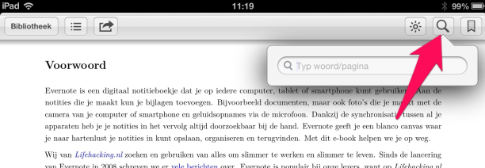

## Begripsbepalingen

Achterin een boek verwacht je wellicht in een index of register een lijst met trefwoorden en de bijbehorende paginanummers of vindplaatsaanduiding. Dit is echter een *e-book*. Daarin kun je zoeken op een of meer trefwoorden via het zoekveld in jouw e-reader. We tonen hier als voorbeeld hoe je dat doet op een iPad.

Een e-book heeft nog een handig verschil met een papieren boek: je kunt er hyperlinks in plaatsen naar aanvullende informatie op het web.

In dit e-book staan onvermijdelijk ook meerdere technische begrippen, waarvan de betekenis niet altijd voor iedere lezer bekend zal zijn. Je kunt zo'n voor jou onbekend begrip opzoeken via een zoekmachine op het web, maar om je op weg te helpen hebben we in dit hoofdstuk enkele in dit e-book gebruikte begippen in alfabetische volgorde gezet en voorzien van een hyperlink naar uitleg over de betekenis in [Wikipedia](http://nl.wikipedia.org "Wikipedia Nederlandstalig Homepage"):

[Android](http://nl.wikipedia.org/wiki/Android_(besturingssysteem)) | [API](http://nl.wikipedia.org/wiki/Application_programming_interface) | [App](http://nl.wikipedia.org/wiki/App) | [AppleScript](http://nl.wikipedia.org/wiki/AppleScript) | [Attribuut](http://nl.wikipedia.org/wiki/Attribuut_(informatica)) | [Autorisatie](http://nl.wikipedia.org/wiki/Autorisatie) | [Batch](http://nl.wikipedia.org/wiki/Batch) | [Bookmarklet](http://nl.wikipedia.org/wiki/Bookmarklet) | [Browser](http://nl.wikipedia.org/wiki/Browser) | [Cloud](http://nl.wikipedia.org/wiki/Cloud_computing) | [Community](http://nl.wikipedia.org/wiki/Virtuele_gemeenschap) | [Digitaal](http://nl.wikipedia.org/wiki/Digitaal) | [DMS](http://nl.wikipedia.org/wiki/Documentmanagementsysteem) | [DRM](http://nl.wikipedia.org/wiki/Digital_Rights_Management) | [Encryptie](http://nl.wikipedia.org/wiki/Encryptie) | [EPUB](http://nl.wikipedia.org/wiki/EPUB) | [Extensie](http://nl.wikipedia.org/wiki/Uitbreidingspakket) | [Freemium](http://en.wikipedia.org/wiki/Freemium) | [Hyperlink](http://nl.wikipedia.org/wiki/Hyperlink) | [iDEAL](http://nl.wikipedia.org/wiki/IDeal) | [IMAP](http://nl.wikipedia.org/wiki/Internet_Message_Access_Protocol) [Interface](http://nl.wikipedia.org/wiki/Interface) | [iOS](http://nl.wikipedia.org/wiki/IOS_(Apple)) | [Label](http://nl.wikipedia.org/wiki/Tag_(metadata)) |  [Lifehacking](http://lifehacking.nl/over-lifehackingnl/) | [Metadata](http://nl.wikipedia.org/wiki/Metadata) | [MOBI](http://en.wikipedia.org/wiki/Comparison_of_e-book_formats#Mobipocket) | [Moodboard](http://en.wikipedia.org/wiki/Mood_board) | [OCR](http://nl.wikipedia.org/wiki/OCR) | [OSX](http://nl.wikipedia.org/wiki/OSX) | [PayPal](http://nl.wikipedia.org/wiki/PayPal) | [PDF](http://nl.wikipedia.org/wiki/Portable_Document_Format) | [Platform](http://nl.wikipedia.org/wiki/Platform_(informatica)) | [POP](http://nl.wikipedia.org/wiki/Post_Office_Protocol) | [RSS](http://nl.wikipedia.org/wiki/RSS) | [Scanner](http://nl.wikipedia.org/wiki/Scanner_(grafisch)) | [Smartphone](http://nl.wikipedia.org/wiki/Smartphone) | [SSL](http://nl.wikipedia.org/wiki/Secure_Sockets_Layer) | [Synchroniseren](http://nl.wikipedia.org/wiki/Bestandssynchronisatie) | [Tablet](http://nl.wikipedia.org/wiki/Tablet-pc) | [Thumbnail](http://nl.wikipedia.org/wiki/Thumbnail) | [TWAIN](http://nl.wikipedia.org/wiki/TWAIN) | [URL](http://nl.wikipedia.org/wiki/Uniform_Resource_Locator) | [WAV](http://nl.wikipedia.org/wiki/WAV) | [Windows](http://nl.wikipedia.org/wiki/Windows).
